# Design of Separation Columns (Distillation & Absorption)

This skill provides an authoritative, detailed, textbook-grounded reference on distillation column sizing, stage-by-stage equilibrium calculations, tray hydraulics, and packing rating, based directly on Chapter 17 of *Chemical Engineering Design* (Towler & Sinnott, 2nd Edition, pp. 816–941).

---

## 1. Continuous Distillation: Process Anatomy & Fundamentals

Distillation separates liquid mixtures based on differences in vapor pressure (relative volatility $\alpha_{ij} = K_i / K_j$).

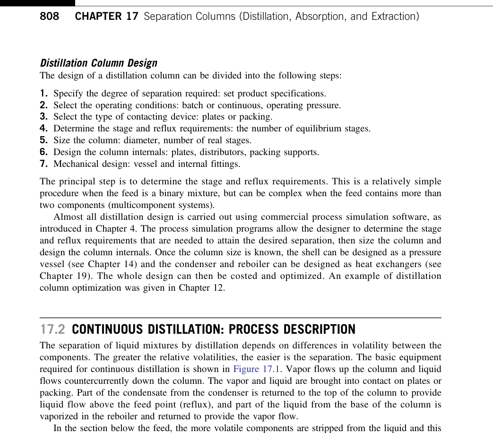

### 1.1 Column Sections & Stream Balances
* **Overall Mass Balance**:
  $$F = D + B$$
  $$F z_i = D x_{D,i} + B x_{B,i}$$
* **Condenser Duty ($Q_C$)**:
  $$Q_C = V_1 \Delta H_{vap} = (R + 1) D \Delta H_{vap}$$
* **Reboiler Duty ($Q_R$)**:
  $$Q_R = D h_D + B h_B + Q_C + Q_{loss} - F h_F$$

### 1.2 The Rigorous Stage MESH Equations

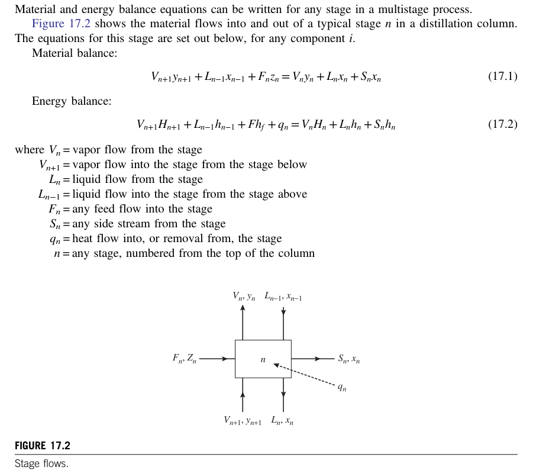

For every theoretical equilibrium stage $n$ ($n = 1$ at top, $N$ at bottom):
1. **M (Material Balance)**:
   $$L_{n-1} + V_{n+1} + F_n = (L_n + U_n) + (V_n + W_n)$$
   $$L_{n-1} x_{n-1,i} + V_{n+1} y_{n+1,i} + F_n z_{n,i} = (L_n + U_n) x_{n,i} + (V_n + W_n) y_{n,i}$$
2. **E (Equilibrium Relationship)**:
   $$y_{n,i} = K_{n,i}(T_n, P_n, \mathbf{x}_n, \mathbf{y}_n) x_{n,i}$$
3. **S (Summation of Mole Fractions)**:
   $$\sum_{i=1}^C x_{n,i} = 1.0, \quad \sum_{i=1}^C y_{n,i} = 1.0$$
4. **H (Heat / Energy Balance)**:
   $$L_{n-1} h_{L,n-1} + V_{n+1} H_{V,n+1} + F_n h_{F,n} = L_n h_{L,n} + V_n H_{V,n} + Q_n$$

---

## 2. Binary Distillation: The McCabe-Thiele Method

Under Constant Molar Overflow (CMO) assumptions: molar latent heats are equal ($\lambda_A \approx \lambda_B$), sensible heat effects and heat of mixing are negligible, and heat loss through the shell is zero ($L$ and $V$ are constant within each section).

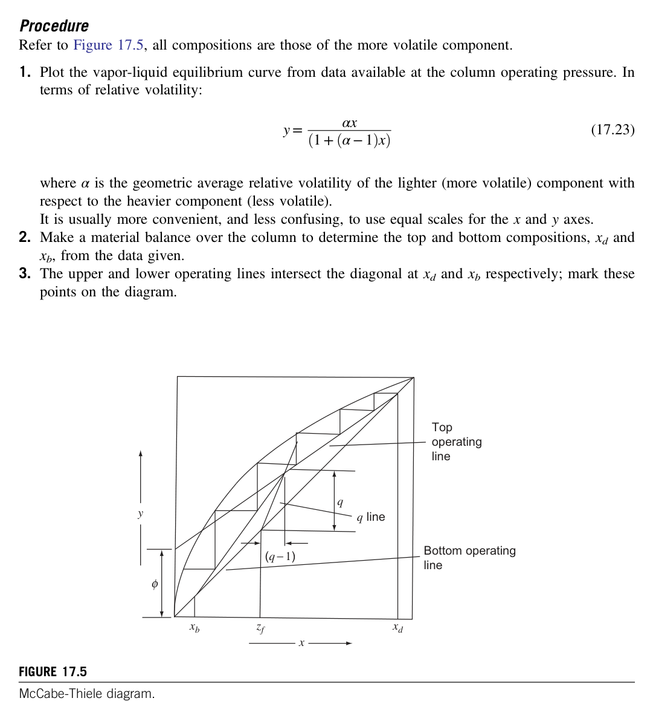

### 2.1 The Operating Lines

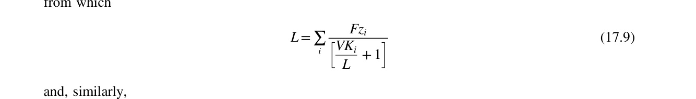

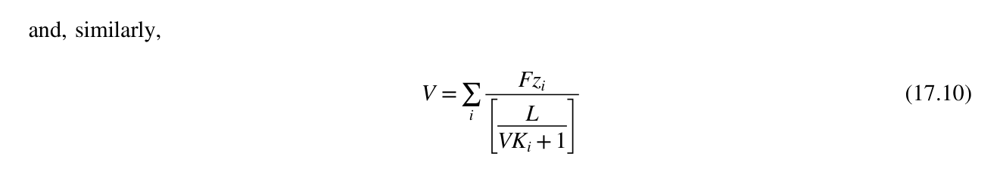

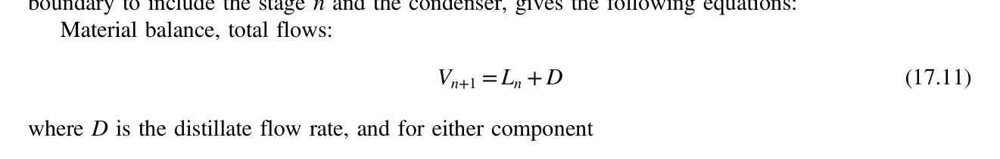

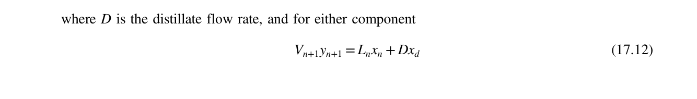

1. **Rectifying Operating Line (ROL)**:
   $$y = \frac{R}{R + 1} x + \frac{x_D}{R + 1}$$
   * Passes through $(x_D, x_D)$ on the $y=x$ diagonal with slope $\frac{L}{V} = \frac{R}{R+1}$ and y-intercept $\frac{x_D}{R+1}$.
2. **Stripping Operating Line (SOL)**:
   $$y = \frac{L'}{V'} x - \frac{B}{V'} x_B$$
   * Passes through $(x_B, x_B)$ on the $y=x$ diagonal with slope $\frac{L'}{V'} > 1$.
3. **Feed Line ($q$-Line)**:
   $$y = \frac{q}{q - 1} x - \frac{z_F}{q - 1}$$
   where $q$ is the thermal condition of the feed:

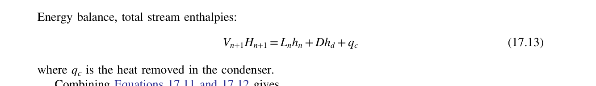

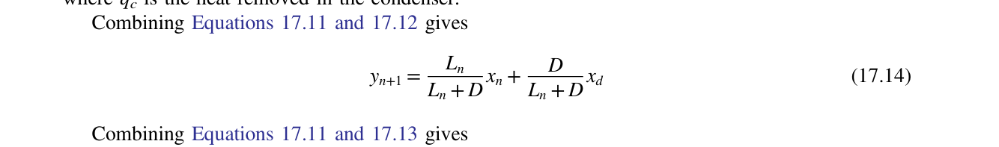

$$q = \frac{\text{Heat required to bring 1 mole of feed to saturated vapor}}{\text{Molar latent heat of vaporization } \Delta H_{vap}} = \frac{H_V - h_F}{H_V - h_L}$$

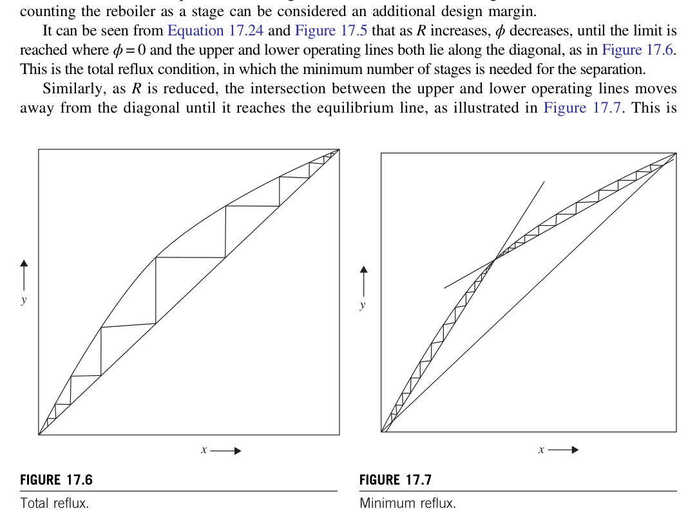

* **$q$-Line Orientation by Feed Thermal State**:
  * Cold liquid ($T_F < T_b$): $q > 1$, slope $> 0$, extends up and right.
  * Saturated liquid (bubble point): $q = 1$, vertical line $x = z_F$.
  * Two-phase mixture: $0 < q < 1$ ($q = 1 - \text{vapor fraction}$), slope $< 0$, extends up and left.
  * Saturated vapor (dew point): $q = 0$, horizontal line $y = z_F$.
  * Superheated vapor ($T_F > T_{dew}$): $q < 0$, slope $> 0$, extends down and left.

### 2.2 Operational Limits: Minimum Reflux & Minimum Stages

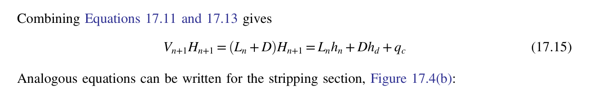

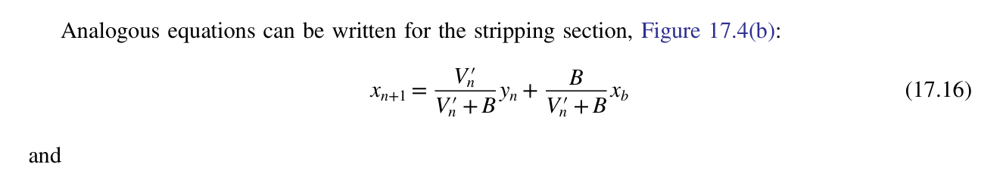

1. **Minimum Reflux Ratio ($R_{min}$)**:
   Occurs when the ROL, SOL, and $q$-line intersect directly on the VLE equilibrium curve (pinch point $(x_p, y_p)$), requiring an infinite number of stages:
   $$\frac{R_{min}}{R_{min} + 1} = \frac{x_D - y_p}{x_D - x_p}$$
2. **Minimum Theoretical Stages ($N_{min}$)**:
   Occurs at Total Reflux ($R = \infty$), where operating lines collapse onto the $y=x$ diagonal. Sized by the **Fenske Equation**:
   $$N_{min} = \frac{\ln\left[ \left(\frac{x_D}{1 - x_D}\right) \left(\frac{1 - x_B}{x_B}\right) \right]}{\ln \alpha_{avg}}$$
3. **Operating Reflux Ratio**:
   Economic optimum balances capital cost (number of trays) against operating cost (condenser cooling water and reboiler steam):
   $$R_{opt} = 1.10 \text{ to } 1.30 \times R_{min}$$

---

## 3. Multicomponent Shortcut Sizing: FUG Method

For multicomponent mixtures, key components are selected: Light Key (LK) and Heavy Key (HK).

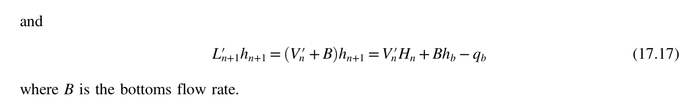

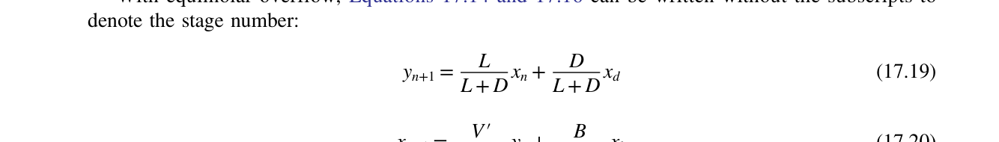

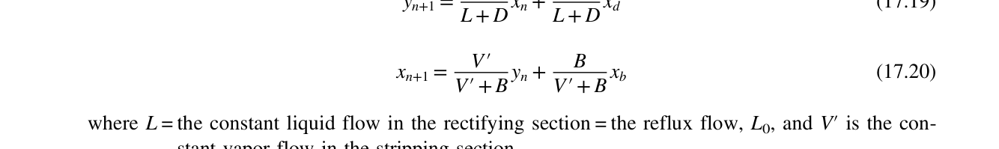

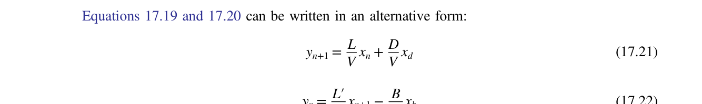

1. **Fenske Equation**:
   $$N_{min} = \frac{\ln\left[ \left(\frac{d_{LK}}{b_{LK}}\right) \left(\frac{b_{HK}}{d_{HK}}\right) \right]}{\ln \alpha_{LK/HK}}$$
2. **Underwood Equations for $R_{min}$**:
   Solve for root $\theta$ lying between $\alpha_{HK}$ and $\alpha_{LK}$:
   $$1 - q = \sum_{i=1}^C \frac{\alpha_i z_{F,i}}{\alpha_i - \theta}$$
   $$R_{min} + 1 = \sum_{i=1}^C \frac{\alpha_i x_{D,i}}{\alpha_i - \theta}$$
3. **Gilliland Correlation**:
   Relates actual theoretical stages $N$ to $N_{min}, R, R_{min}$:
   $$\frac{N - N_{min}}{N + 1} = 0.75 \left[ 1 - \left(\frac{R - R_{min}}{R + 1}\right)^{0.566} \right]$$
4. **Kirkbride Equation for Optimal Feed Stage ($N_F$)**:

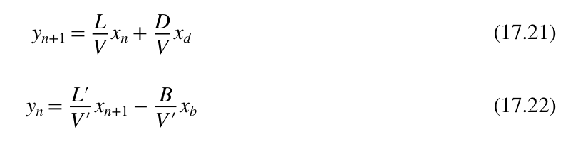

$$\log\left(\frac{N_R}{N_S}\right) = 0.206 \log\left[ \left(\frac{z_{HK}}{z_{LK}}\right) \left(\frac{x_{B,LK}}{x_{D,HK}}\right)^2 \left(\frac{B}{D}\right) \right]$$

---

## 4. Plate Hydraulic Design (Sieve & Valve Trays)

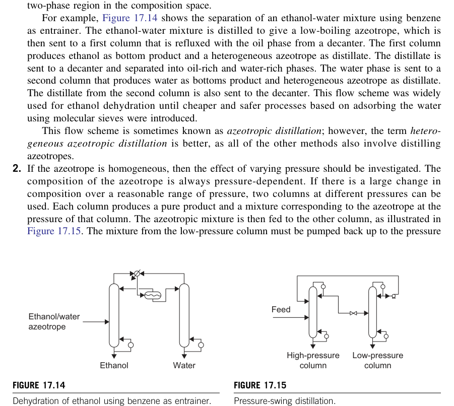

### 4.1 Flooding Velocity (Fair's Correlation)
Flooding sets the minimum column diameter. Sized using the **Flow Parameter ($F_{LV}$)**:

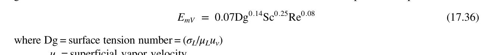

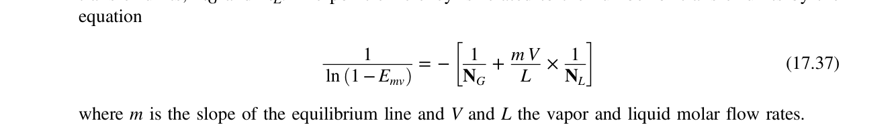

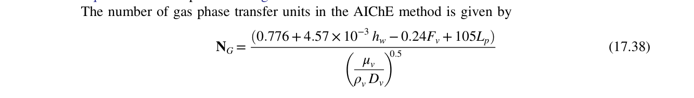

$$F_{LV} = \frac{L_w}{V_w} \sqrt{\frac{\rho_V}{\rho_L}}$$
The flooding vapor velocity is:
$$u_f = C_{sb} \left(\frac{\rho_L - \rho_V}{\rho_V}\right)^{0.5} \left(\frac{\sigma}{20}\right)^{0.2} \quad [\text{m/s}]$$
where $\sigma$ is liquid surface tension ($\text{mN/m}$) and $C_{sb}$ is obtained from Fair's correlation chart:

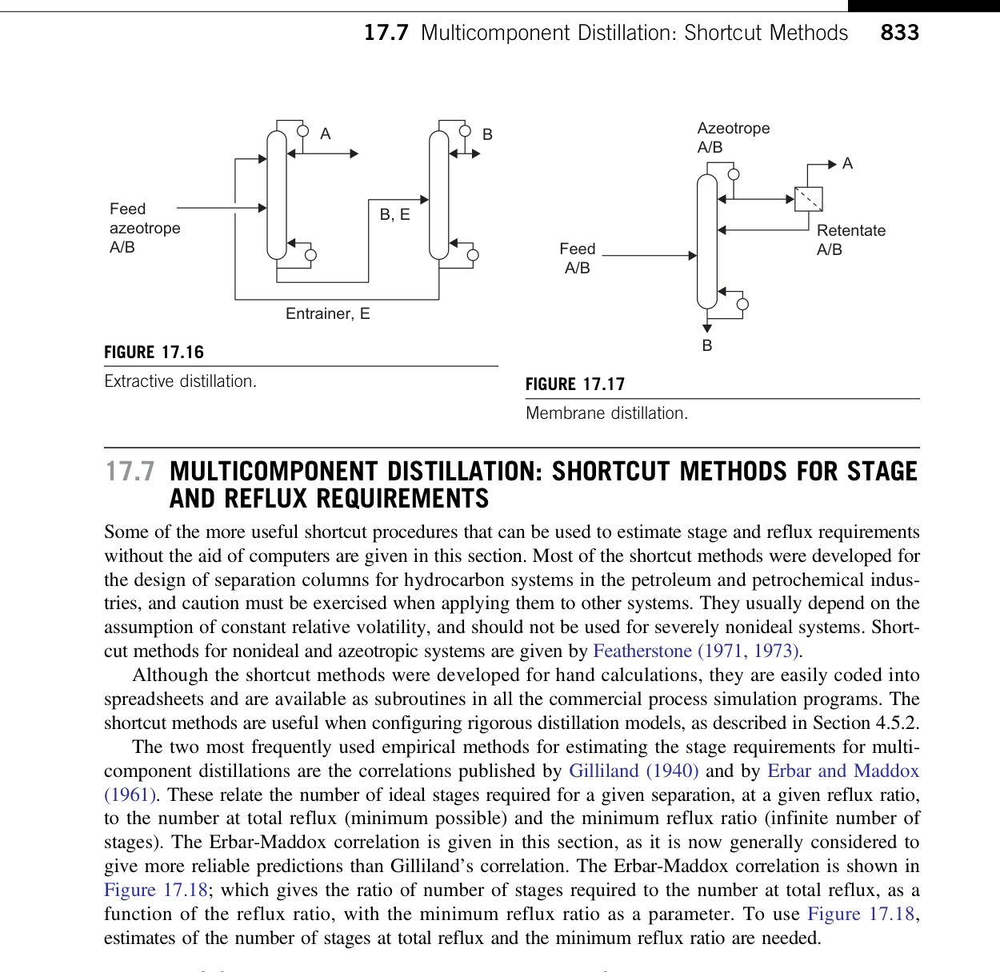

* **Design Vapor Velocity**:
  $$u_{design} = (0.75 - 0.85) \times u_f$$
* **Net Vapor Area**:
  $$A_n = \frac{\dot{V}_{vapor}}{u_{design}}$$
* **Column Total Area**:
  $$A_{col} = \frac{A_n}{1 - (A_d / A_{col})} \implies D_{col} = \sqrt{\frac{4 A_{col}}{\pi}}$$
  where downcomer area fraction $A_d / A_{col} \approx 0.10 - 0.15$.

---

### 4.2 The Sieve Tray Operating Limits Envelope

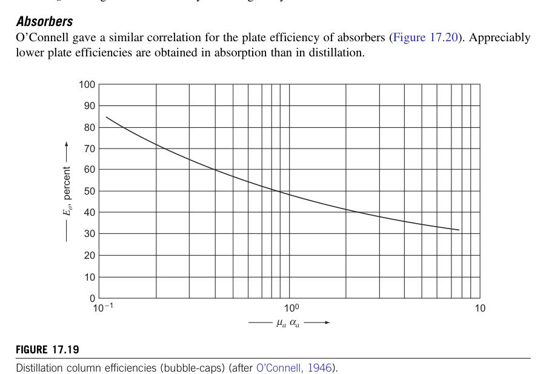

A stable tray operates within 4 distinct hydrodynamic boundaries:
1. **Jet Flooding (Upper Vapor Limit)**: Excess vapor entrainment drowns the tray above ($u_v > 0.85 u_f$).
2. **Weeping / Dumping (Lower Vapor Limit)**: Vapor velocity through perforations is insufficient to support the liquid pool, causing liquid to dump through holes instead of crossing the weir:

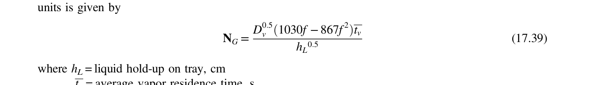

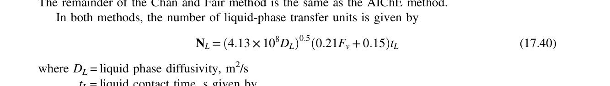

$$u_{h,min} = \frac{K_2 - 0.9(25.4 - d_h)}{\rho_V^{0.5}}$$
(where $K_2$ is weeping constant and $d_h$ is hole diameter, typically $3 - 6\text{ mm}$).
3. **Downcomer Backup Flooding**: Liquid backs up into the downcomer due to total tray pressure drop and entrance head loss:

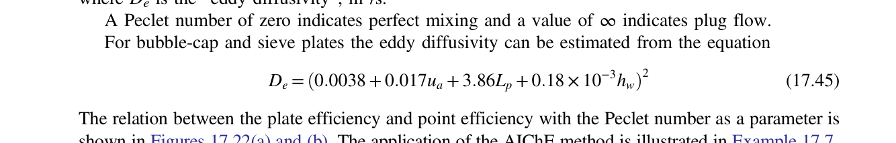

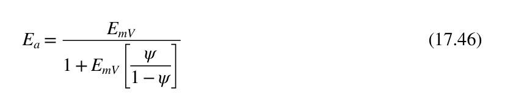

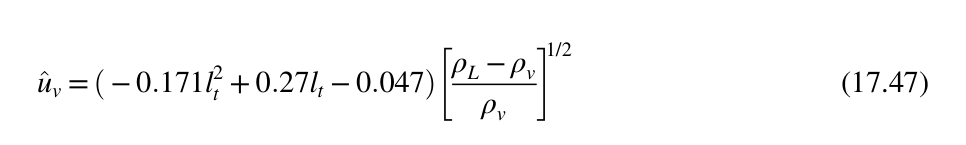

$$h_{dc} = h_w + h_{ow} + h_t + h_{da}$$
* **Design Constraint**:
  $$h_{dc} \le 0.50 \times (\text{Tray Spacing})$$
  (Typically tray spacing $t = 0.45\text{ m}$ to $0.60\text{ m}$).
4. **Downcomer Choking (Upper Liquid Limit)**: Liquid velocity in downcomer exceeds $0.15\text{ m/s}$, preventing vapor disengagement.

---

### 4.3 Tray Pressure Drop Formulation
Total tray pressure drop ($h_t$, in mm of liquid):

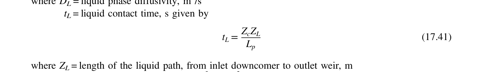

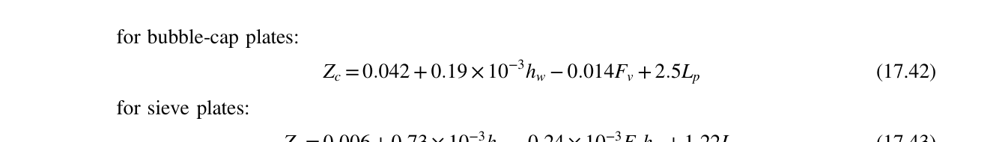

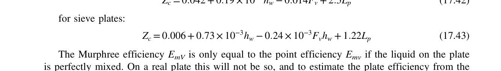

$$h_t = h_d + (h_w + h_{ow}) \beta + h_\sigma$$
* $h_d$ = Dry hole pressure drop: $h_d = 51 \left(\frac{u_h}{C_o}\right)^2 \left(\frac{\rho_V}{\rho_L}\right)$
* $h_w$ = Outlet weir height (typically $40 - 50\text{ mm}$)
* $h_{ow}$ = Liquid crest over weir (Francis weir formula):
  $$h_{ow} = 750 \left(\frac{L_w}{\rho_L l_w}\right)^{2/3}$$
* $h_\sigma$ = Surface tension head: $h_\sigma = \frac{4 \sigma}{\rho_L g d_h}$

---

## 5. Packed Column Design

Used when low pressure drop is required (vacuum distillation), corrosive fluids require non-metals, or column diameter is small ($D < 1.0\text{ m}$).

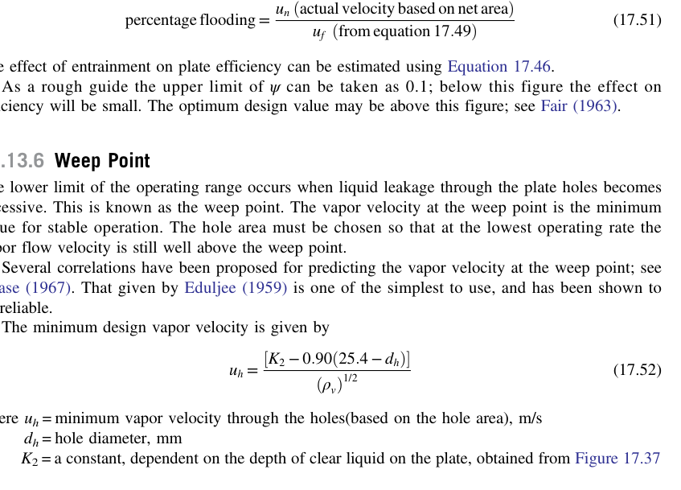

### 5.1 Hydraulic Sizing via GPDC (Generalized Pressure Drop Correlation)

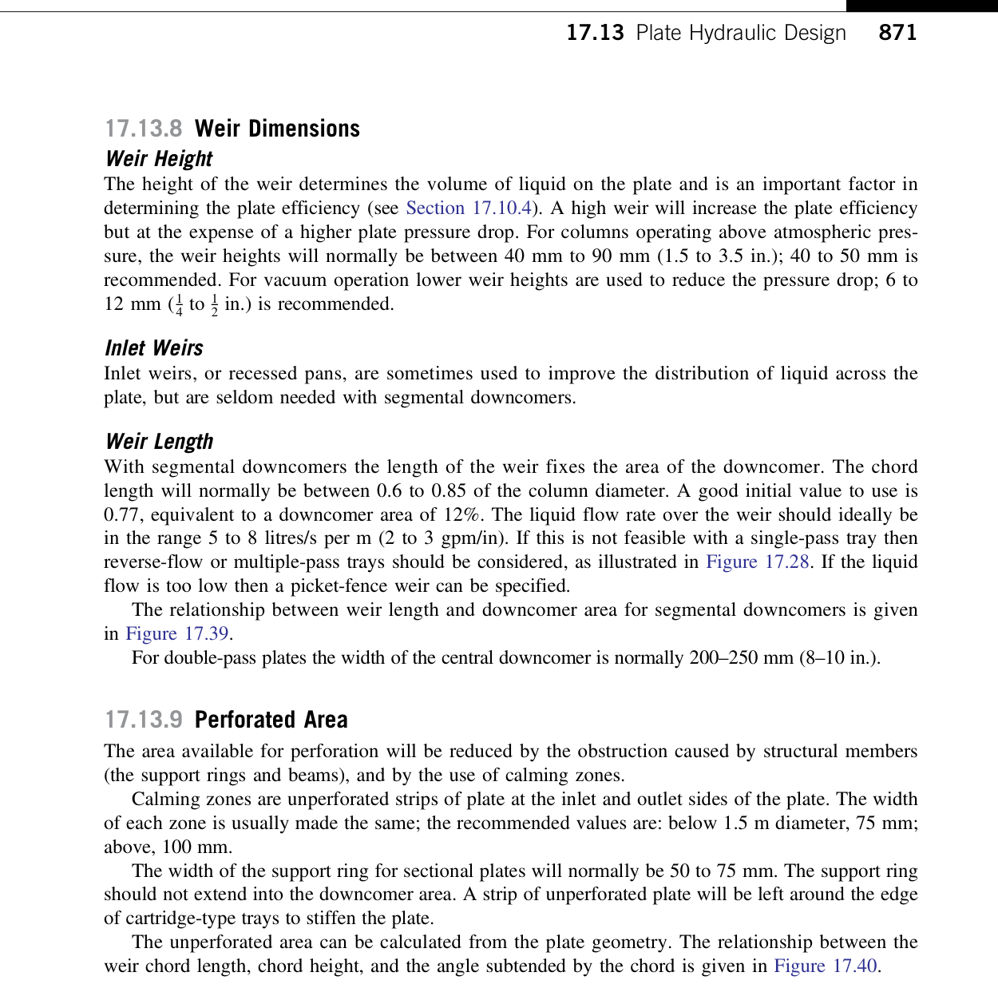

* **Abscissa (Flow Parameter)**:
  $$F_{LV} = \frac{L_w}{V_w} \sqrt{\frac{\rho_V}{\rho_L}}$$
* **Ordinate (Capacity Parameter)**:
  $$Y = \frac{u_0^2 F_p \mu_L^{0.1}}{g \rho_V} \left(\frac{\rho_L}{\rho_w}\right)^{-1}$$
  where $F_p$ is the empirical **Packing Factor** ($\text{m}^{-1}$), specific to packing type and size.
* **Height Equivalent to a Theoretical Plate (HETP)**:
  $$Z_{bed} = N_{theoretical} \times \text{HETP}$$
  * Structured packing: $\text{HETP} \approx 0.3 - 0.5\text{ m}$.
  * Random packing (50mm Pall rings): $\text{HETP} \approx 0.6 - 0.9\text{ m}$.
