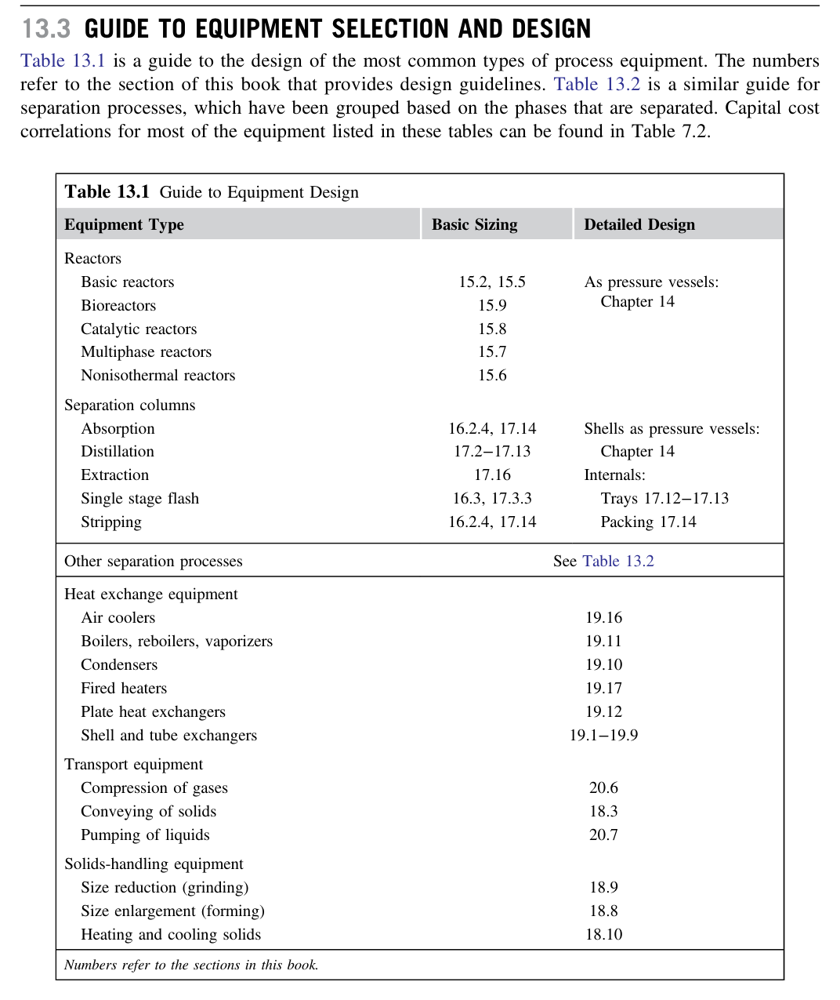

# Equipment Selection, Specification, and Design

This skill synthesizes equipment specification workflows, proprietary vs. non-proprietary selection criteria, design safety margins, and specification sheets from Chapter 13 of *Chemical Engineering Design* (Towler & Sinnott, 2nd Edition, pp. 566–570).

---

## 1. Proprietary vs. Non-Proprietary Process Equipment

Chemical process equipment is divided into two distinct engineering classes:

### 1.1 Proprietary Equipment (Standard Catalog Items)
* **Definition**: Equipment designed, rated, warrantied, and sold as standard catalog items by specialist manufacturers.
* **Examples**: Centrifugal and positive displacement pumps, gas compressors, centrifuges, rotary drum vacuum filters, cyclones, plate heat exchangers, refrigeration packages, and solids conveyors.
* **Chemical Engineer's Role**:
  * Determine the process duty: flow rate ($\dot{m}$), total dynamic head ($\Delta H$), operating $T$ and $P$, fluid physical properties (viscosity, density, solids loading), and corrosion requirements.
  * Select standard vendor catalog model sizes that meet the operating requirements.
  * Consult with equipment vendors to verify performance curves, materials compatibility, and seal selections.
  * Never design proprietary equipment from first principles when standard, off-the-shelf units are available (standard units reduce lead time, capital cost, and mechanical risk).

### 1.2 Non-Proprietary Equipment (Custom Fabricated Items)
* **Definition**: Custom, one-off equipment designed specifically for a unique process duty and fabricated to order by qualified vessel fabricators.
* **Examples**: Chemical reactors, distillation and absorption columns, flash drums, knock-out pots, liquid-liquid decanters, and shell-and-tube heat exchangers.
* **Chemical Engineer's Role**:
  * Perform the process sizing: determine vessel volume, diameter, height, number of theoretical stages, tray type and spacing, heat transfer surface area, tube count and pitch, baffle cuts, nozzle locations, and internals layout.
  * Prepare formal **Process Data Sheets** and sketches.
  * Transmit specification sheets to mechanical engineering specialists and ASME/TEMA fabricators for structural wall thickness calculations, wind/seismic load analysis, and nozzle reinforcement design.

---

## 2. Equipment Selection & Design Guides

The textbook provides two comprehensive master tables mapping equipment classes to their sizing and detailed design methodologies:

### 2.1 Guide to Equipment Design (Table 13.1)
Maps all major unit operation types (Reactors, Separation Columns, Heat Exchangers, Storage Vessels, Solids Handling, Fluid Transport) to their design procedures and mechanical standards:

### 2.2 Guide to Separation Processes (Table 13.2)
Categorizes industrial separation technologies by the physical phases being separated (Gas-Gas, Gas-Liquid, Liquid-Liquid, Solid-Liquid, Gas-Solids, Solid-Solid, and Dissolved Components):

---

## 3. Standard Design Margins & Safety Factors

Chemical process equipment is never sized for bare nominal flowsheet conditions. Designers apply standard **overdesign allowances**:

| Equipment Type | Parameter | Recommended Overdesign Margin | Rationale |
| :--- | :--- | :--- | :--- |
| **Pumps** | Volumetric Flow ($Q$) | $+10\%$ to $+20\%$ | Allows control valve throttling authority and debottlenecking. |
| | Total Head ($H$) | $+10\%$ to $+15\%$ | Compensates for pipe wall fouling and aging. |
| **Compressors**| Volumetric Flow ($Q$) | $+10\%$ to $+15\%$ | Accommodates molecular weight variations and off-design feeds. |
| **Heat Exchangers** | Surface Area ($A$) | $+15\%$ to $+25\%$ | Fouling allowance ($R_f$) between maintenance cleanings. |
| **Columns** | Vapor Area ($A_n$) | Design at $75\% - 85\%$ of Fair's flooding velocity | Provides stable operating margin below the jet flooding boundary. |
| **Vessels / Drums**| Liquid Holdup Volume | 5 to 10 minutes normal; 15 min column feed | Buffer capacity to absorb upstream disturbances without tripping. |
| **Pressure Vessels**| Design Pressure ($P_{des}$)| $\max(P_{op} + 1.7\text{ bar}, 1.10 P_{op})$ | ASME Boiler and Pressure Vessel Code (Section VIII) margin. |
| | Design Temperature ($T_{des}$)| $T_{op} + 25^\circ\text{C}$ to $T_{op} + 50^\circ\text{C}$ | Prevents metal yield stress reduction during thermal excursions. |

---

## 4. Equipment Specification Data Sheets

The exchange of design specifications between operating companies, EPC contractors, and equipment fabricators is standardized through **Equipment Data Sheets**:
1. **Title Header**: Equipment tag number (e.g., **C-101**, **E-204**), equipment name, service description, P&ID reference number, project number, design code (ASME Section VIII, TEMA, API 610, API 650).
2. **Operating Conditions**: Normal, minimum, and design temperature and pressure; heat duty; operating fluid physical properties (density, viscosity, vapor pressure, corrosive contaminants).
3. **Materials of Construction**: Shell material (e.g. Carbon Steel SA-516 Gr. 70, 316L Stainless Steel), tube/internals metallurgy, corrosion allowance (typically $1.5 - 3.0\text{ mm}$ for carbon steel; $0\text{ mm}$ for stainless steel).
4. **Nozzle Schedule**: Size, rating (150#, 300#, 600# RF flange), and service of all inlet, outlet, vent, drain, relief valve, and instrument connections.
