# Separation of Fluids (Phase Separators & Gravity Decanters)

This skill provides an authoritative, textbook-grounded reference on gas-liquid phase separators, mist eliminator sizing, and liquid-liquid gravity decanters, based directly on Chapter 16 of *Chemical Engineering Design* (Towler & Sinnott, 2nd Edition, pp. 762–814).

---

## 1. Gas-Liquid Phase Separation Fundamentals

Gas-liquid separation relies on density differences ($\Delta \rho = \rho_L - \rho_v$) to disengage entrained liquid droplets from a continuous vapor stream under gravity.

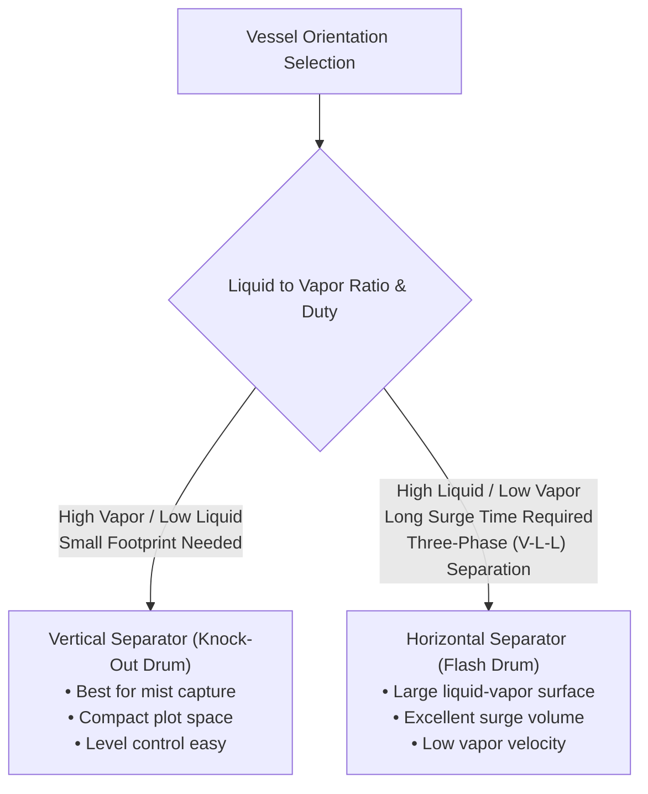

### 1.1 Vessel Orientation Criteria
* **Vertical Separators (Figure 16.11)**:
  * Preferred when vapor volume is large compared to liquid volume.
  * Occupies minimum plant footprint.
  * Liquid level control is more sensitive and easier to maintain.
  * Liquid droplets fall counter-current to the upward vapor flow.
* **Horizontal Separators (Figure 16.12)**:
  * Preferred when large liquid holdup or surge capacity is needed (e.g. compressor suction drums, refrigeration flash tanks).
  * Ideal for three-phase separation (vapor, light hydrocarbon, heavy water phase with boot).
  * Droplets settle perpendicularly across a cross-flowing horizontal vapor stream, significantly reducing required vertical disengagement height.

---

## 2. Terminal Settling Velocity & The Souders-Brown Equation

A suspended liquid droplet in a rising gas stream accelerates until the gravitational force minus buoyancy equals the aerodynamic drag force:

### 2.1 Drag Regimes & Droplet Terminal Settling Velocity ($u_t$)
1. **Stokes' Law Regime ($Re_p < 0.2$, fine mist droplets $d_p < 50\ \mu\text{m}$)**:
   $$u_t = \frac{g d_p^2 (\rho_L - \rho_v)}{18 \mu_v}$$
2. **Intermediate Regime ($0.2 < Re_p < 500$, typical droplets $50\ \mu\text{m} < d_p < 1000\ \mu\text{m}$)**:
   $$u_t = 0.153 \frac{g^{0.71} d_p^{1.14} (\rho_L - \rho_v)^{0.71}}{\rho_v^{0.29} \mu_v^{0.43}}$$
3. **Newton's Law Regime ($Re_p > 500$, coarse droplets $d_p > 1000\ \mu\text{m}$)**:
   $$u_t = 1.74 \sqrt{\frac{g d_p (\rho_L - \rho_v)}{\rho_v}}$$

---

### 2.2 Maximum Allowable Vapor Velocity (The Souders-Brown Formulation)
In industrial practice, design vapor velocity is evaluated using the classic Souders-Brown equation (Equation 16.5 / 16.6):

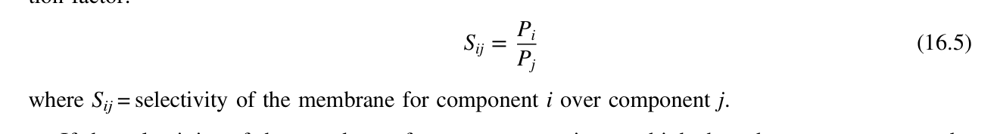

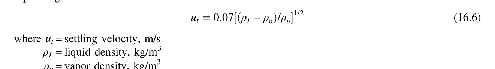

$$u_v = K_{SB} \sqrt{\frac{\rho_L - \rho_v}{\rho_v}}$$
$$\text{Where:}$$
* $u_v$ = Maximum allowable superficial vapor velocity ($\text{m/s}$)
* $\rho_L, \rho_v$ = Liquid and vapor densities at operating conditions ($\text{kg/m}^3$)
* $K_{SB}$ = Souders-Brown empirical design parameter ($\text{m/s}$)

#### Textbook $K_{SB}$ Heuristic Values (Towler & Sinnott, Section 16.3):
| Separator Configuration | Design $K_{SB}$ ($\text{m/s}$) | Design $K_{SB}$ ($\text{ft/s}$) | Typical Droplet Cut Size ($d_p$) |
| :--- | :--- | :--- | :--- |
| **Vertical drum, no demister pad** | $0.035 - 0.060$ | $0.11 - 0.20$ | Disengages droplets $\ge 100 - 150\ \mu\text{m}$ |
| **Vertical drum with knitted wire mesh demister** | **$0.070 - 0.107$** | **$0.23 - 0.35$** | Captures $99\%$ of droplets $\ge 5 - 10\ \mu\text{m}$ |
| **Horizontal drum, vapor space** | $0.100 - 0.150$ | $0.33 - 0.50$ | Cross-flow gravity disengagement |
| **High-Pressure Derating ($P > 7\text{ bar}$)** | $K = K_0 [1 - 0.005(P - 7)]$ | Reduces $K$ at elevated pressure due to reduced surface tension |

---

### 2.3 Demister Pads (Mist Eliminators)
Knitted wire mesh demisters (Figure 16.11) consist of interlocking asymmetric loops of wire (stainless steel, Monel, polypropylene) with $97\% - 99\%$ void fraction.
* **Mechanism**: Fine droplets ($1 - 10\ \mu\text{m}$) cannot follow the tortuous gas streamlines, impact on wire surfaces, coalesce into larger drops, and drain downward against the rising gas.
* **Operating Velocity Limits**:
  * *Minimum Velocity*: $u_{min} \approx 0.3 u_v$ (below which inertial impaction is inefficient).
  * *Maximum Velocity*: $u_{max} \approx 1.05 u_v$ (above which re-entrainment of accumulated liquid occurs).
* **Thickness & Pressure Drop**: Standard pad thickness is $100 - 150\text{ mm}$ ($4 - 6\text{ in.}$); clean pressure drop is negligible ($\Delta P \approx 25 - 50\text{ mm } H_2O \approx 0.25 - 0.5\text{ kPa}$).

---

## 3. Step-by-Step Separator Sizing Procedures

### 3.1 Vertical Gas-Liquid Separator (Figure 16.11)

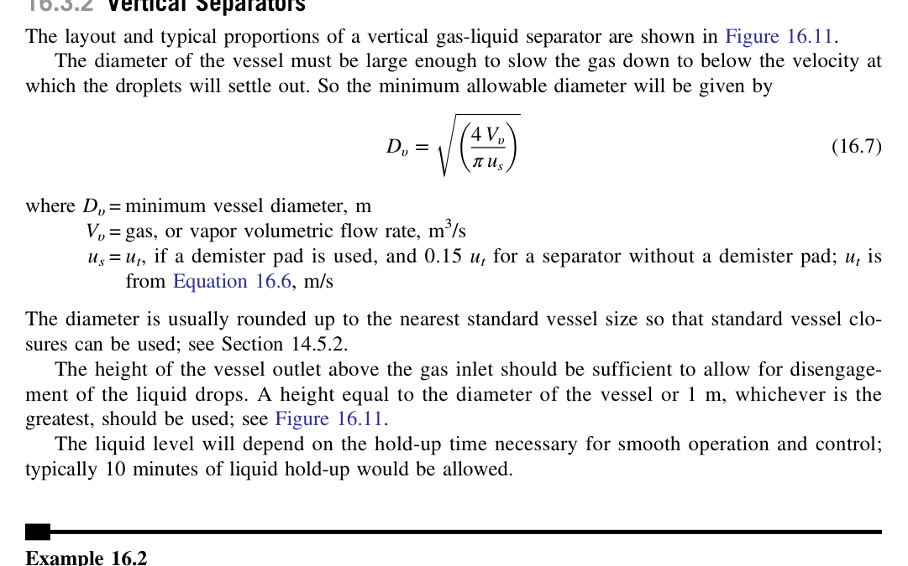

#### Step 1: Calculate Design Vapor Velocity ($u_v$)
Select $K_{SB} = 0.107\text{ m/s}$ (with mesh demister) or $0.05\text{ m/s}$ (bare drum). Evaluate:
$$u_v = K_{SB} \sqrt{\frac{\rho_L - \rho_v}{\rho_v}}$$
Set operating superficial velocity: $u_{oper} = 0.75 - 0.85\ u_v$.

#### Step 2: Calculate Required Vessel Cross-Sectional Area & Diameter
$$A_v = \frac{\dot{V}_v}{u_{oper}} = \frac{\dot{m}_v}{\rho_v u_{oper}} \implies D_v = \sqrt{\frac{4 A_v}{\pi}}$$
Round $D_v$ up to the nearest standard nominal diameter ($50\text{ mm}$ or $2\text{ in.}$ increments).

#### Step 3: Determine Liquid Holdup Volume & Surge Time
From process requirements, select liquid holdup time $t_{hold}$:
* Reflux drum / general feed drum: $5\text{ to } 10\text{ minutes}$.
* Feed drum to fired heater / furnace: $15\text{ to } 20\text{ minutes}$.
* Compressor suction knockout: $3\text{ to } 5\text{ minutes}$ slug capacity.

Calculate required liquid volume:
$$V_L = \dot{V}_L \times t_{hold}$$
Liquid height in cylindrical shell:
$$h_L = \frac{V_L}{(\pi D_v^2 / 4)}$$

#### Step 4: Vertical Clearances & Total Vessel Height ($H$)
1. **Low Liquid Level to Bottom Tan Line**: Minimum $0.2 - 0.3\text{ m}$ (or 1 minute holdup).
2. **Liquid Holdup Range ($h_L$, Low to High Level Alarms)**: Calculated from Step 3 (minimum $0.6\text{ m}$).
3. **High Liquid Level to Feed Inlet Nozzle**: Minimum $0.3\text{ m}$ (or $0.5 D_v$).
4. **Feed Inlet Nozzle to Demister Pad Bottom**: Minimum $0.6 - 0.9\text{ m}$ (inlet impingement baffle redirects flow downward).
5. **Demister Pad Thickness**: $0.15\text{ m}$.
6. **Demister Pad Top to Top Tan Line**: Minimum $0.3 - 0.6\text{ m}$.
7. **Aspect Ratio Check**: Overall tangent-to-tangent height $H = \sum h_i$. Verify $L/D_v = H/D_v$ is between **$2.5$ and $4.0$** (optimal for pressure vessel fabrication economics).

---

### 3.2 Horizontal Gas-Liquid Separator (Figure 16.12)

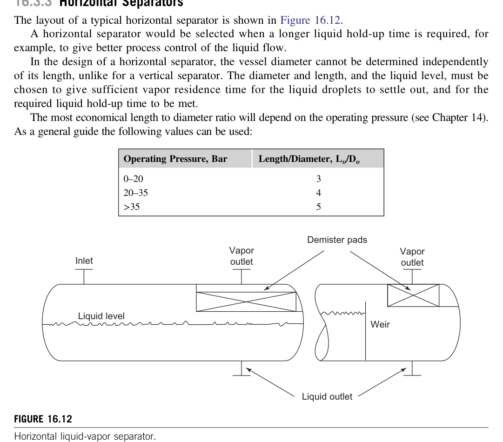

#### Step 1: Vessel Volume Allocation
A horizontal drum is operated typically half-full of liquid ($50\%$ vapor area, $50\%$ liquid area at normal liquid level):
$$A_L = A_v = 0.5 \left(\frac{\pi D_v^2}{4}\right)$$

#### Step 2: Liquid Holdup & Dimensions
$$V_L = \dot{V}_L \times t_{hold} = A_L L \implies L = \frac{V_L}{0.5 (\pi D_v^2 / 4)}$$
Set $L/D_v$ aspect ratio between **$3.0$ and $5.0$**:
$$L = 3 D_v \text{ to } 5 D_v \implies D_v = \left(\frac{2 V_L}{\pi (L/D_v)}\right)^{1/3}$$

#### Step 3: Check Vapor Disengagement & Droplet Settling
* Vapor horizontal velocity:
  $$u_{v,horiz} = \frac{\dot{V}_v}{A_v} = \frac{\dot{V}_v}{0.5 (\pi D_v^2 / 4)}$$
* Vapor residence time across drum length $L$:
  $$t_{res} = \frac{L}{u_{v,horiz}}$$
* Vertical droplet settling time from drum crown to liquid interface ($h_v = D_v / 2$):
  $$t_{settle} = \frac{D_v / 2}{u_t(d_p = 100\ \mu\text{m})}$$
* **Criterion**: Require $t_{res} \ge t_{settle}$ (vapor residence time must exceed droplet fallout time).

---

## 4. Liquid-Liquid Separation: Gravity Decanters

When two immiscible liquids (e.g. oil/water, hydrocarbon/aqueous wash) are mixed, they form a dispersion that separates into two continuous liquid phases under gravity in a continuous decanter.

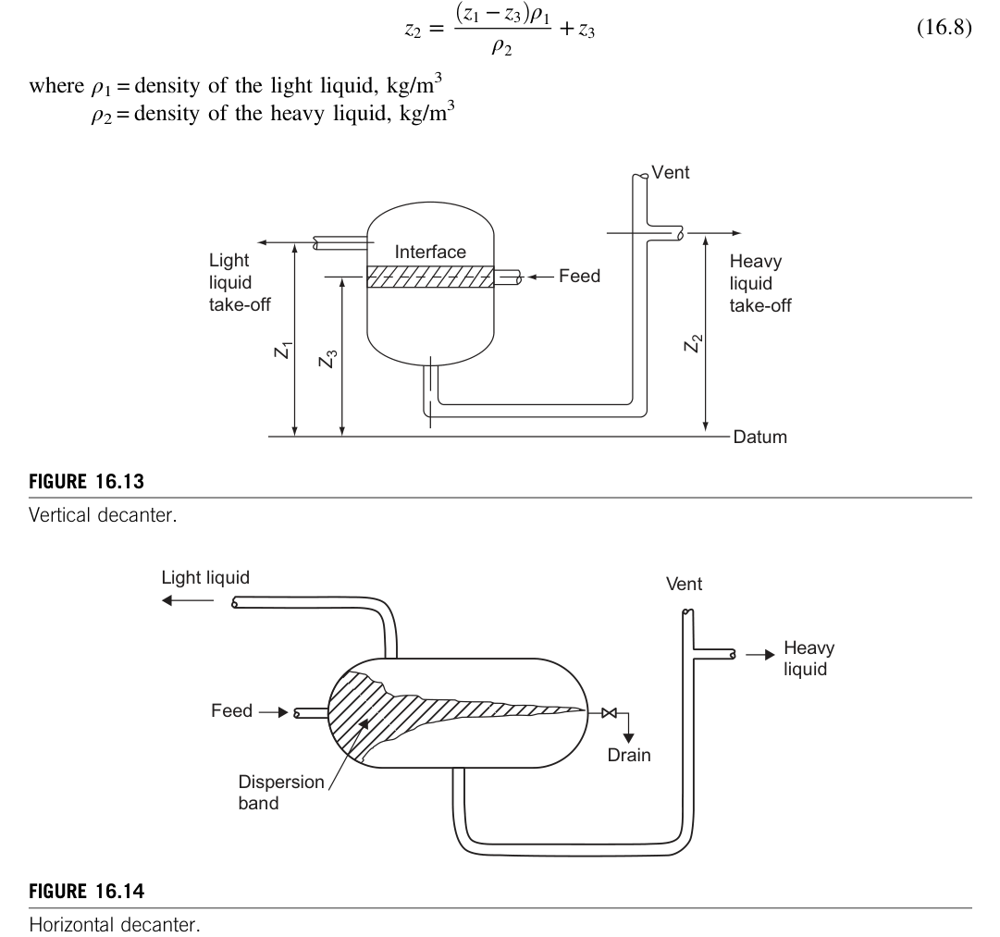

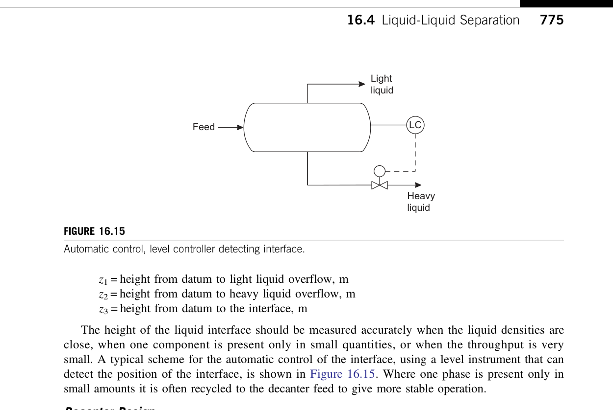

### 4.1 Stokes' Settling of Dispersed Droplets
The terminal velocity of droplets of dispersed phase (density $\rho_d$, diameter $d_p$) settling through continuous phase (density $\rho_c$, dynamic viscosity $\mu_c$) is governed by Stokes' Law:

$$u_d = \frac{g d_p^2 |\rho_c - \rho_d|}{18 \mu_c}$$
* For design, assume minimum droplet size $d_p = 150\ \mu\text{m}$ ($0.00015\text{ m}$) unless experimental emulsion data is available.

---

### 4.2 Decanter Vessel Sizing Algorithm
1. **Decanter Horizontal Area ($A_{dec}$)**:
   The continuous phase superficial horizontal velocity $u_c$ must not re-entrain settling droplets:
   $$u_c = \frac{\dot{V}_c}{A_{flow}} \le 0.8 u_d$$
   The minimum interfacial settling area:
   $$A_{interface} \ge \frac{\dot{V}_d + \dot{V}_c}{u_d}$$
2. **Residence Time Heuristic**:
   * Clean hydrocarbon / water mixtures: $5\text{ to } 10\text{ minutes}$.
   * High viscosity or small density difference ($\Delta \rho < 50\text{ kg/m}^3$): $15\text{ to } 30\text{ minutes}$.
3. **Decanter Geometry**:
   * For horizontal decanter: diameter $D_v$, length $L = 3 D_v$ to $5 D_v$. Liquid-liquid interface maintained at approximately $0.5 D_v$.

---

### 4.3 Hydrostatic Weir Height Formulation
Continuous decanters use gravity overflow weirs to maintain a stable, fixed interface position without complex active control loops.

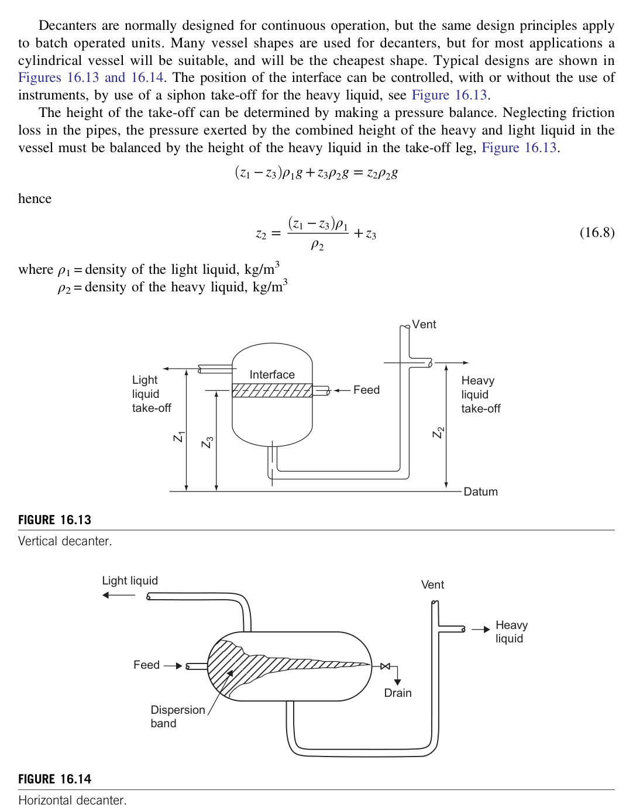

Balancing hydrostatic pressure heads at the datum level of the heavy-phase bottom outlet gives Equations 16.9–16.11:

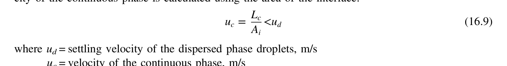

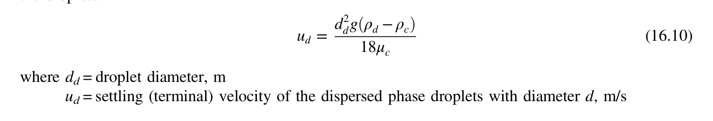

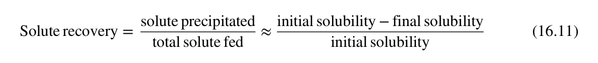

$$h_1 \rho_H = h_2 \rho_H + (h_1 - h_2) \rho_L$$
Rearranging to solve for the heavy-liquid overflow weir height ($h_2$):

$$h_2 = \frac{h_1 \rho_H - (h_1 - h_i) \rho_L}{\rho_H}$$

$$\text{Or in terms of interface height } z_i \text{ from datum:}$$
$$z_H = z_L + \left(\frac{\rho_L}{\rho_H}\right) (z_i - z_L)$$

$$\text{Where:}$$
* $\rho_H, \rho_L$ = Densities of heavy and light liquid phases ($\text{kg/m}^3$)
* $h_1$ (or $z_L$) = Height of the light-liquid overflow weir above bottom datum ($\text{m}$)
* $h_2$ (or $z_H$) = Height of the heavy-liquid overflow weir above bottom datum ($\text{m}$)
* $h_i$ (or $z_i$) = Desired position of liquid-liquid interface ($\text{m}$)

> [!IMPORTANT]
> Both the light and heavy phase overflow legs must be fitted with **anti-siphon balance vents** connected back to the vessel vapor space (or atmosphere) to prevent atmospheric siphon drainage of the vessel contents.

---

### 4.4 Coalescing Filters for Secondary Haze Separation
When droplets are smaller than $50\ \mu\text{m}$, gravity settling is uneconomically slow. A **coalescing filter** (Figure 16.16) is used:

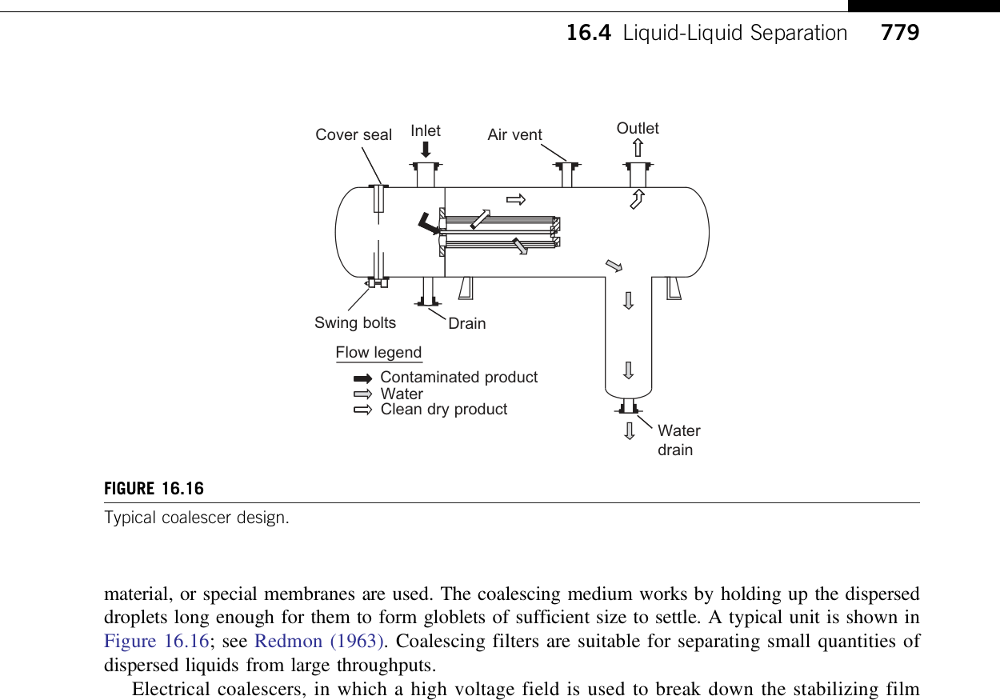

* Fine droplets impinge on glass fiber or polymer matrices, wet the fibers, coalesce into large droplets ($> 1000\ \mu\text{m}$), and separate rapidly in a downstream gravity sump.

---

## 5. Visualcheme Implementation Architecture

1. **State Variables**: Model flash drums and decanters with liquid holdup level ($h_L$), interface level ($z_i$), phase densities ($\rho_v, \rho_L, \rho_H$), and vapor superficial velocity ($u_{oper}$).
2. **Interactive Visualization Gradients**:
   * *Velocity Profile Gradient*: Color code vapor space by local velocity versus $u_v$ limit ($< 80\%$ green, $80-100\%$ amber, $> 100\%$ red for entrainment).
   * *Droplet Fallout Trajectory*: Plot parabolic droplet gravity settling trajectories inside horizontal drums.
   * *Hydrostatic Pressure Gradient*: Color code decanter liquid height demonstrating hydrostatic equilibrium across the heavy-liquid seal leg.
3. **Preset Scenarios**:
   * *Compressor Suction K.O. Drum*: Gas rate $15,000\text{ kg/h}$, wire mesh demister pad, $K_{SB} = 0.107\text{ m/s}$.
   * *Oil-Water Gravity Decanter*: $\rho_L = 800\text{ kg/m}^3$, $\rho_H = 1000\text{ kg/m}^3$, interface at $50\%$ height.
