# Transport and Storage of Fluids (Piping, Pumps & Compressors)

This skill provides an authoritative, detailed, textbook-grounded reference on fluid flow in pipes, frictional pressure drop, economic pipe sizing, centrifugal pumps, cavitation prevention (NPSH), and gas compressors, based directly on Chapter 20 of *Chemical Engineering Design* (Towler & Sinnott, 2nd Edition, pp. 1216–1272).

---

## 1. Pipeline Fluid Dynamics & Frictional Pressure Drop

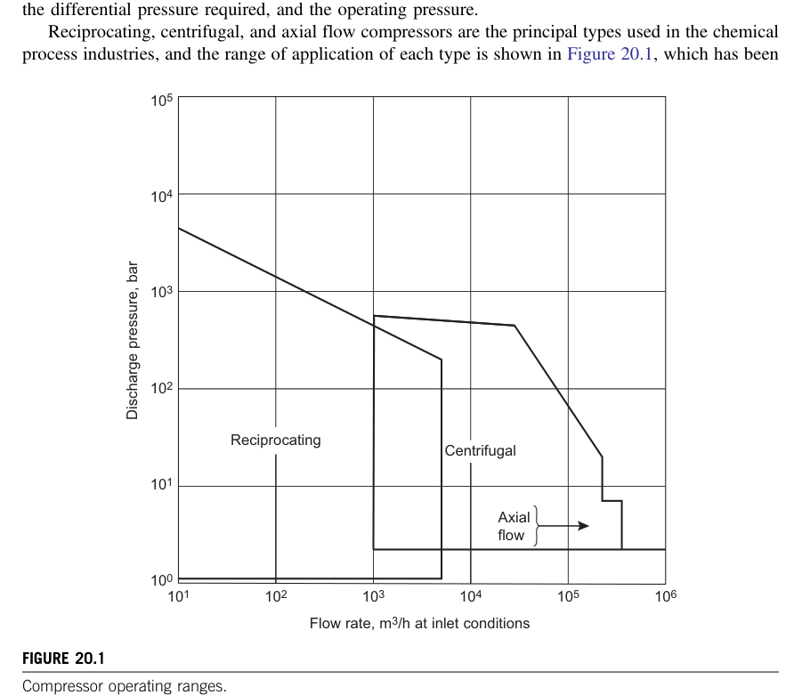

### 1.1 The Darcy-Weisbach Equation
The fundamental equation for pressure loss due to wall friction in circular pipes of diameter $D$ and length $L$:

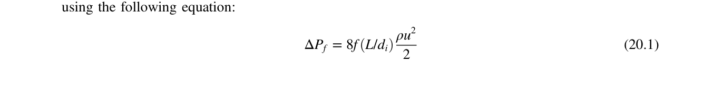

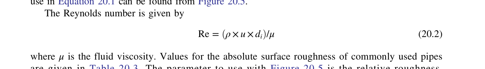

$$\Delta P_f = f \left(\frac{L}{D}\right) \left(\frac{\rho v^2}{2}\right) \quad [\text{Pa}]$$
In terms of frictional head loss $h_f$:
$$h_f = \frac{\Delta P_f}{\rho g} = f \left(\frac{L}{D}\right) \left(\frac{v^2}{2g}\right) \quad [\text{m}]$$
*(Note: $f$ is the Darcy-Weisbach friction factor; the Fanning friction factor is $f_{Fanning} = f / 4$)*.

---

### 1.2 The Moody Diagram & Friction Factor Formulations

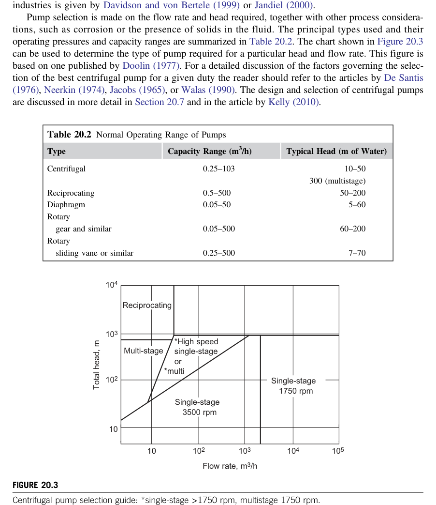

#### 1.2.1 Laminar Flow ($Re < 2100$)

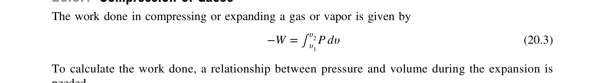

$$f = \frac{64}{Re}$$
Flow is governed strictly by viscous shear; wall roughness $\varepsilon$ has zero effect.

#### 1.2.2 Turbulent Flow ($Re > 4000$)

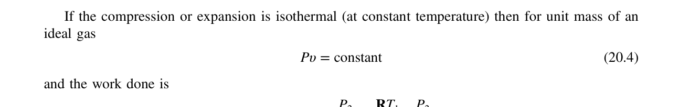

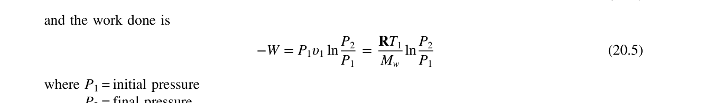

* **Colebrook-White Equation (Implicit Standard)**:
  $$\frac{1}{\sqrt{f}} = -2.0 \log_{10}\left( \frac{\varepsilon / D}{3.7} + \frac{2.51}{Re \sqrt{f}} \right)$$
* **Swamee-Jain Equation (Explicit, $< 1\%$ Error)**:
  $$f = \frac{0.25}{\left[ \log_{10}\left( \frac{\varepsilon / D}{3.7} + \frac{5.74}{Re^{0.9}} \right) \right]^2}$$
* **Churchill Correlation (Continuous Across All Regimes)**:
  Valid seamlessly across laminar, transition, and fully rough turbulent flow:
  $$f = 8 \left[ \left(\frac{8}{Re}\right)^{12} + \frac{1}{(A + B)^{1.5}} \right]^{1/12}$$
  $$A = \left[ 2.457 \ln\left( \frac{1}{(7/Re)^{0.9} + 0.27 (\varepsilon / D)} \right) \right]^{16}, \quad B = \left( \frac{37530}{Re} \right)^{16}$$

---

### 1.3 Minor Losses in Fittings and Valves

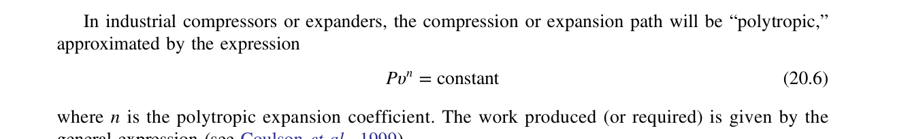

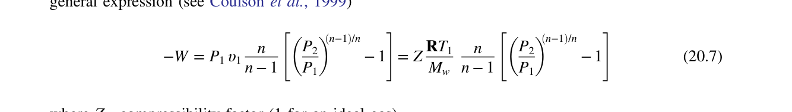

$$\Delta P_{minor} = \sum K \left(\frac{\rho v^2}{2}\right) \quad \text{or} \quad L_{equiv} = \sum \left(\frac{K \cdot D}{f}\right)$$
* Standard $90^\circ$ elbow: $K \approx 0.75$
* Long radius $90^\circ$ elbow: $K \approx 0.45$
* Tee (through flow): $K \approx 0.35$; (branch flow): $K \approx 1.5$
* Gate valve (wide open): $K \approx 0.17$; (half open): $K \approx 4.5$
* Globe valve (wide open): $K \approx 6.0$
* Swing check valve: $K \approx 2.0$

---

## 2. Economic Pipe Diameter Selection

Optimal pipe diameter balances annualized capital cost (piping, fittings, valves, installation) against lifetime operating cost (pumping electricity).

### 2.1 Velocity Rules of Thumb

| Service | Recommended Velocity ($v$) | Allowable $\Delta P / L$ |
| :--- | :--- | :--- |
| **Pump Suction (Liquids)** | $0.5 - 1.2\text{ m/s}$ ($1.5 - 4\text{ ft/s}$) | $10 - 20\text{ kPa}/100\text{m}$ ($0.1 - 0.2\text{ bar/km}$) |
| **Pump Discharge (Liquids)**| $1.2 - 2.5\text{ m/s}$ ($4 - 8\text{ ft/s}$) | $50 - 150\text{ kPa}/100\text{m}$ ($0.5 - 1.5\text{ bar/km}$) |
| **Gases (Moderate Pressure)**| $15 - 30\text{ m/s}$ ($50 - 100\text{ ft/s}$) | $10 - 50\text{ kPa}/100\text{m}$ |
| **Vacuum Vapors** | $30 - 75\text{ m/s}$ | Minimize $\Delta P$ ($< 5\text{ kPa}/100\text{m}$) |
| **High-Pressure Steam** | $25 - 40\text{ m/s}$ | $20 - 50\text{ kPa}/100\text{m}$ |

---

## 3. Centrifugal Pumps & System Hydraulics

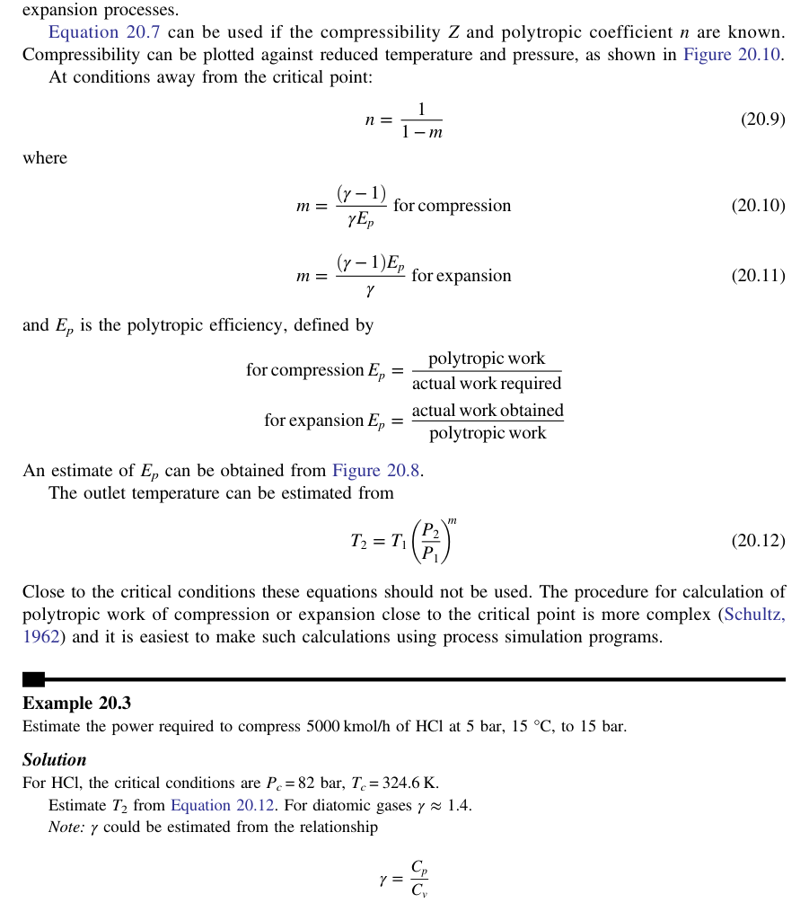

### 3.1 Operating Point Determination
* **System Head Curve ($H_{sys}$)**:
  $$H_{sys}(Q) = \Delta z + \frac{\Delta P_{static}}{\rho g} + k Q^2$$
  where $\Delta z$ is static elevation rise, $\Delta P_{static}$ is differential vessel pressure, and $k Q^2$ represents frictional head losses in piping and fittings.
* **Operating Point**: The intersection where the pump manufacturer's $H-Q$ curve meets the process $H_{sys}(Q)$ curve.
* **Brake Horsepower (BHP / Shaft Power)**:

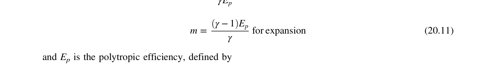

$$P_{shaft} = \frac{\rho g Q H}{\eta_{pump}}$$

---

### 3.2 Net Positive Suction Head (NPSH) & Cavitation

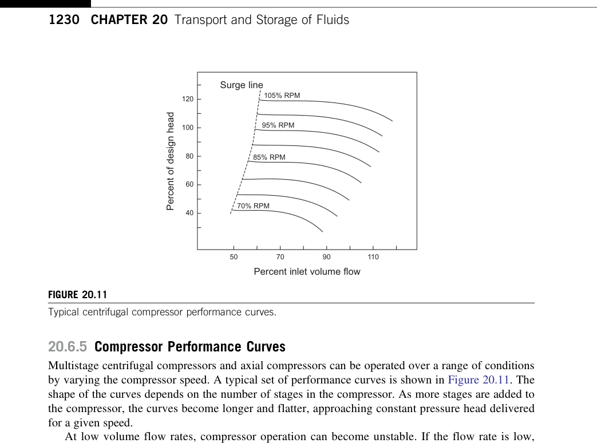

Cavitation occurs when local static pressure at the pump impeller blade suction drops below liquid vapor pressure ($P_{vap}$), causing vapor bubbles to nucleate and collapse violently against metal surfaces.

* **Available NPSH ($NPSH_A$)**:

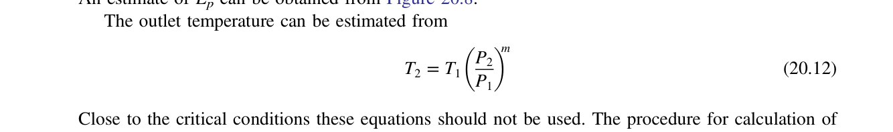

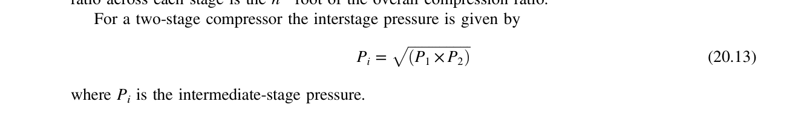

$$NPSH_A = \frac{P_{suction} - P_{vap}}{\rho g} + \frac{v_s^2}{2g} = \frac{P_{vessel} - P_{vap}}{\rho g} \pm z_s - h_{f,suction}$$
* **Design Rule**:
  $$NPSH_A \ge NPSH_R + 0.5\text{ m} \quad (\text{or } 1.5\text{ ft safety margin})$$

### 3.3 Pump Affinity Laws
* Flowrate: $\frac{Q_1}{Q_2} = \frac{N_1}{N_2} = \frac{D_1}{D_2}$
* Head: $\frac{H_1}{H_2} = \left(\frac{N_1}{N_2}\right)^2 = \left(\frac{D_1}{D_2}\right)^2$
* Power: $\frac{P_1}{P_2} = \left(\frac{N_1}{N_2}\right)^3 = \left(\frac{D_1}{D_2}\right)^3$

---

## 4. Gas Compression

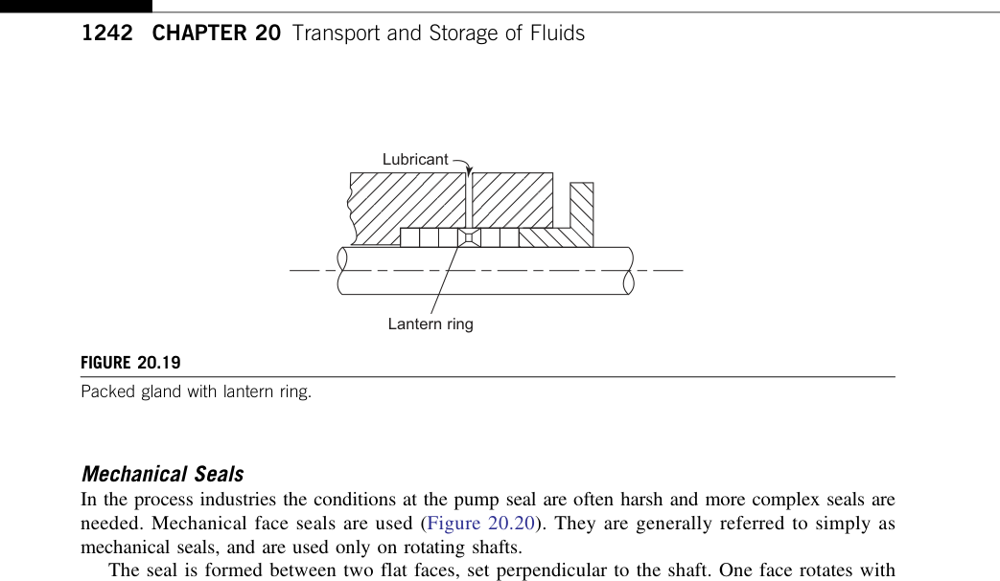

### 4.1 Isentropic Work and Discharge Temperature

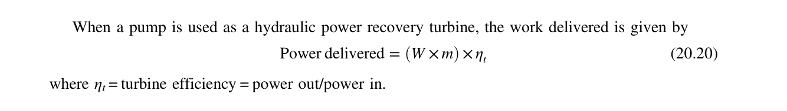

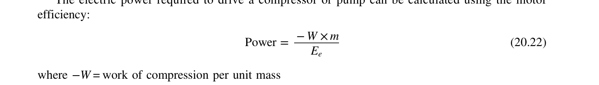

* **Isentropic Work for Ideal Gas**:
  $$W_{is} = \dot{m} \left(\frac{\gamma}{\gamma - 1}\right) R T_1 \left[ \left(\frac{P_2}{P_1}\right)^{\frac{\gamma - 1}{\gamma}} - 1 \right]$$
* **Discharge Temperature**:
  $$T_2 = T_1 \left(\frac{P_2}{P_1}\right)^{\frac{\gamma - 1}{\gamma}}$$
* **Shaft Power**: $P_{shaft} = \frac{W_{is}}{\eta_{is}}$.

### 4.2 Multistage Compression Heuristics
* Limit stage compression ratio: $r_p = P_{out} / P_{in} \le 3.5 - 4.0$.
* Limit stage discharge temperature: $T_{dis} \le 150 - 160^\circ\text{C}$ (to prevent lube oil carbonization and thermal seal breakdown).
* If total pressure ratio $> 4.0$, split into $N$ equal stages ($r_{p,stage} = (P_{final} / P_{initial})^{1/N}$) with intercoolers and knockout drums between stages.
