# Transport and Storage of Fluids (Piping, Pumps, and Compressors)

This skill provides an authoritative, textbook-grounded reference on fluid transport, pipeline hydraulics, pump rating, cavitation mechanics, gas compression, and control valve sizing, based directly on Chapter 20 of *Chemical Engineering Design* (Towler & Sinnott, 2nd Edition, pp. 1216–1272).

---

## 1. Pipeline Fluid Dynamics & Frictional Pressure Drop

Fluid flow through commercial conduits experiences frictional resistance governed by fluid momentum, viscosity, wall roughness, and pipe geometry.

### 1.1 The Darcy-Weisbach Equation
The fundamental governing equation for frictional head and pressure drop in a straight, full pipe of circular cross-section is the **Darcy-Weisbach equation** (Equation 20.1):

$$\Delta P_f = 8 f \left(\frac{L}{d_i}\right) \left(\frac{\rho u^2}{2}\right) = 4 f \left(\frac{L}{d_i}\right) \rho u^2$$
$$\text{Or in head of fluid:}$$
$$h_f = \frac{\Delta P_f}{\rho g} = 4 f \left(\frac{L}{d_i}\right) \left(\frac{u^2}{2 g}\right)$$

> [!NOTE]
> **Fanning vs. Darcy-Weisbach Friction Factor Convention**:
> Towler & Sinnott adopt the **Fanning friction factor** $f$ (common in chemical engineering literature), which is defined as $f = \tau_w / (\frac{1}{2} \rho u^2)$. The Moody/Darcy friction factor $f_D$ used in civil/mechanical engineering is related by $f_D = 4 f$.

---

### 1.2 Flow Regimes & Friction Factor Correlations
Flow is characterized by the dimensionless **Reynolds number**:
$$Re = \frac{\rho u d_i}{\mu} = \frac{u d_i}{\nu}$$

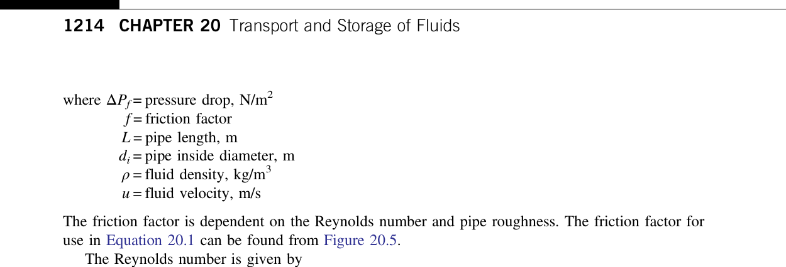

#### 1.2.1 Laminar Regime ($Re < 2000$)
Viscous shear completely dominates; surface roughness has no effect. The friction factor follows the **Hagen-Poiseuille equation** (Equation 20.2):

$$f = \frac{16}{Re}$$

#### 1.2.2 Turbulent Regime ($Re > 4000$)
Turbulent eddies dissipate energy against wall asperities. The friction factor is given by the implicit **Colebrook-White equation** (Equation 20.3):

$$\frac{1}{\sqrt{f}} = -4.0 \log_{10} \left[ \frac{\varepsilon / d_i}{3.7} + \frac{1.255}{Re \sqrt{f}} \right]$$

#### 1.2.3 Universal Explicit Formulation: The Churchill Equation (Equation 20.4)
To avoid implicit root-solving iterations across laminar, transition, and fully turbulent regimes, Churchill (1977) developed a continuous explicit correlation:

$$f = 2 \left[ \left(\frac{8}{Re}\right)^{12} + \frac{1}{(A + B)^{1.5}} \right]^{1/12}$$
$$\text{Where:}$$
$$A = \left[ 2.457 \ln \left( \frac{1}{(7/Re)^{0.9} + 0.27 (\varepsilon / d_i)} \right) \right]^{16}$$
$$B = \left( \frac{37,530}{Re} \right)^{16}$$

#### 1.2.4 Standard Pipe Surface Roughness ($\varepsilon$) (Table 20.2):
* Commercial drawn tubing (brass, copper, plastic): $\varepsilon = 0.0015\text{ mm}$
* Clean commercial carbon steel: $\varepsilon = 0.046\text{ mm}$
* Galvanized steel: $\varepsilon = 0.15\text{ mm}$
* Cast iron: $\varepsilon = 0.26\text{ mm}$
* Corroded / scaled steel: $\varepsilon = 0.5 - 2.0\text{ mm}$

---

### 1.3 Minor Losses in Pipe Fittings and Valves
Flow through bends, tees, reducers, and valves experiences flow separation and secondary vortex dissipation.

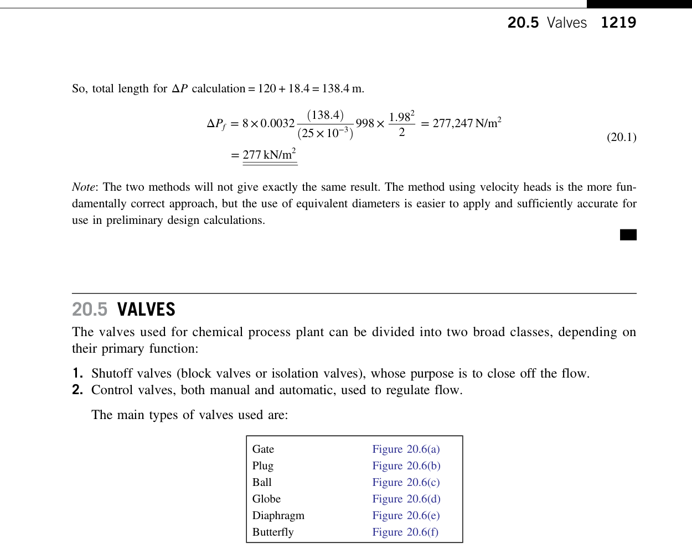

Minor losses are evaluated either via the loss coefficient $K$ or the equivalent length of straight pipe $(L_e/d_i)$:
$$\Delta P_m = K \left( \frac{\rho u^2}{2} \right) = 4 f \left( \frac{L_e}{d_i} \right) \left( \frac{\rho u^2}{2} \right)$$

#### Representative Loss Values (Table 20.4):
* **Gate valve (fully open)**: $K \approx 0.15 - 0.20$, $L_e/d_i \approx 8$
* **Globe valve (fully open)**: $K \approx 6.0 - 10.0$, $L_e/d_i \approx 340$ (high pressure drop, good throttling)
* **Plug / Ball valve (full bore)**: $K \approx 0.05 - 0.10$, $L_e/d_i \approx 3$
* **Standard $90^\circ$ elbow (short radius)**: $K \approx 0.75 - 0.90$, $L_e/d_i \approx 30$
* **Standard $90^\circ$ elbow (long radius)**: $K \approx 0.40 - 0.50$, $L_e/d_i \approx 20$
* **Tee (through branch)**: $K \approx 1.5 - 1.8$, $L_e/d_i \approx 60$
* **Swing check valve**: $K \approx 2.0 - 2.5$, $L_e/d_i \approx 100$

---

## 2. Economic Pipe Diameter Selection

Sizing pipelines involves an economic optimization balancing capital cost (larger pipe = higher pipe, flange, and insulation cost) against operating power cost (smaller pipe = higher velocity = higher frictional head loss and pump electricity consumption).

### 2.1 Velocity Guidelines (Table 20.1)
| Process Fluid Service | Recommended Velocity Range | Technical Design Reason |
| :--- | :--- | :--- |
| **Pump Suction (Liquid)** | **$0.5 - 1.5\text{ m/s}$ ($1.5 - 5\text{ ft/s}$)** | Minimizes suction pressure drop to maximize $NPSH_a$ and prevent cavitation. |
| **Pump Discharge (Liquid)**| **$1.5 - 3.0\text{ m/s}$ ($5 - 10\text{ ft/s}$)** | Economic compromise between pipe capital cost and pumping power. |
| **Gravity Feed (Drain Lines)**| **$0.2 - 0.8\text{ m/s}$ ($0.7 - 2.5\text{ ft/s}$)** | Self-venting flow under low hydrostatic head. |
| **Steam & Process Gas** | **$15 - 30\text{ m/s}$ ($50 - 100\text{ ft/s}$)** | Prevents excessive line pressure drop and acoustic pipe vibration. |
| **Compressor Suction Gas** | **$10 - 20\text{ m/s}$ ($30 - 60\text{ ft/s}$)** | Limits inlet stagnation pressure loss. |
| **Slurries & Suspensions** | **$1.5 - 2.5\text{ m/s}$ ($5 - 8\text{ ft/s}$)** | Above saltation velocity to prevent settling; below erosion threshold. |

---

### 2.2 Sizing Nomographs & Formulations
For turbulent liquid flow, the optimum economic pipe internal diameter $d_{i,opt}$ is evaluated using Equations 20.24 and 20.25:

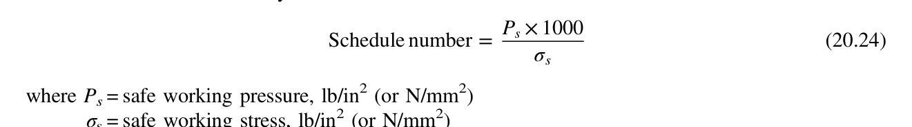

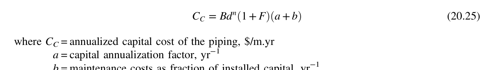

$$d_{i,opt} = C \cdot \dot{m}^{0.45} \cdot \rho^{-0.31}$$

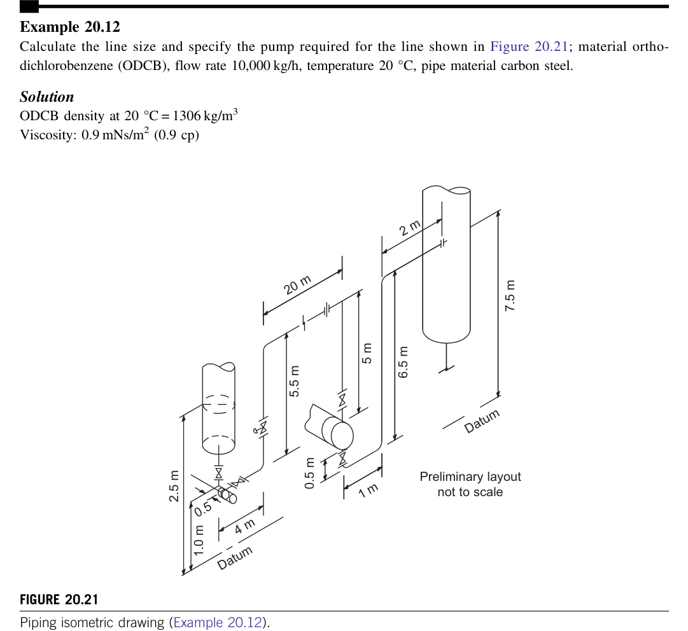

$$\text{Where:}$$
* $\dot{m}$ = Mass flow rate ($\text{kg/s}$)
* $\rho$ = Fluid density ($\text{kg/m}^3$)
* $C$ = Economic factor ($C \approx 0.28 - 0.36$ for carbon steel; $C \approx 0.38 - 0.45$ for stainless steel)
* $d_{i,opt}$ = Optimum pipe inside diameter ($\text{m}$)

---

## 3. Centrifugal Pumps & Hydraulic System Design

Centrifugal pumps convert shaft rotational kinetic energy from an electric motor or steam turbine into fluid static pressure and head via a high-speed rotating impeller and diffuser volute.

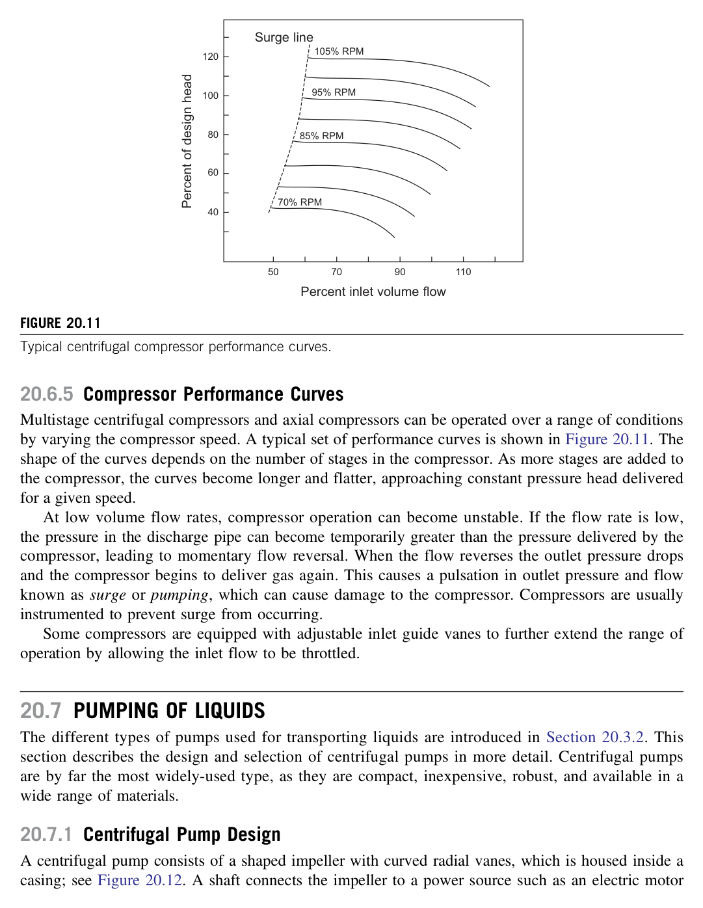

### 3.1 Pump Characteristic Curves ($H-Q$)
Pump manufacturers test pumps at constant rotational speed with water to produce characteristic curves:

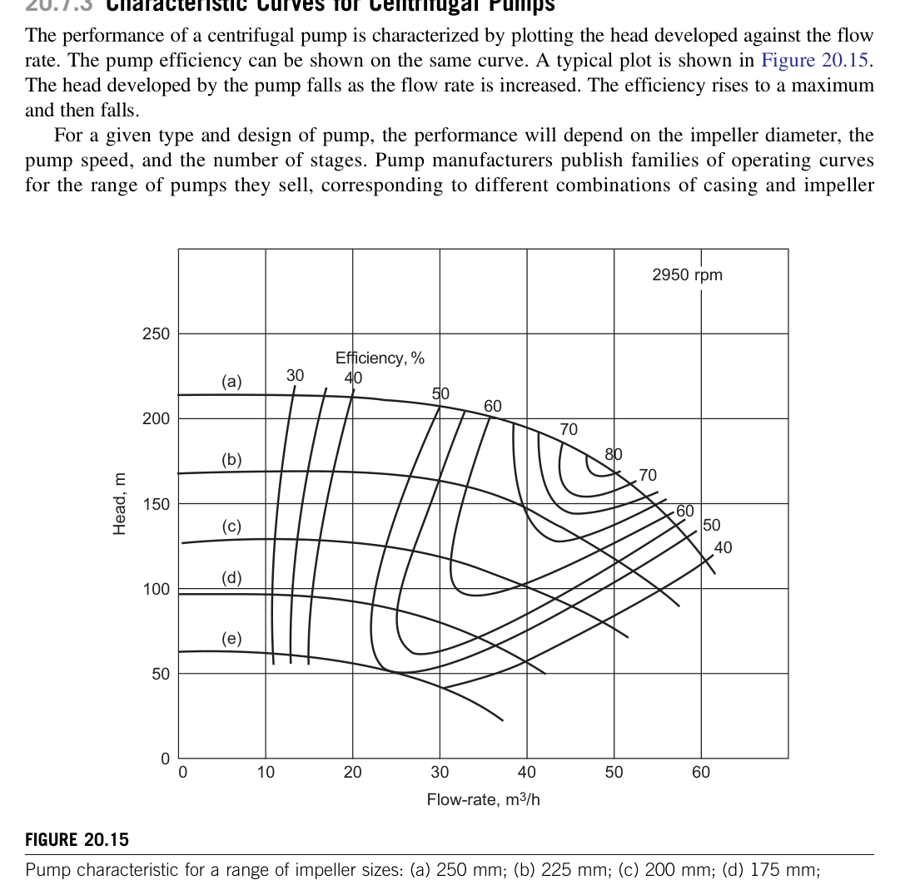

1. **Head-Capacity ($H-Q$) Curve**: Total head developed $H$ falls monotonically as volumetric discharge $Q$ increases.
2. **Efficiency ($\eta_p$) Curve**: Rises to a maximum at the **Best Efficiency Point (BEP)** (typically $65\% - 85\%$) and declines at off-design flows.
3. **Brake Power ($P_B$) Curve**: Shaft work input required by the pump:
   $$P_B = \frac{\dot{m} g H}{\eta_p} = \frac{\rho g Q H}{\eta_p}$$

---

### 3.2 System Resistance Curve & Operating Point
A piping system requires head to overcome static elevation, vessel pressure difference, and pipeline friction:

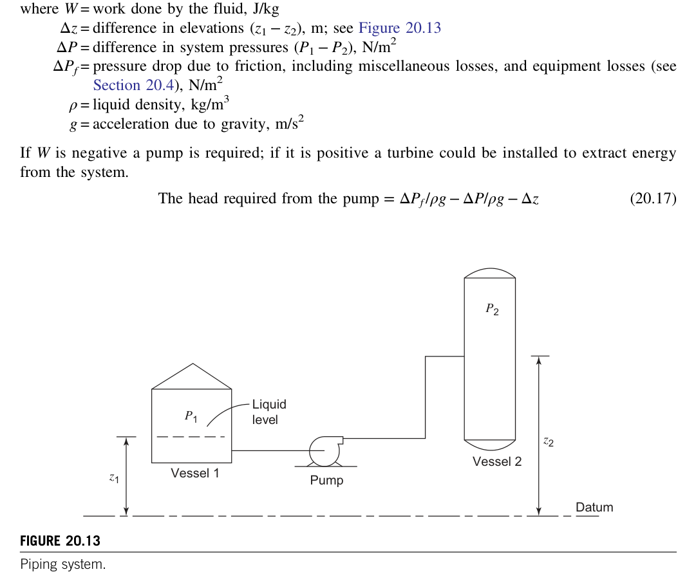

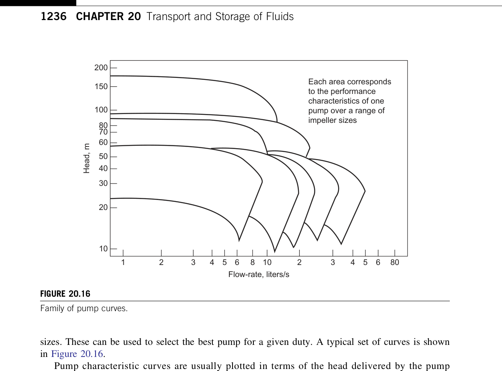

The system head equation (Equation 20.12 / 20.13):

$$H_{sys} = \Delta z + \frac{\Delta P}{\rho g} + \sum h_f + \sum h_m = H_{static} + c Q^2$$
$$\text{Where:}$$
* $H_{static} = (z_2 - z_1) + \frac{P_2 - P_1}{\rho g}$ (independent of flow rate)
* $c Q^2$ = Dynamic frictional and fitting loss (proportional to $Q^2$)
* **Operating Point**: The unique intersection where $H_{pump}(Q) = H_{sys}(Q)$ (Figure 20.16).

---

### 3.3 Net Positive Suction Head (NPSH) & Cavitation Prevention
Cavitation occurs when the local static pressure inside the pump (typically at the impeller eye) drops below the fluid's saturation vapor pressure $P_v$ at operating temperature. Vapor bubbles form instantly, are swept into high-pressure regions within the impeller vanes, and collapse violently ($> 10,000\text{ bar}$ local shockwave), causing severe pitting, metal erosion, vibration, and mechanical seal destruction.

#### 3.3.1 NPSH Available ($NPSH_a$) (Equation 20.15)
The absolute pressure head available at the pump suction nozzle above vapor pressure:

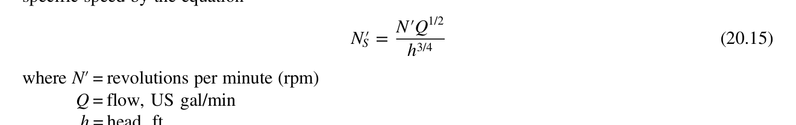

$$NPSH_a = \frac{P_1 - P_v}{\rho g} + z_1 - h_{fs}$$
$$\text{Where:}$$
* $P_1$ = Absolute pressure in suction supply vessel ($\text{N/m}^2$)
* $P_v$ = Fluid saturation vapor pressure at pumping temperature ($\text{N/m}^2$)
* $z_1$ = Liquid level elevation above pump suction centerline ($\text{m}$, positive if vessel is above pump; negative for suction lift)
* $h_{fs}$ = Total frictional and minor head loss in suction line at rated flow ($\text{m}$)

#### 3.3.2 NPSH Required ($NPSH_r$) & Safety Margin
* $NPSH_r$ is determined experimentally by the pump manufacturer as the suction head at which total developed head drops by **$3\%$** due to cavitation inception.
* **Golden Design Rule**:
  $$NPSH_a \ge NPSH_r + \text{Margin}$$
  Where $\text{Margin} \ge \mathbf{0.5\text{ m} - 1.0\text{ m}}$ ($2 - 3\text{ ft}$) for stable liquids; $\ge \mathbf{1.5\text{ m}}$ for boiling hydrocarbons near bubble point.

---

## 4. Gas Compression & Multistage Systems

Compressors increase the pressure of compressible gases for transmission, reaction, or refrigeration.

### 4.1 Thermodynamic Compression Paths
1. **Isentropic Compression (Reversible Adiabatic, $P v^\gamma = \text{constant}$)**:
   $$W_s = \left(\frac{\gamma}{\gamma - 1}\right) Z R T_1 \left[ \left(\frac{P_2}{P_1}\right)^{\frac{\gamma - 1}{\gamma}} - 1 \right]$$
2. **Polytropic Compression ($P v^n = \text{constant}$)**:
   Used for real centrifugal/axial compressors where internal friction adds heat to the gas:

$$\frac{n - 1}{n} = \left(\frac{\gamma - 1}{\gamma}\right) \frac{1}{E_p}$$
$$T_2 = T_1 \left( \frac{P_2}{P_1} \right)^{\frac{n - 1}{n}}$$
$$\text{Where } E_p \text{ is the polytropic efficiency (typically } 0.72 - 0.82\text{)}.$$

---

### 4.2 Multi-Stage Compression with Intercooling
Gas discharge temperature must not exceed **$150^\circ\text{C} - 180^\circ\text{C}$** to prevent lubricating oil breakdown, seal failure, and thermal stress. If the overall pressure ratio $P_{out}/P_{in} > 3.5 - 4.0$, compression must be split across multiple stages with intercoolers:

#### Equal Stage Pressure Ratio Rule (Equation 20.11):
To minimize total shaft power work across $N$ stages with identical intercooling back to suction temperature $T_1$:

$$r_p = \left( \frac{P_{out}}{P_{in}} \right)^{1/N} = \frac{P_2}{P_1} = \frac{P_3}{P_2} = \dots = \frac{P_{N+1}}{P_N}$$

---

## 5. Control Valve Sizing ($C_v$)

Control valves throttle process flow to regulate downstream pressure, level, temperature, or flow rate.

### 5.1 Valve Flow Coefficient ($C_v$)
$C_v$ is defined as the volumetric flow of water at $60^\circ\text{F}$ in US gallons per minute (gpm) that passes through a wide-open valve with a pressure drop of $1.0\text{ psi}$.

#### Liquid Sizing Formulation (Equation 20.31):
$$Q = N_1 F_p C_v \sqrt{\frac{\Delta P}{SG}}$$
$$\text{Or in metric units ($Q$ in $\text{m}^3/\text{h}$, $\Delta P$ in $\text{bar}$, $SG = \rho / 1000$):}$$
$$C_v = 1.16 \cdot Q \sqrt{\frac{SG}{\Delta P}}$$

#### Gas Sizing Formulation (Equation 20.32):
For non-choked subcritical gas flow:

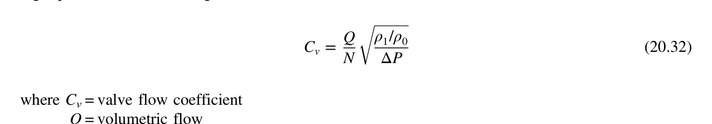

$$W = N_6 F_p C_v Y \sqrt{x P_1 \rho_1}$$
$$\text{Where:}$$
* $x = \Delta P / P_1$ = Pressure drop ratio across valve
* $Y = 1 - \frac{x}{3 F_\gamma x_T}$ = Gas expansion factor ($Y \ge 0.667$)
* $x_T$ = Critical pressure drop ratio factor (typically $0.70 - 0.75$)
* If $x \ge F_\gamma x_T$, flow is **choked** (sonic velocity at vena contracta); flow rate becomes independent of downstream pressure $P_2$.

---

## 6. Visualcheme Implementation Architecture

1. **State Variables**: Model pipeline streams with mass flow $\dot{m}$, pressure $P(x)$, velocity $u(x)$, temperature $T(x)$, Reynolds number $Re$, friction factor $f$, and elevation $z$.
2. **Interactive Visualization Gradients**:
   * *Hydraulic Grade Line (HGL)*: Dynamic spatial curve along pipeline length $z(x) + P(x)/\rho g$, displaying steep pressure gradients across valves, orifice plates, and elbows.
   * *Cavitation Danger Indicator*: Visual bar graph comparing $NPSH_a$ to $NPSH_r$. Flashes red if $NPSH_a - NPSH_r < 0.5\text{ m}$.
   * *Velocity Profile Visualization*: Cross-sectional velocity field displaying parabolic laminar flow ($u(r) = 2 u_{avg}(1 - r^2/R^2)$) transitioning to logarithmic turbulent profile.
3. **Preset Scenarios**:
   * *Boiler Feed Water Pumping*: High pressure discharge ($45\text{ bar}$), multistage centrifugal pump, $NPSH_a = 4.2\text{ m}$.
   * *Natural Gas Transmission Line*: $100\text{ km}$ pipeline, $d_i = 400\text{ mm}$, Colebrook-White friction, compressor station boost.
