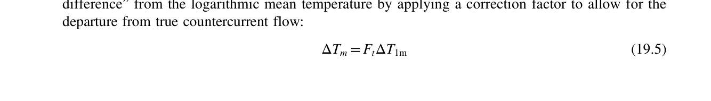
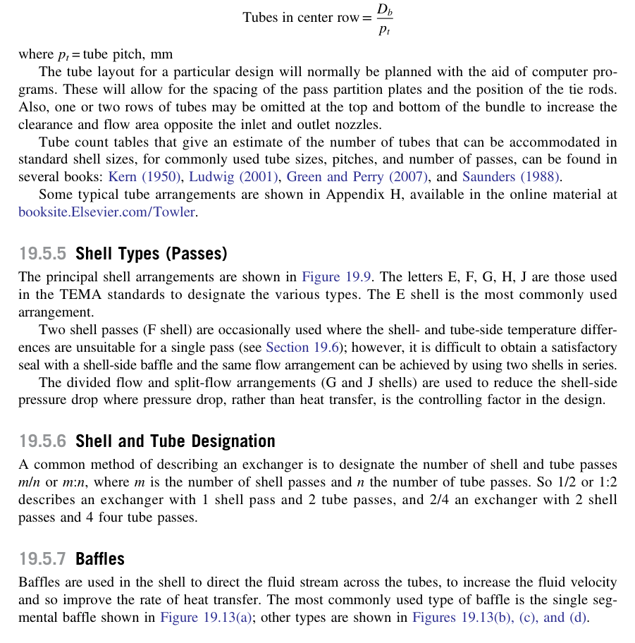
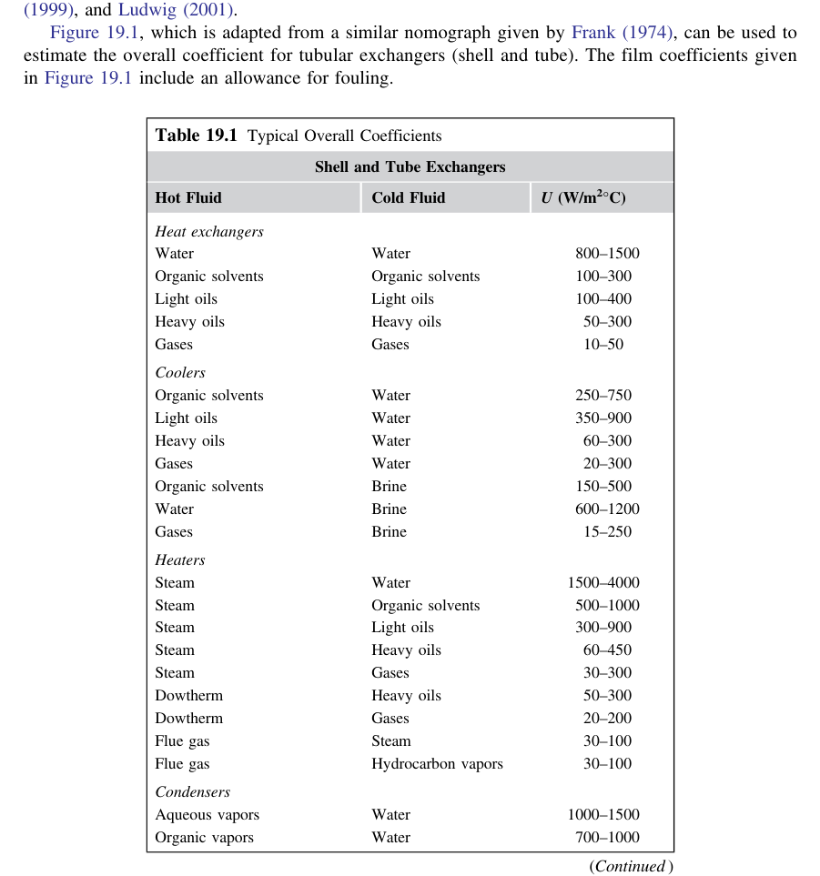
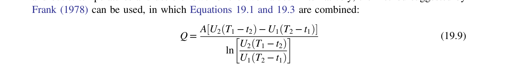
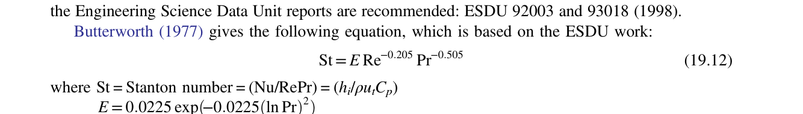
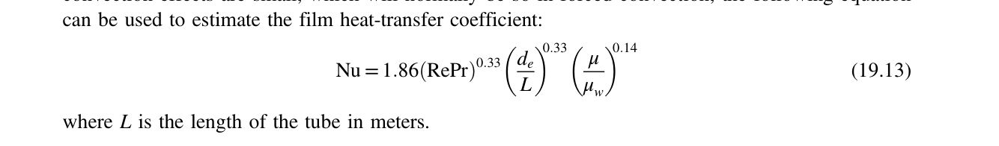
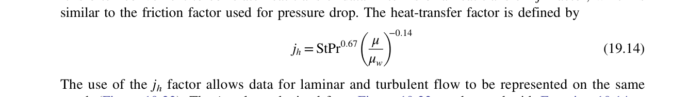
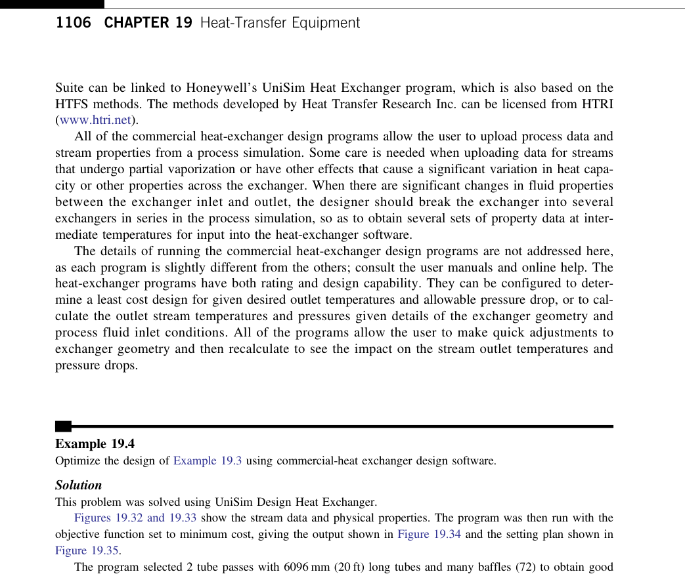
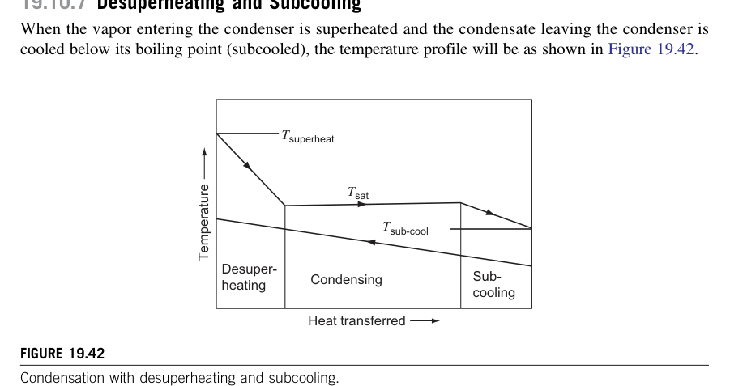

# Heat-Transfer Equipment Design

This skill provides an authoritative, detailed, textbook-grounded reference on thermal sizing, geometry configuration, Kern shortcut rating, Bell-Delaware rigorous stream analysis, condensers, reboilers, and plate heat exchangers, based directly on Chapter 19 of *Chemical Engineering Design* (Towler & Sinnott, 2nd Edition, pp. 1056–1210).

---

## 1. Overall Heat-Transfer Equation & Thermal Sizing

The basic design equation for heat transfer equipment:

$$Q = U \cdot A \cdot \Delta T_m = U \cdot A \cdot (F_T \cdot \Delta T_{lm})$$
where:
* $Q$ = Total heat duty ($\text{W}$)
* $U$ = Overall heat-transfer coefficient ($\text{W}/\text{m}^2\cdot\text{K}$)
* $A$ = Heat transfer area based on outside tube surface ($\text{m}^2$)
* $\Delta T_{lm}$ = Log Mean Temperature Difference for pure countercurrent flow
* $F_T$ = Temperature cross correction factor ($F_T \le 1.0$)

### 1.1 Overall Heat-Transfer Coefficient ($U_o$) Formulation

$$\frac{1}{U_o} = \frac{1}{h_o} + R_{fo} + \frac{d_o \ln(d_o / d_i)}{2 k_w} + \left(\frac{d_o}{d_i}\right) R_{fi} + \left(\frac{d_o}{d_i}\right) \frac{1}{h_i}$$
$$\text{Where:}$$
* $h_o, h_i$ = Shell-side and tube-side fluid film coefficients ($\text{W}/\text{m}^2\cdot\text{K}$)
* $R_{fo}, R_{fi}$ = Shell-side and tube-side fouling resistances ($\text{m}^2\cdot\text{K}/\text{W}$)
* $d_o, d_i$ = Outside and inside tube diameters ($\text{m}$)
* $k_w$ = Thermal conductivity of tube wall metal ($\text{W}/\text{m}\cdot\text{K}$)

---

### 1.2 Log Mean Temperature Difference & $F_T$ Correction Factor

$$\Delta T_{lm} = \frac{(T_1 - t_2) - (T_2 - t_1)}{\ln\left[ \frac{T_1 - t_2}{T_2 - t_1} \right]}$$
For multipass shell-and-tube exchangers (e.g. 1-2 exchanger: 1 shell pass, 2 tube passes), the true mean temperature difference is corrected by $F_T$:

* Dimensionless temperature parameters:
  $$R = \frac{T_1 - T_2}{t_2 - t_1} = \frac{(m C_p)_{cold}}{(m C_p)_{hot}}, \quad P = \frac{t_2 - t_1}{T_1 - t_1}$$
* **Critical Design Constraint**: Never specify an exchanger with $F_T < 0.75$. If $F_T < 0.75$, temperature cross occurs; the design must use multiple shells in series (e.g. two 1-2 shells in series).

---

## 2. Shell-and-Tube Construction & TEMA Standards

### 2.1 TEMA 3-Letter Designation
Identifies stationary front head, shell type, and rear head (e.g., **AES**, **BEM**, **AEL**):
* **Front Head**: **A** (channel with removable cover, standard), **B** (bonnet welded cover, cheap, high pressure).
* **Shell Type**: **E** (one-pass shell, most common), **F** (two-pass shell with longitudinal baffle), **J** (divided flow), **K** (kettle reboiler).
* **Rear Head**: **S** (floating head with backing device, allows thermal expansion and tube bundle removal), **U** (U-tube bundle, cheap thermal expansion, cannot rod tubes mechanically), **M** (fixed tubesheet, low cost, cannot handle differential thermal expansion $> 50^\circ\text{C}$ without expansion joint).

### 2.2 Tube Layout & Pitch
* **Triangular Pitch ($30^\circ \text{ or } 60^\circ$)**: $p_t = 1.25 d_o$. Maximum tube density (highest $A$ per shell volume); higher heat transfer coefficient. Cleaned chemically.
* **Square Pitch ($90^\circ \text{ or } 45^\circ$)**: Continuous cleaning lanes ($> 6.35\text{ mm}$ clearance). Mandatory when shell-side fluid fouls heavily, requiring mechanical rodding or hydroblasting.

---

## 3. Tube-Side Heat Transfer & Pressure Drop

For fluid flowing inside tubes of inside diameter $d_i$:
$$Re_t = \frac{\rho v_t d_i}{\mu}, \quad Pr = \frac{C_p \mu}{k}$$

### 3.1 Sieder-Tate Correlation (Turbulent Flow $Re_t > 10,000$)
$$Nu_t = \frac{h_i d_i}{k} = 0.027 Re_t^{0.8} Pr^{0.33} \left(\frac{\mu}{\mu_w}\right)^{0.14}$$

### 3.2 Tube-Side Pressure Drop
$$\Delta P_t = N_p \left[ 8 j_f \left(\frac{L}{d_i}\right) \left(\frac{\rho v_t^2}{2}\right) + 2.5 \left(\frac{\rho v_t^2}{2}\right) \right] \left(\frac{\mu}{\mu_w}\right)^{-0.14}$$
where $N_p$ is number of tube passes, and the second term accounts for nozzle and turnaround losses ($2.5$ velocity heads per pass).

---

## 4. Shell-Side Rating: Kern's Method

### 4.1 Geometric Parameters

1. **Cross-Flow Area ($A_s$)**:
   $$A_s = \frac{(p_t - d_o) D_s B}{p_t}$$
   where $D_s$ is shell inside diameter and $B$ is baffle pitch ($B \approx 0.2 - 0.5 D_s$).
2. **Equivalent Diameter ($d_e$)**:
   * For triangular pitch ($30^\circ$):
     $$d_e = \frac{1.10}{d_o} (p_t^2 - 0.917 d_o^2)$$
   * For square pitch ($90^\circ$):
     $$d_e = \frac{1.27}{d_o} (p_t^2 - 0.785 d_o^2)$$

### 4.2 Shell-Side Heat Transfer & Pressure Drop

* **Shell-Side Reynolds Number**: $Re_s = \frac{\rho v_s d_e}{\mu}$
* **Kern Nusselt Correlation**:
  $$\frac{h_o d_e}{k} = 0.36 Re_s^{0.55} Pr^{0.33} \left(\frac{\mu}{\mu_w}\right)^{0.14}$$
* **Kern Pressure Drop**:
  $$\Delta P_s = 8 j_f \left(\frac{D_s}{d_e}\right) \left(\frac{L}{B}\right) \left(\frac{\rho v_s^2}{2}\right) \left(\frac{\mu}{\mu_w}\right)^{-0.14}$$

---

## 5. The Bell-Delaware Rigorous Method

Kern's method assumes pure cross-flow and neglects clearances. The **Bell-Delaware Method** calculates real heat transfer and pressure drop by modeling the 5 distinct shell leakage and bypass streams:

* **Stream A**: Leakage through tube-to-baffle hole clearances.
* **Stream B**: True cross-flow across the tube bundle (effective heat transfer).
* **Stream C**: Bundle-to-shell bypass stream through clearance lanes.
* **Stream E**: Baffle-to-shell leakage stream (major cold bypass).
* **Stream F**: Bypass through pass-partition lanes.
* **Actual Shell Heat Transfer Coefficient**:
  $$h_o = h_{ideal} \times J_c \times J_l \times J_b \times J_s \times J_r$$
  where $J_c$ is baffle cut correction ($0.8 - 1.15$), $J_l$ is baffle leakage factor ($0.7 - 0.8$), $J_b$ is bundle bypass factor ($0.7 - 0.9$), and $J_s$ is baffle spacing gradient factor.

---

## 6. Reboilers & Plate Heat Exchangers

### 6.1 Kettle Reboilers
* Tube bundle submerged in an enlarged shell (vapor space diameter $D_{shell} \approx 1.5 - 2.0 D_{bundle}$).
* Overflow weir separates the boiling pool from the bottoms product surge compartment.
* Acts as one theoretical equilibrium stage.
* Sizing limit: Maximum heat flux must stay well below Critical Heat Flux (CHF / pool boiling burnout):
  $$q_{max} \approx 0.18 \Delta H_{vap} \rho_V^{0.5} [g \sigma (\rho_L - \rho_V)]^{0.25}$$

### 6.2 Vertical Thermosiphon Reboilers
* Natural circulation driven by hydrostatic density difference between liquid in the column sump and the boiling two-phase mixture inside the vertical tubes:
  $$\rho_L g H_{sump} > \bar{\rho}_{two-phase} g H_{tubes} + \Delta P_{friction}$$
* High circulation rates ($3:1$ to $10:1$ liquid-to-vapor ratio) wash tube surfaces and prevent fouling.
