# Heat-Transfer Equipment Design (Shell-and-Tube, Reboilers, and Plate Exchangers)

This skill provides an authoritative, textbook-grounded reference on thermal and hydraulic rating of heat transfer equipment, based directly on Chapter 19 of *Chemical Engineering Design* (Towler & Sinnott, 2nd Edition, pp. 1056–1210).

---

## 1. Overall Heat-Transfer Equation & Thermal Sizing

The basic heat transfer duty for steady-state exchange between two fluid streams is governed by Equation 19.1:

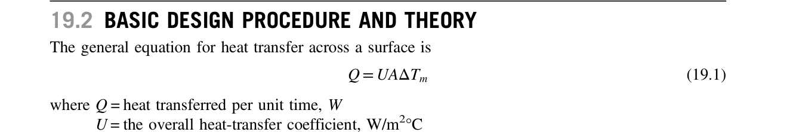

$$Q = U_o A_o \Delta T_{lm} F_T$$
$$\text{Where:}$$
* $Q$ = Total heat transfer rate ($\text{W}$ or $\text{J/s}$)
* $U_o$ = Overall heat transfer coefficient based on outside tube area ($\text{W/m}^2\cdot\text{K}$)
* $A_o$ = Total external tube heat transfer surface area ($\text{m}^2$)
* $\Delta T_{lm}$ = Logarithmic Mean Temperature Difference ($\text{K}$ or $^\circ\text{C}$)
* $F_T$ = Temperature correction factor for non-countercurrent multi-pass flow configurations ($F_T \le 1.0$)

---

### 1.1 Overall Heat-Transfer Coefficient ($U_o$) Formulation
The overall heat transfer resistance is the sum of five individual thermal resistances in series (Equation 19.2):

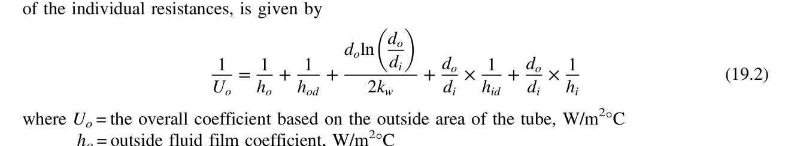

$$\frac{1}{U_o} = \frac{1}{h_o} + R_{fo} + \frac{d_o \ln(d_o / d_i)}{2 k_w} + \left(\frac{d_o}{d_i}\right) R_{fi} + \left(\frac{d_o}{d_i}\right) \frac{1}{h_i}$$
$$\text{Where:}$$
* $h_o, h_i$ = Shell-side and tube-side fluid film heat transfer coefficients ($\text{W/m}^2\cdot\text{K}$)
* $R_{fo}, R_{fi}$ = Shell-side and tube-side fouling resistances (dirt factors, $\text{m}^2\cdot\text{K/W}$)
* $d_o, d_i$ = Tube outside and inside diameters ($\text{m}$)
* $k_w$ = Thermal conductivity of the tube wall material ($\text{W/m}\cdot\text{K}$)

#### 1.1.1 Typical Overall Heat Transfer Coefficients (Table 19.1):
| Exchanger Service | Typical $U_o$ ($\text{W/m}^2\cdot\text{K}$) | Typical $U_o$ ($\text{Btu/h}\cdot\text{ft}^2\cdot^\circ\text{F}$) |
| :--- | :--- | :--- |
| **Water to Water** | $800 - 1500$ | $140 - 260$ |
| **Water to Organic Liquids** | $250 - 750$ | $45 - 130$ |
| **Water to Gases (Moderate Pressure)**| $10 - 50$ | $2 - 9$ |
| **Light Hydrocarbons to Light Hydrocarbons**| $300 - 600$ | $50 - 100$ |
| **Steam Condenser (Water Cooled)**| $1500 - 4000$ | $260 - 700$ |
| **Steam Reboiler (Aqueous Solutions)**| $1000 - 2500$ | $175 - 440$ |

#### 1.1.2 Typical Design Fouling Factors ($R_f$) (Table 19.2):
* Treated Boiler Feed Water / Clean Steam: $R_f = 0.0001\text{ m}^2\cdot\text{K/W}$ ($0.0005\text{ h}\cdot\text{ft}^2\cdot^\circ\text{F/Btu}$)
* Industrial Cooling Water (Treated, $< 50^\circ\text{C}$): $R_f = 0.0002 - 0.00035\text{ m}^2\cdot\text{K/W}$
* Light Organic Hydrocarbons: $R_f = 0.0002 - 0.0003\text{ m}^2\cdot\text{K/W}$
* Heavy Fuel Oil / Residuals: $R_f = 0.0007 - 0.0010\text{ m}^2\cdot\text{K/W}$

---

## 2. Shell-and-Tube Construction & TEMA Standards

The Tubular Exchanger Manufacturers Association (TEMA) establishes standardized three-letter designations for industrial exchangers:
* **First Letter (Front Head Type)**: `A` (Channel and removable cover), `B` (Bonnet integral cover), `C` (Channel integral with tubesheet).
* **Second Letter (Shell Type)**: `E` (One-pass shell, standard), `F` (Two-pass shell with longitudinal baffle), `G` (Split flow), `H` (Double split flow), `J` (Divided flow), `K` (Kettle reboiler), `X` (Cross flow).
* **Third Letter (Rear Head Type)**: `M` (Fixed tubesheet), `U` (U-tube bundle), `S` (Floating head with backing device), `T` (Pull-through floating head), `P` (Outside packed floating head).

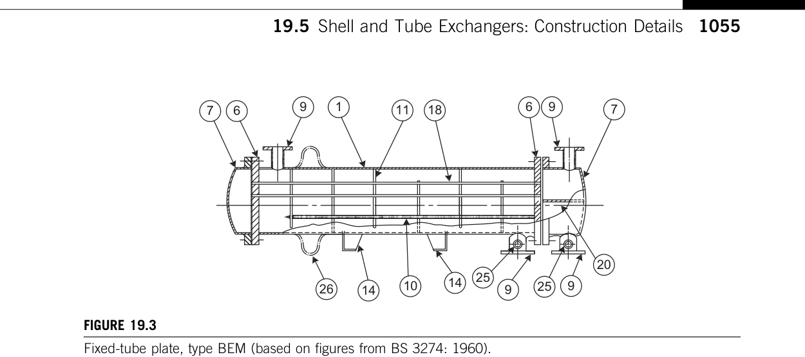

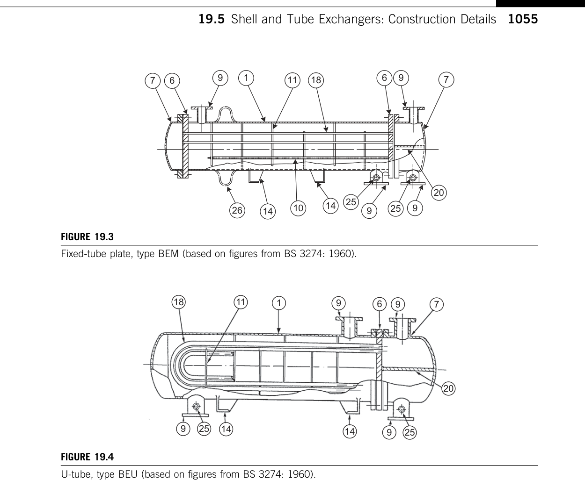

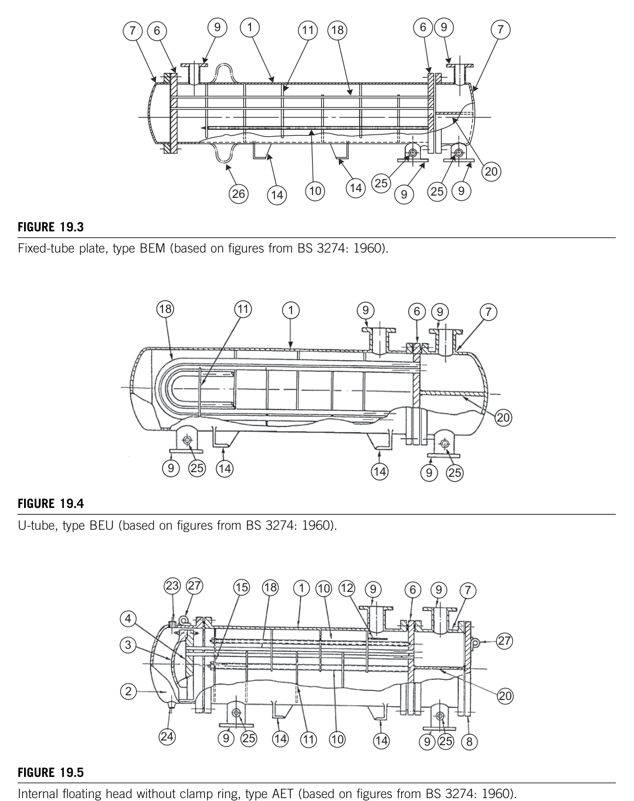

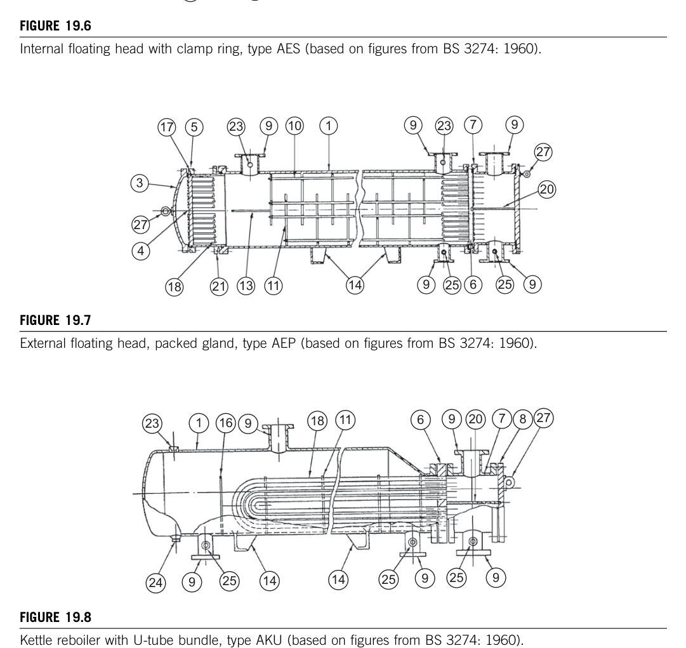

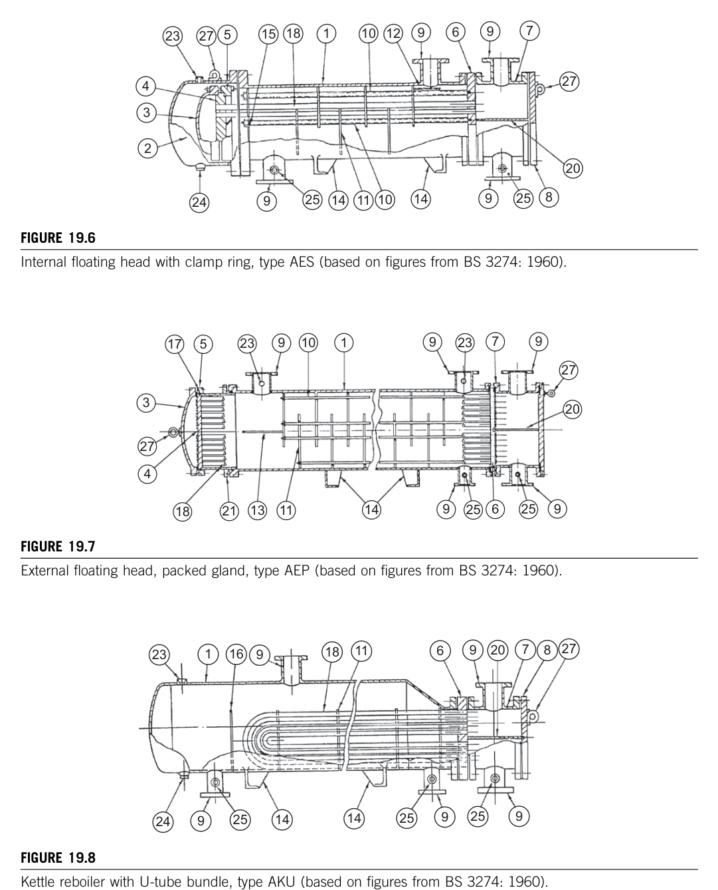

### 2.1 Standard Tube Geometry & Pitch Arrangements
Standard tube outer diameters: $16\text{ mm}$ ($5/8\text{ in.}$), $20\text{ mm}$ ($3/4\text{ in.}$), $25\text{ mm}$ ($1.0\text{ in.}$). Standard tube lengths: $2.44\text{ m}$ ($8\text{ ft}$), $3.66\text{ m}$ ($12\text{ ft}$), $4.88\text{ m}$ ($16\text{ ft}$), $6.10\text{ m}$ ($20\text{ ft}$).

* **Triangular Pitch ($30^\circ$)**: Gives highest tube density ($15\%$ more area than square pitch for same shell diameter) and highest heat transfer coefficients. Difficult to clean mechanically; used for clean, non-fouling shell-side fluids.
* **Square Pitch ($90^\circ$)**: Provides continuous external cleaning lanes between tube columns ($> 6.35\text{ mm}$ gap). Essential for heavily fouling shell fluids where bundles must be hydro-blasted.
* **Rotated Square Pitch ($45^\circ$)**: Higher shell-side turbulence at low Reynolds numbers.

---

### 2.2 Tube Count & Bundle Diameter Empirical Formulations (Equation 19.3)
The bundle diameter $D_b$ and total number of tubes $N_t$ are related by empirical constants (Equations 19.3a and 19.3b):

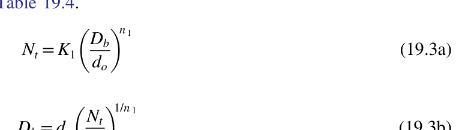

$$N_t = K_1 \left( \frac{D_b}{d_o} \right)^{n_1}$$

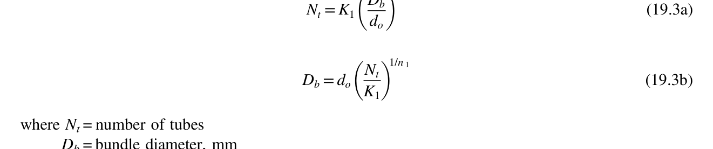

$$D_b = d_o \left( \frac{N_t}{K_1} \right)^{1/n_1}$$

#### Empirical Constants $K_1$ and $n_1$ (Table 19.4):
| Tube Pitch Pattern | 1 Pass ($K_1, n_1$) | 2 Passes ($K_1, n_1$) | 4 Passes ($K_1, n_1$) | 6 Passes ($K_1, n_1$) |
| :--- | :--- | :--- | :--- | :--- |
| **Triangular ($p_t = 1.25 d_o$)** | $0.319,\ 2.142$ | $0.249,\ 2.207$ | $0.175,\ 2.285$ | $0.0743,\ 2.499$ |
| **Square ($p_t = 1.25 d_o$)** | $0.215,\ 2.207$ | $0.156,\ 2.291$ | $0.158,\ 2.263$ | $0.0402,\ 2.617$ |

---

### 2.3 Baffle Geometry (Figure 19.14)
Transverse segmental baffles support the tube bundle against flow-induced vibration and force the shell-side fluid to flow perpendicularly across the tubes in cross-flow.

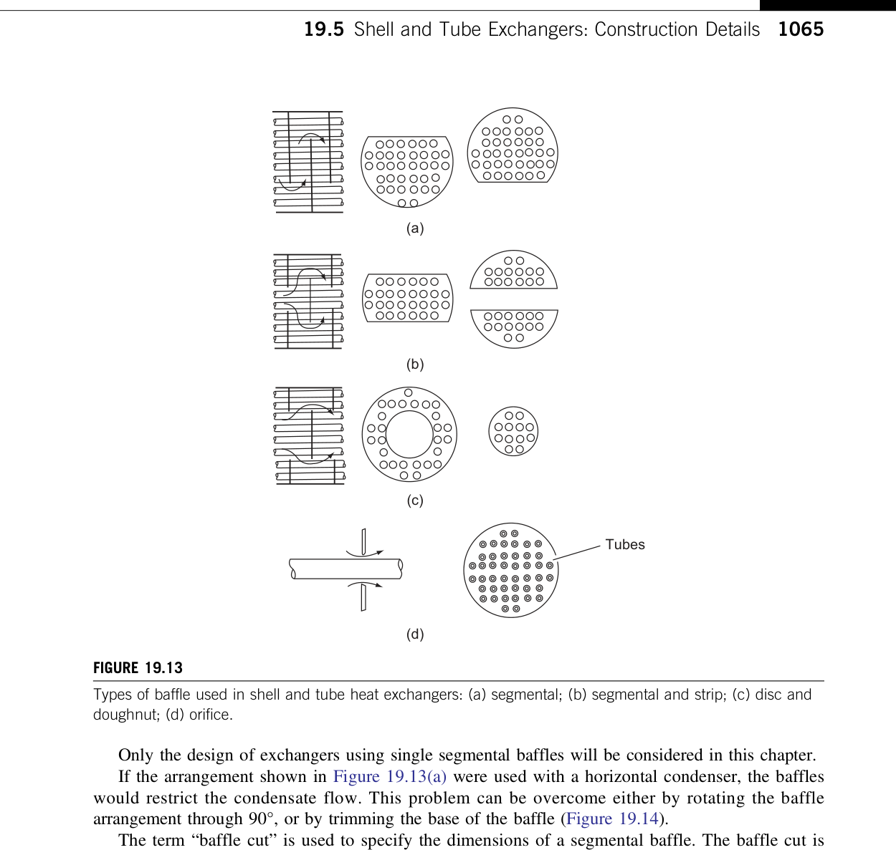

* **Baffle Cut**: The height of the segmental opening expressed as a percentage of shell inside diameter ($15\% - 45\%$). Optimum baffle cut is **$20\% - 25\%$** (provides maximum cross-flow velocity without stagnant recirculation pockets).
* **Baffle Spacing ($B$)**: Distance between successive baffles:
  * Minimum spacing: $0.2\ D_s$ or $50\text{ mm}$ (to prevent excessive shell $\Delta P$).
  * Maximum spacing: $1.0\ D_s$ (to prevent tube sagging and acoustic resonance). Typical optimal spacing: $B = 0.3 - 0.5\ D_s$.

---

## 3. Mean Temperature Difference & $F_T$ Correction

For pure countercurrent single-pass flow, the temperature driving force is the Log Mean Temperature Difference:

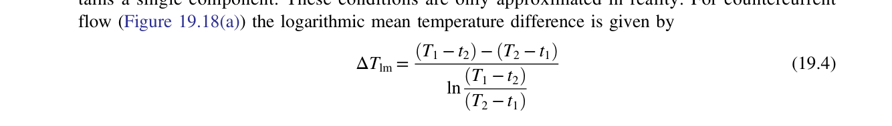

$$\Delta T_{lm} = \frac{(T_1 - t_2) - (T_2 - t_1)}{\ln\left(\frac{T_1 - t_2}{T_2 - t_1}\right)}$$

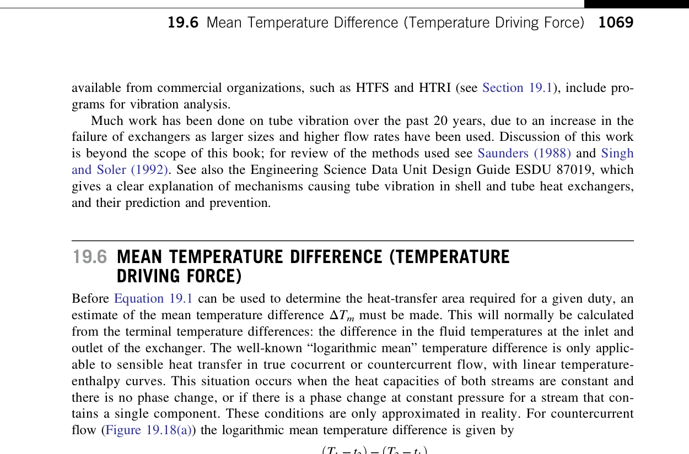

### 3.1 Multi-Pass Correction Factor ($F_T$)
In multi-pass exchangers (e.g. 1 shell pass, 2 or more tube passes), part of the flow is co-current and part is countercurrent. The effective driving force is corrected by factor $F_T$:

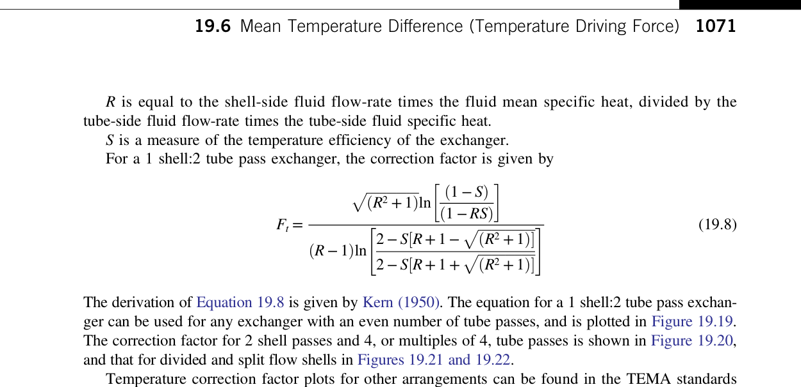

$F_T$ is read from charts (Figures 19.19–19.22) as a function of dimensionless parameters $R$ and $S$:

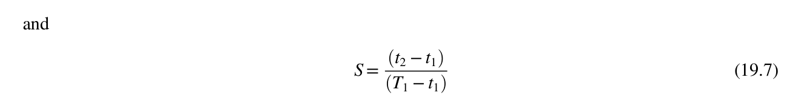

$$R = \frac{T_1 - T_2}{t_2 - t_1}$$

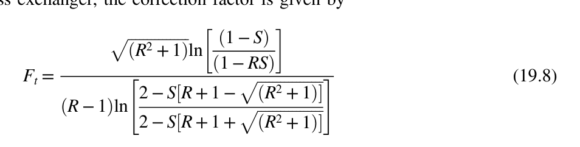

$$S = \frac{t_2 - t_1}{T_1 - t_1}$$

> [!CRITICAL]
> **The $F_T \ge 0.80$ Rule of Thumb**:
> If calculated $F_T < 0.80$, the operating point lies on the steep, unstable slope of the curve where a slight process disturbance causes a "temperature cross". In such cases, switch from a 1-shell-pass exchanger to a **2-shell-pass unit (TEMA F or two shells in series, Figure 19.20)** to restore $F_T \ge 0.90$.

---

## 4. Tube-Side Heat Transfer & Pressure Drop

### 4.1 Tube-Side Film Coefficient ($h_i$)
Flow inside straight tubes is well-characterized. For turbulent flow ($Re_t > 10,000$), use the **Sieder-Tate correlation** (Equation 19.10):

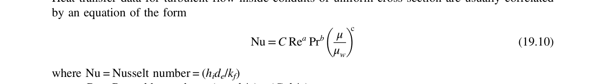

$$Nu = \frac{h_i d_i}{k_f} = 0.027 Re_t^{0.8} Pr^{0.33} \left(\frac{\mu}{\mu_w}\right)^{0.14}$$

Or evaluate via the Colburn heat transfer factor $j_h$ (Figure 19.23, Equations 19.14, 19.15):

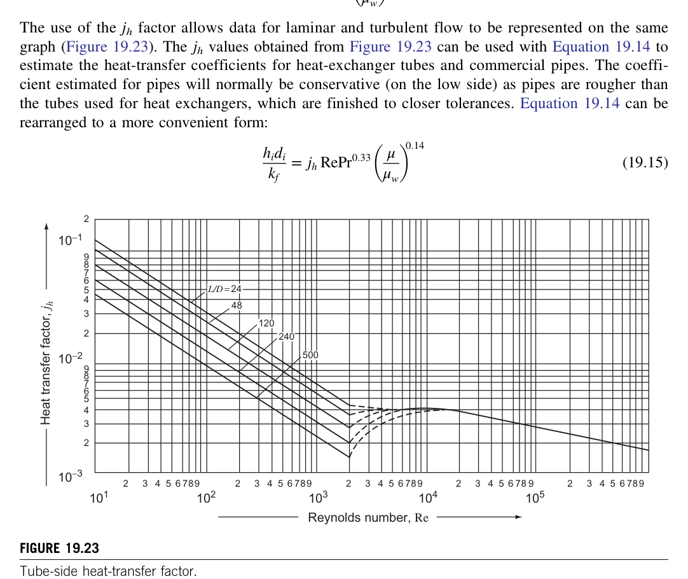

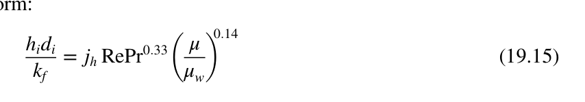

$$h_i = j_h \left(\frac{k_f}{d_i}\right) Re_t Pr^{0.33} \left(\frac{\mu}{\mu_w}\right)^{0.14}$$

---

### 4.2 Tube-Side Pressure Drop ($\Delta P_t$) (Equation 19.11)
The total tube-side pressure drop accounts for pipe friction along tube length $L$ across $N_p$ tube passes plus sudden expansion, contraction, and reversal losses in the channel headers:

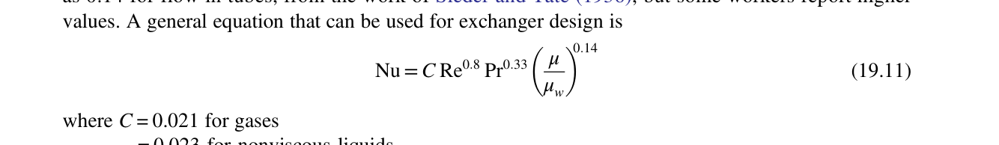

$$\Delta P_t = N_p \left[ 8 j_f \left(\frac{L}{d_i}\right) \left(\frac{\mu}{\mu_w}\right)^{-m} + 2.5 \right] \left(\frac{\rho u_t^2}{2}\right)$$

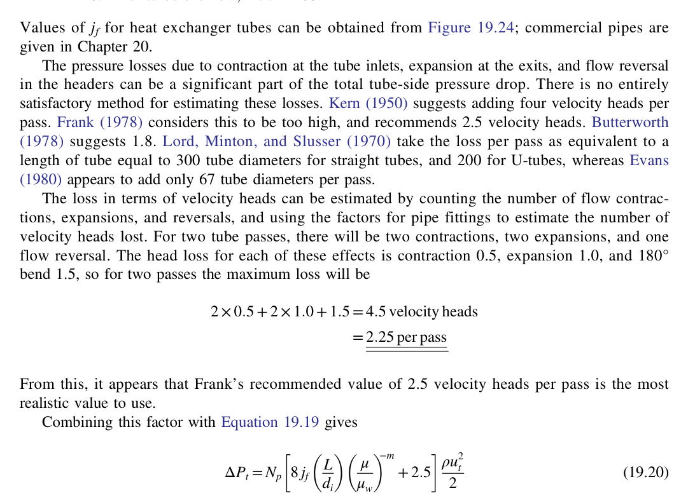

$$\text{Where:}$$
* $u_t$ = Linear tube velocity ($\text{m/s}$), typically designed at **$1.0 - 2.5\text{ m/s}$** for liquids.
* $j_f$ = Friction factor from Figure 19.24.
* $m = 0.14$ for turbulent flow.
* The constant $2.5$ represents return and nozzle entrance/exit velocity head losses per pass.

---

## 5. Shell-Side Rating: Kern's Shortcut Method

Kern's method is the universal chemical engineering standard for preliminary sizing and rating of segmental baffled shell-and-tube exchangers.

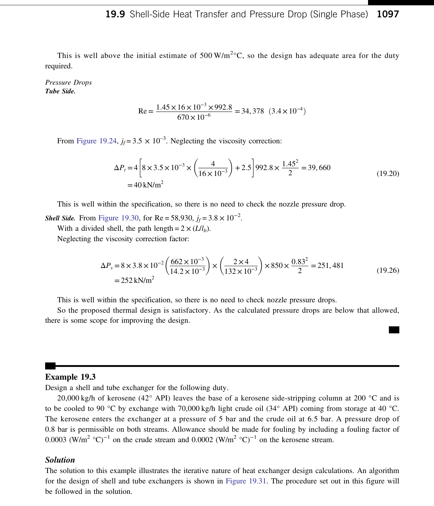

### 5.1 Shell Cross-Flow Area ($A_s$) (Equation 19.17)
The fictitious flow area at the shell centerline:

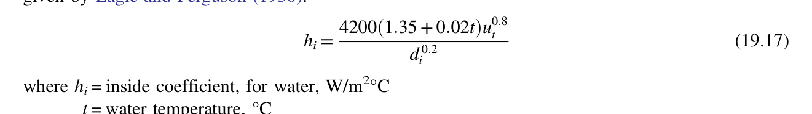

$$A_s = \frac{(p_t - d_o) D_s B}{p_t}$$
$$\text{Where } D_s \text{ is shell inside diameter, } B \text{ is baffle spacing, and } p_t \text{ is tube pitch.}$$

---

### 5.2 Shell Hydraulic Equivalent Diameter ($d_e$) (Equation 19.16)
The equivalent hydraulic diameter depends on the tube layout geometry:

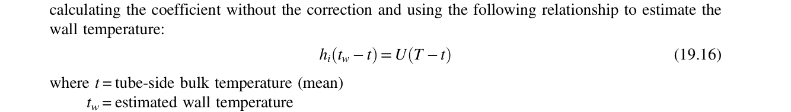

* **For Triangular Pitch ($30^\circ$)**:
  $$d_e = \frac{4 \left( \frac{\sqrt{3}}{4} p_t^2 - \frac{\pi}{8} d_o^2 \right)}{\frac{\pi}{2} d_o} = \frac{1.10}{d_o} \left( p_t^2 - 0.917 d_o^2 \right)$$
* **For Square Pitch ($90^\circ$)**:
  $$d_e = \frac{4 \left( p_t^2 - \frac{\pi}{4} d_o^2 \right)}{\pi d_o} = \frac{1.27}{d_o} \left( p_t^2 - 0.785 d_o^2 \right)$$

---

### 5.3 Shell-Side Heat Transfer Coefficient ($h_s$) (Equation 19.18)
Evaluate shell mass velocity $G_s = \dot{m}_s / A_s$ and shell Reynolds number:
$$Re_s = \frac{G_s d_e}{\mu_s}$$

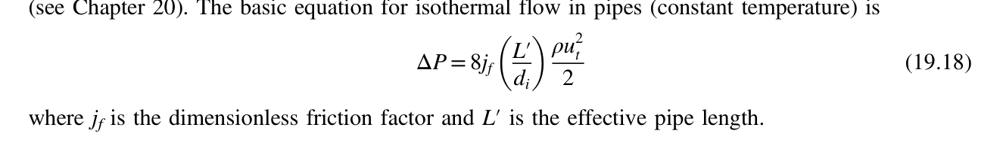

$$h_s = j_h \left(\frac{k_f}{d_e}\right) Re_s Pr^{0.33} \left(\frac{\mu}{\mu_w}\right)^{0.14}$$

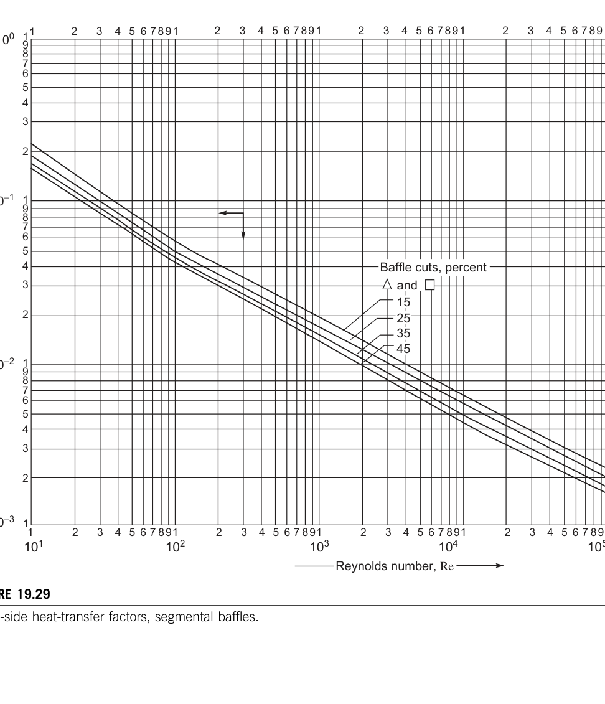

Read $j_h$ from Figure 19.29 at the appropriate baffle cut (typically $25\%$).

---

### 5.4 Shell-Side Pressure Drop ($\Delta P_s$) (Equations 19.19 and 19.20)
Pressure drop across the shell passes through $N_b = (L/B) - 1$ baffle compartments:

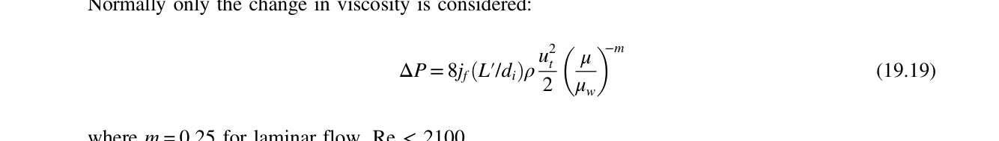

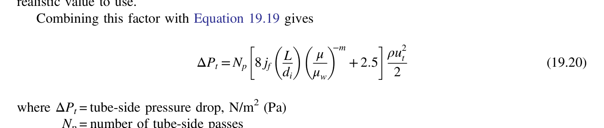

$$\Delta P_s = 8 j_f \left(\frac{D_s}{d_e}\right) \left(\frac{L}{B}\right) \left(\frac{\rho u_s^2}{2}\right) \left(\frac{\mu}{\mu_w}\right)^{-0.14}$$

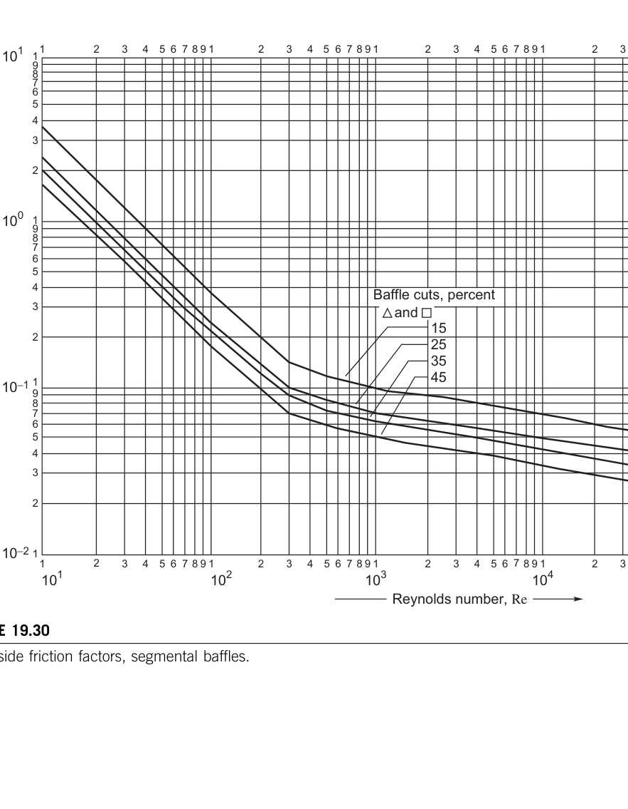

Read $j_f$ from Figure 19.30. Allowable shell pressure drop is typically **$0.3 - 0.7\text{ bar}$ ($5 - 10\text{ psi}$)**.

---

## 6. Rigorous Shell-Side Analysis: The Bell-Delaware Method

Kern's method assumes ideal uniform cross-flow. In real industrial exchangers, significant fluid streams leak through manufacturing clearances or bypass the bundle:

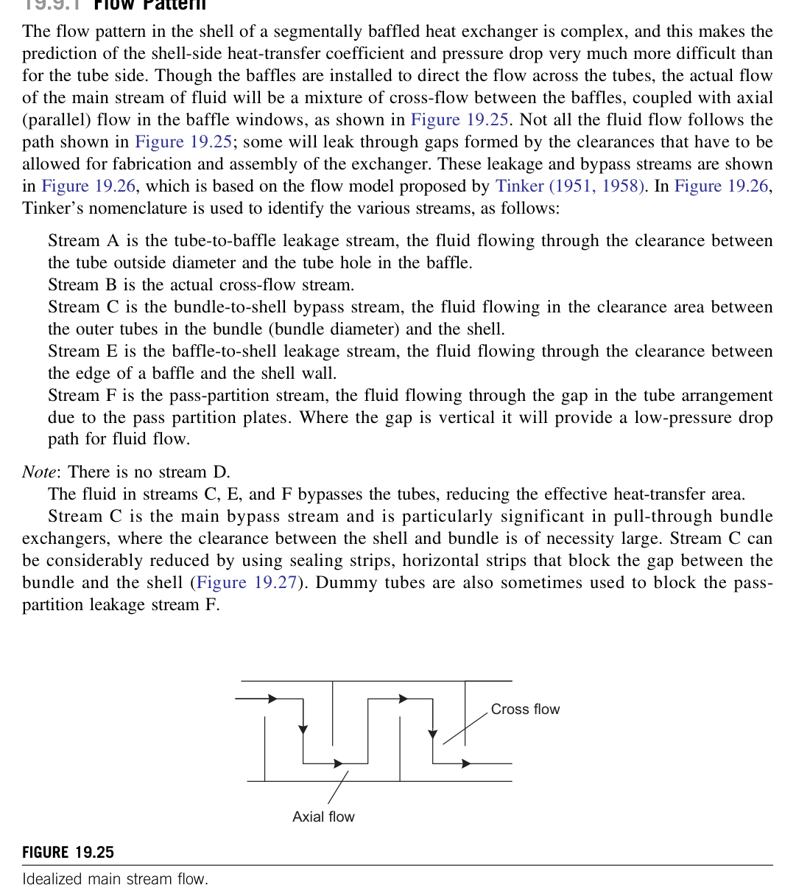

### 6.1 Tinker's Flow Streams (Figure 19.26):
* **Stream A**: Tube-to-baffle hole leakage stream. Reduces heat transfer.
* **Stream B**: True cross-flow stream contacting the tubes. Primary effective heat transfer stream.
* **Stream C**: Bundle-to-shell bypass stream flowing around outer perimeter of bundle.
* **Stream E**: Baffle-to-shell edge leakage stream. Completely bypasses tube contact.
* **Stream F**: Pass partition lane bypass stream.

### 6.2 Bell-Delaware Correction Factors:
The true shell-side heat transfer coefficient is evaluated by applying correction multipliers to the ideal cross-flow coefficient $h_{ideal}$:
$$h_s = h_{ideal} \times J_c \times J_l \times J_b \times J_s \times J_r$$
$$\text{Where:}$$
* $J_c$ = Baffle cut and window correction factor (typically $0.9 - 1.15$)
* $J_l$ = Baffle leakage correction for streams A and E (typically $0.7 - 0.8$)
* $J_b$ = Bundle bypass correction for stream C (typically $0.7 - 0.9$; improved with sealing strips)
* $J_s$ = Unequal baffle spacing correction at inlet/outlet nozzles ($0.85 - 1.0$)
* $J_r$ = Laminar flow temperature gradient correction

---

## 7. Reboilers and Vaporizers

Reboilers supply vapor traffic to distillation columns by boiling liquid bottoms.

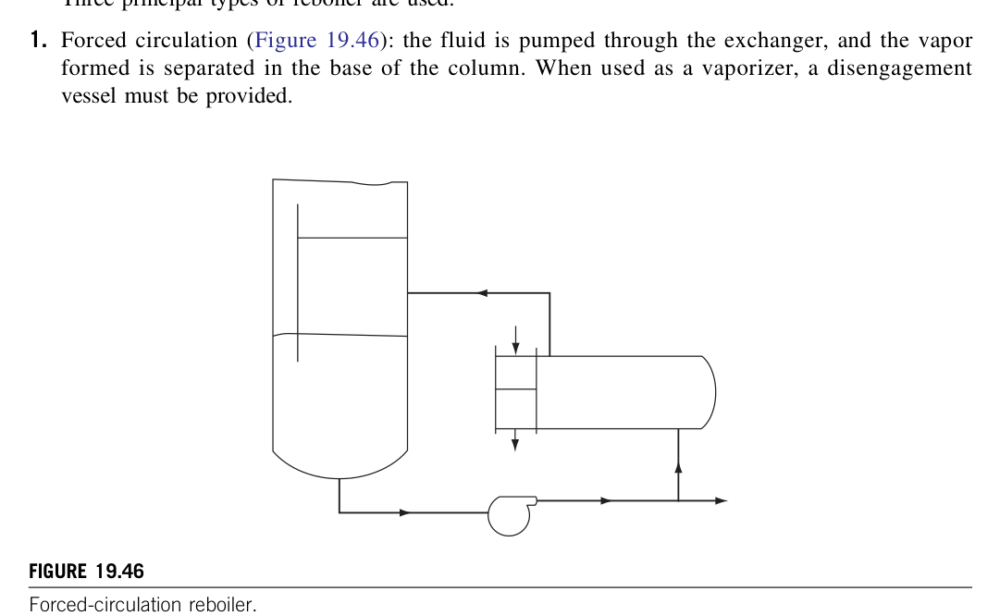

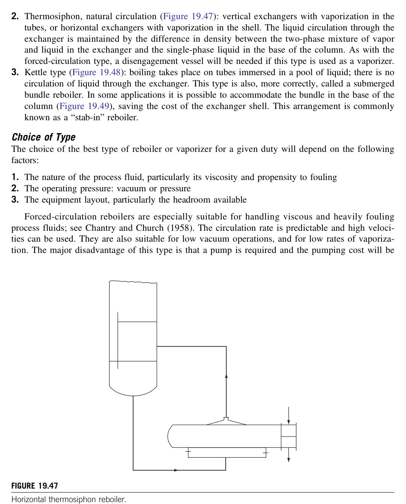

### 7.1 Reboiler Types Comparison
1. **Kettle Reboiler (TEMA K Shell, Figure 19.48)**:
   * Tube bundle immersed in an enlarged horizontal cylindrical shell providing ample vapor disengagement space.
   * Overflow weir maintains liquid level over tubes; product overflows into discharge sump.
   * High boiling rates, handles fouling slurries, easy to inspect and clean. Disadvantage: high shell capital cost.
2. **Vertical Thermosiphon Reboiler (Figure 19.47)**:
   * Natural circulation driven by the hydrostatic density difference between the solid liquid in the column bottoms sump and the low-density two-phase boiling foam in the exchanger tubes.
   * High liquid circulation rates ($3:1$ to $10:1$ liquid-to-vapor recirculating ratio) prevent dryout and fouling.
   * Requires careful hydrostatic head balance ($h_{sump} \rho_L g \ge \Delta P_{inlet} + \Delta P_{2-phase} + \Delta P_{outlet}$).

### 7.2 Nucleate Boiling & Critical Heat Flux Limits
Nucleate pool boiling heat transfer coefficient is estimated by Mostinski's correlation:

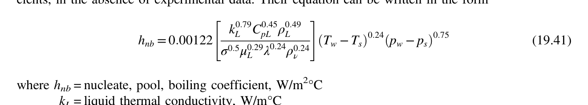

$$h_{nb} = 0.104 (P_c)^{0.69} (q)^{0.7} [1.8 (P_r)^{0.17} + 4 (P_r)^{1.2} + 10 (P_r)^{10}]$$

To prevent "film boiling" burnout (where a continuous insulating vapor blanket coats the tube surfaces, dropping $U$ by $90\%$ and causing thermal runaway):
* Maintain heat flux $q = Q/A$ below the **maximum critical heat flux** ($q_{max}$, Equation 19.42):

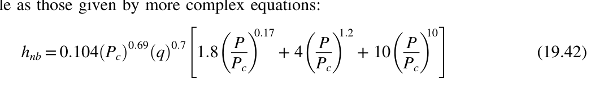

$$q_{max} = 0.18 \lambda_v \rho_v^{0.5} [\sigma g (\rho_L - \rho_v)]^{0.25}$$
* Industrial design heuristic: Design reboilers at **$q \le 0.70\ q_{max}$** (typically $q \le 40,000 - 60,000\text{ W/m}^2$ for organics; $\le 80,000\text{ W/m}^2$ for water).

---

## 8. Plate Heat Exchangers (PHE)

Plate heat exchangers consist of a pack of corrugated stainless steel or titanium plates clamped in a steel frame:

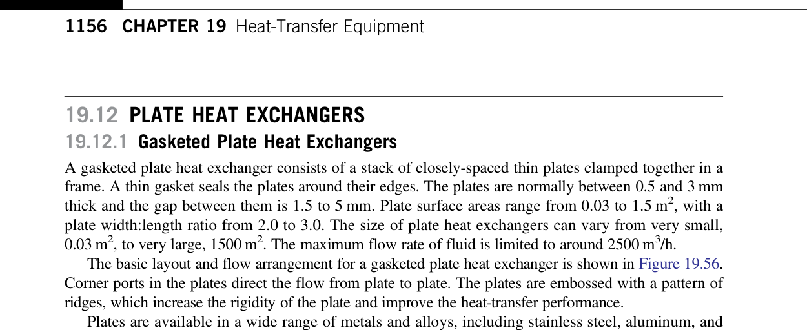

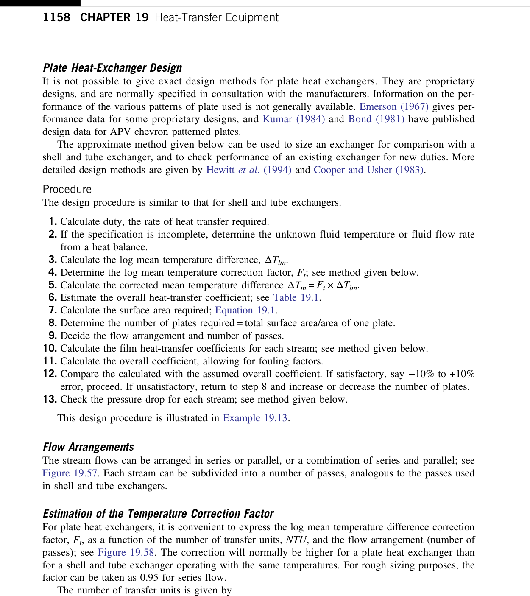

### 8.1 Advantages & Design Characteristics
* Corrugated chevron patterns induce intense turbulence at low Reynolds numbers ($Re > 10 - 50$).
* Very high heat transfer coefficients ($U \approx 3000 - 7000\text{ W/m}^2\cdot\text{K}$, $3 - 5\times$ higher than shell and tube).
* True countercurrent pure plug flow ($F_T \approx 0.95 - 1.0$), enabling close temperature approaches ($\Delta T_{approach} < 1^\circ\text{C} - 2^\circ\text{C}$).
* Limitations: Gasket materials limit temperature to $< 160^\circ\text{C}$ and pressure to $< 25\text{ bar}$.

---

## 9. Visualcheme Implementation Architecture

1. **State Variables**: Model exchangers with thermal duty $Q$, $U_o$, $A_o$, $LMTD$, $F_T$, tube velocity $u_t$, shell velocity $u_s$, tube pressure drop $\Delta P_t$, shell pressure drop $\Delta P_s$, and fouling resistance $R_f$.
2. **Interactive Visualization Gradients**:
   * *Spatial Temperature Profile*: Dual countercurrent fluid temperature curves $T_h(x)$ and $t_c(x)$ across normalized length, shading local $\Delta T(x)$.
   * *Velocity & Pressure Drop HUD*: Live indicators comparing calculated shell/tube pressure drops against allowable process limits ($0.5\text{ bar}$).
   * *TEMA 3D Model Inspector*: Cutaway view showing baffle cut orientation, pass partition plates, and tube bundle pitch pattern.
3. **Preset Scenarios**:
   * *Hydrocarbon Condenser*: BES floating-head exchanger, condensing naphtha overhead, cooling water tube-side.
   * *Thermosiphon Column Reboiler*: Natural circulation boiling with hydrostatic head loop balance.
