# Instrumentation and Process Control

This skill provides an authoritative, detailed, textbook-grounded reference on Piping & Instrumentation Diagrams (P&IDs), control architectures, and control valves, based directly on Chapter 5 of *Chemical Engineering Design* (Towler & Sinnott, 2nd Edition, pp. 262–275).

---

## 1. Piping and Instrumentation Diagram (P&ID) Symbology

The P&ID (also known as the Engineering Flowsheet) is the definitive master document that displays all process equipment, piping, valves, safety relief devices, and instrumentation control loops.

### 1.1 Instrument Tag Identification (Letter Codes)
Instrument tags consist of a standard letter combination followed by a loop identification number (e.g., **TIC-101**):

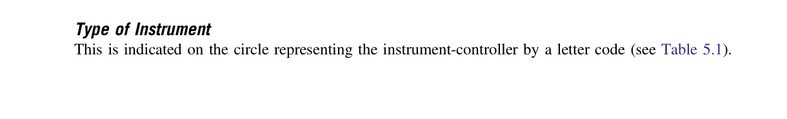

* **First Letter (Measured or Initiating Variable)**:
  * **A**: Analysis (composition, pH, chromatography)
  * **F**: Flow rate ($m^3/h, kg/s$)
  * **L**: Level (liquid height or interface)
  * **P**: Pressure or vacuum
  * **T**: Temperature
  * **Pd** or **d/P**: Differential Pressure
* **Succeeding Letters (Readout or Passive Function)**:
  * **I**: Indicator (local gauge or screen readout)
  * **R**: Recorder (trend logger)
  * **A**: Alarm (e.g., **LAH** = Level Alarm High, **PALL** = Pressure Alarm Low-Low)
* **Final Letter (Output / Control Function)**:
  * **C**: Controller (executes feedback PID algorithm)
  * **T**: Transmitter (measures and transmits $4-20\text{ mA}$ or digital Foundation Fieldbus signal)
  * **V**: Control Valve
  * **Y**: Computing relay or signal converter (e.g. I/P converter)

### 1.2 P&ID Instrument & Line Symbols

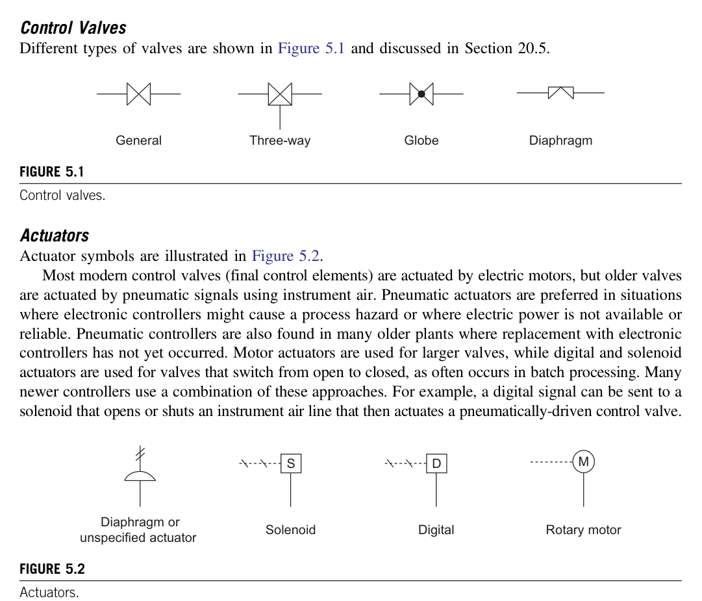

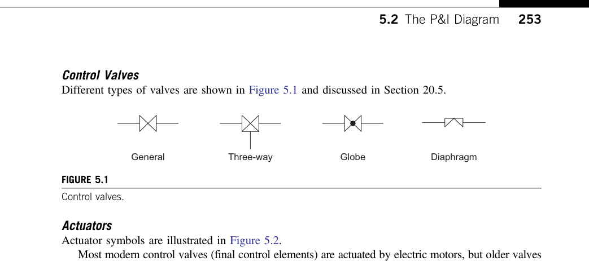

* **Instrument Location Balloon Types**:
  * Clean circle: Field-mounted instrument (mounted locally on equipment or piping).
  * Circle with solid horizontal line: Primary control room panel mounted (accessible to operator).
  * Circle with dashed horizontal line: Mounted behind control board (not normally accessible).
  * Circle inside a square: Distributed Control System (DCS) or PLC shared display function.
* **Line Type Identification**:
  * Heavy solid line: Primary process piping.
  * Thin solid line: Secondary process or utility piping.
  * Dashed line: Electrical signal line (standard $4 - 20\text{ mA}$ DC or digital bus).
  * Line with double diagonal slashes: Pneumatic signal line (standard $0.2 - 1.0\text{ bar}$ / $3 - 15\text{ psig}$).
  * Line with cross-hatch: Capillary tubing (filled thermal systems).

### 1.3 Valve and Actuator Symbols

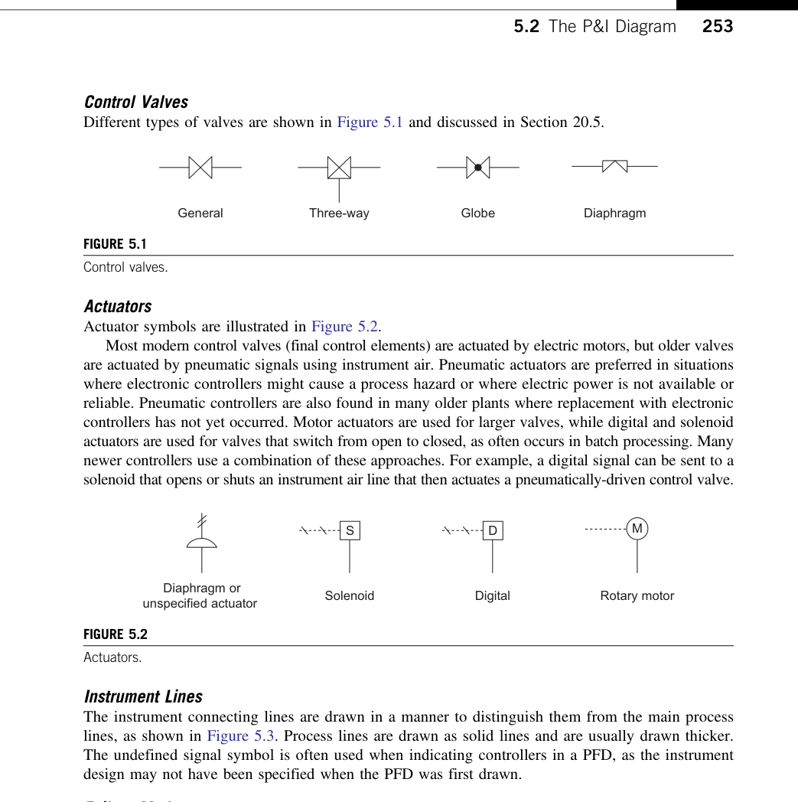

* **Actuator Types**:
  * Diaphragm actuator with spring return (pneumatic).
  * Piston actuator (high thrust for large pressure drops).
  * Motor-operated actuator (electric motor for remote isolation).
  * Manual handwheel.

---

## 2. Basic Process Control Loops

### 2.1 Level Control
Maintains liquid holdup in vessels, tanks, and column sumps.

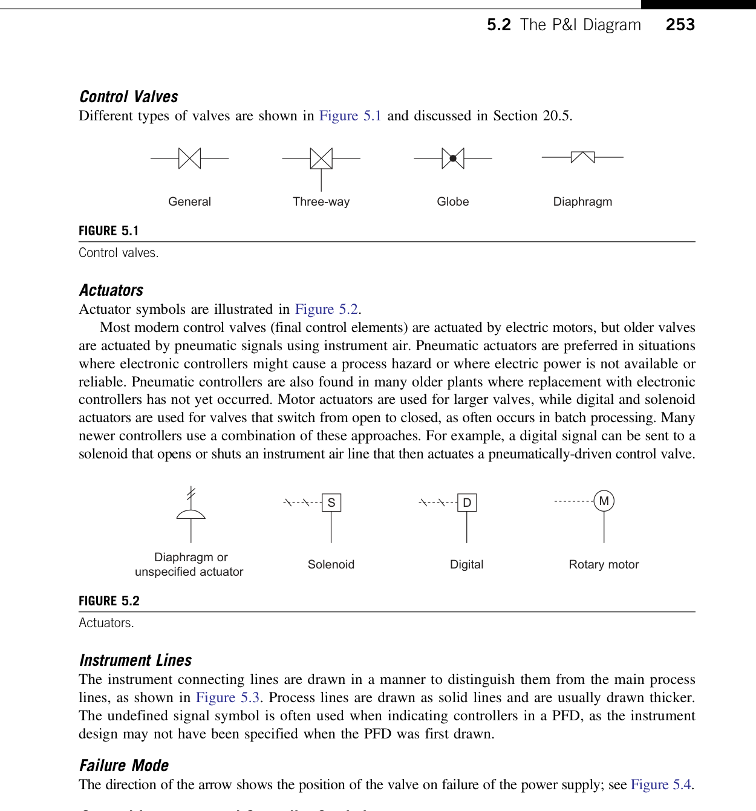

* **Scheme (a) (Manipulating Discharge)**: The level controller throttles the bottoms pump discharge valve. Most common; stable.
* **Scheme (b) (Manipulating Inflow)**: Throttles feed valve upstream to balance vessel level. Used when downstream processing must run at constant rate.
* **Averaging Level Control**: Wide proportional band ($PB = 100 - 200\%$) and slow reset to absorb surge flow oscillations and provide smooth downstream feed rates.

### 2.2 Pressure Control
Maintains vapor space pressure to ensure stable equilibrium and structural vessel safety.

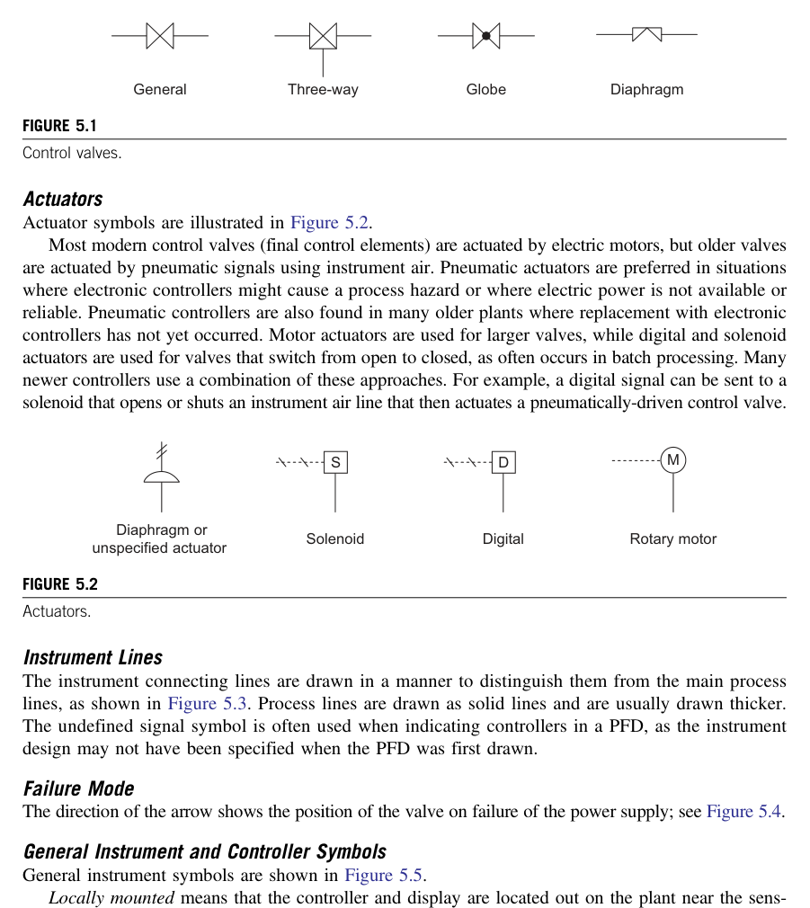

* **Vapor Venting / Offgas**: Valve throttles vapor discharge to flare or fuel header.
* **Condenser Bypass (Hot Vapor Bypass)**: For distillation columns, throttles hot vapor directly around condenser into reflux drum, varying condensation surface and maintaining column pressure.
* **Inert Gas Blanketing (Split-Range Pressure Control)**: Pad gas ($N_2$) admitted when pressure drops; vent gas released to scrubber when pressure rises.

### 2.3 Temperature Control of Heat Exchangers

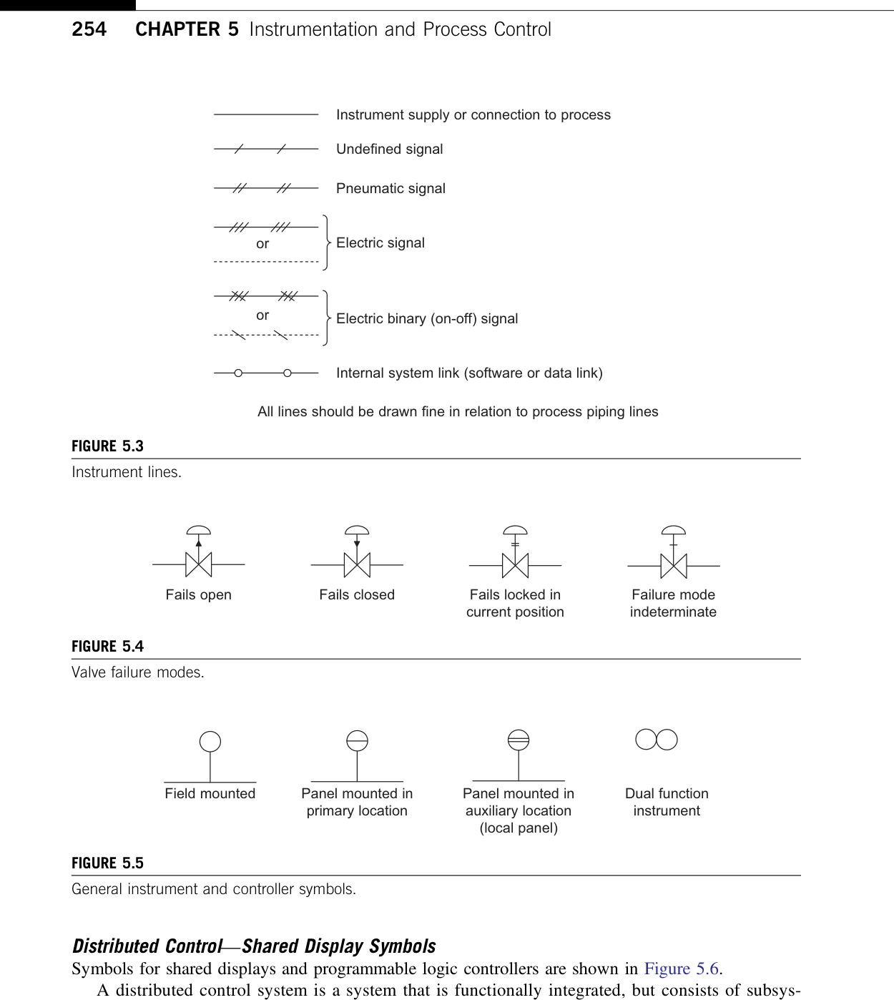

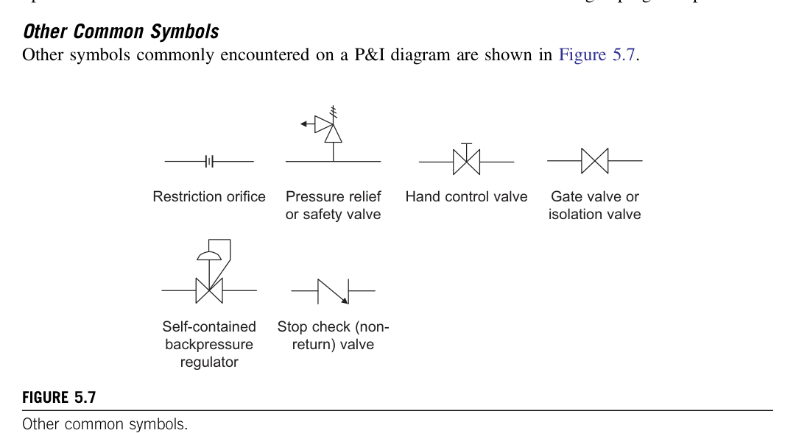

* **Throttling Utility Flow (Scheme a)**: Throttles steam or cooling water valve directly based on process outlet temperature. Simple, but large dead time if heat exchanger is large.
* **Process Bypass Control (Scheme b)**: Mixes hot uncooled process bypass with cold exchanger effluent using a three-way valve. Very fast dynamic response (sub-second).
* **Condensate Throttling (Fig 5.7)**: For steam heaters, throttling the steam trap/condensate outlet floods tubes with liquid condensate, reducing effective heat transfer area $A$. Lower cost valve, but slower response.

---

## 3. Advanced Control Architectures

### 3.1 Cascade Control
Used when disturbances occur in the manipulated variable line or when the primary process has a large measurement lag.

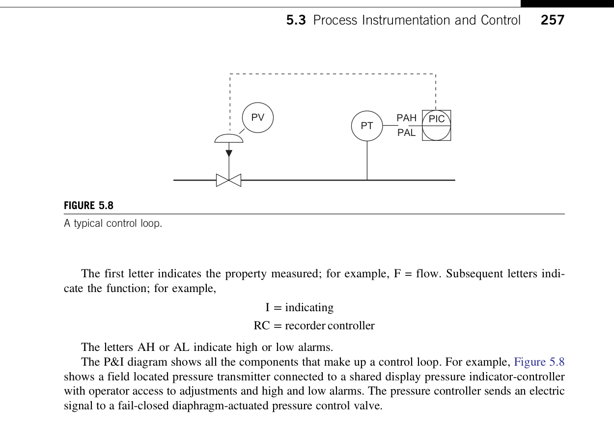

* **Architecture**:
  * **Master (Primary) Controller**: Measures process temperature (slow dynamic response) and calculates required heat input, outputting a **setpoint** to the slave controller.
  * **Slave (Secondary) Controller**: Measures utility steam flow or jacket temperature (fast dynamic response) and directly modulates the control valve.
* **Design Rule**: The slave loop must be at least 3 to 5 times faster than the master loop:
  $$\tau_{slave} \le 0.2 \tau_{master}$$

### 3.2 Ratio Control
Maintains a precise stoichiometric or stoichiometric-equivalent ratio between two flowing streams ($F_B / F_A = R$).

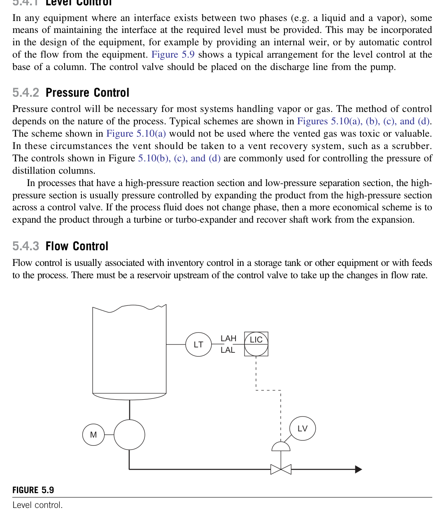

* **Wild Stream ($F_A$)**: Flow is measured but uncontrolled.
* **Controlled Stream ($F_B$)**: Flow setpoint is calculated as $F_{B,sp} = R \times F_A$ and modulated via control valve.
* **Applications**: Fuel-to-air ratio in furnaces, reactant feed ratios in reactors, reflux-to-feed ratio in distillation columns.

### 3.3 Distillation Column Control Strategies

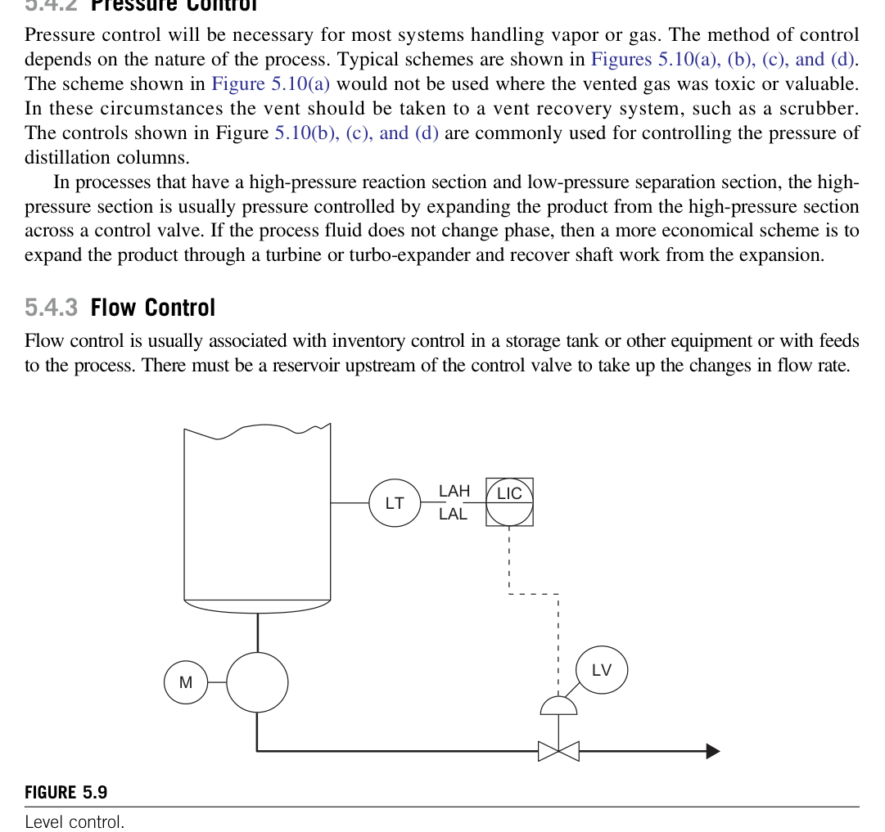

A distillation column has 5 degrees of freedom (manipulated variables: $D, B, L, V, Q_C$). Control schemes fall into two major philosophies:
1. **Material Balance Control**: Product draw rate ($D$ or $B$) is manipulated to control product composition, while reflux $L$ controls drum level.
2. **Energy Balance Control**: Reflux flow ($L$) and reboiler duty ($V$) are manipulated to control top and bottom compositions, while product rates ($D$ and $B$) maintain liquid levels in the drum and sump.

---

## 4. Control Valve Sizing & Selection

The control valve is the physical final control element that throttles fluid pressure to regulate flow.

### 4.1 Valve Sizing Equation (Flow Coefficient $C_v$)
For turbulent liquid flow:
$$Q = C_v \sqrt{\frac{\Delta P_{valve}}{SG}}$$
where $Q$ is volumetric flow in US gpm, $\Delta P_{valve}$ is pressure drop in psi, and $SG$ is specific gravity relative to water at $60^\circ\text{F}$. (In metric units: $K_v = 0.865 C_v$, with $Q$ in $m^3/h$ and $\Delta P$ in bar).

### 4.2 Inherent vs. Installed Characteristics

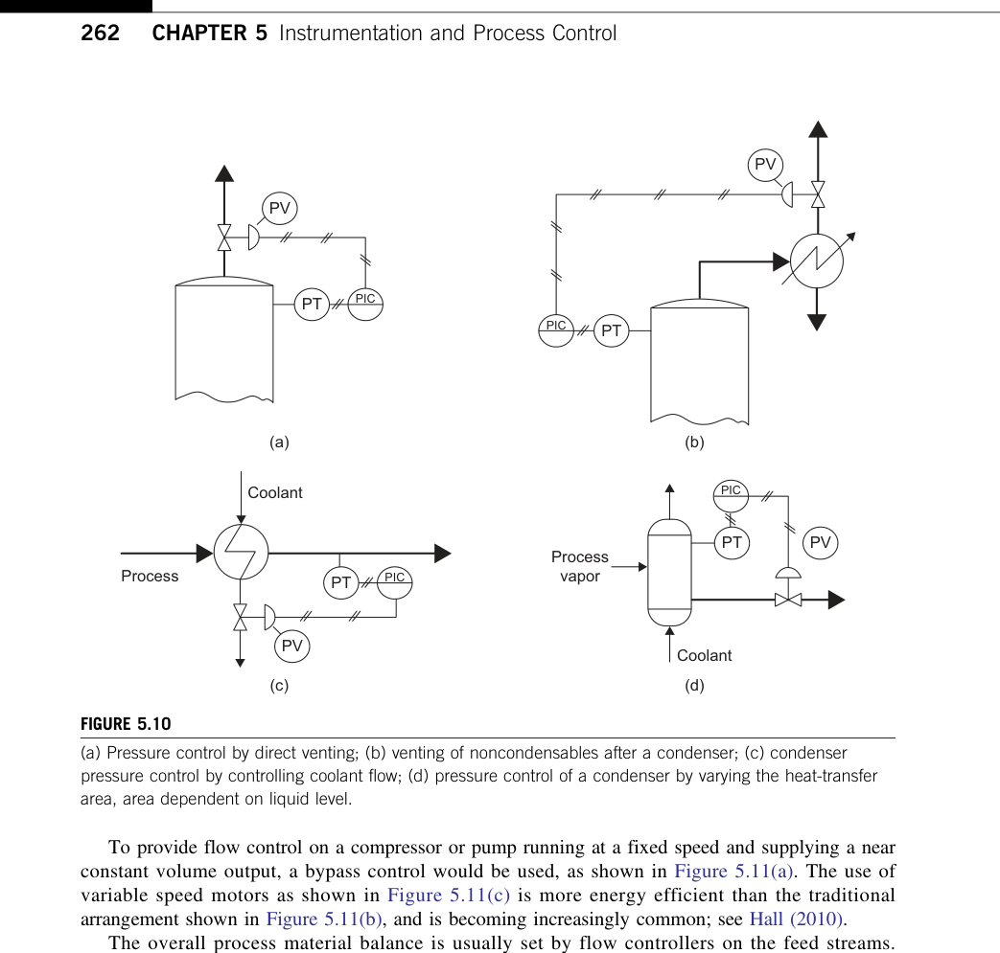

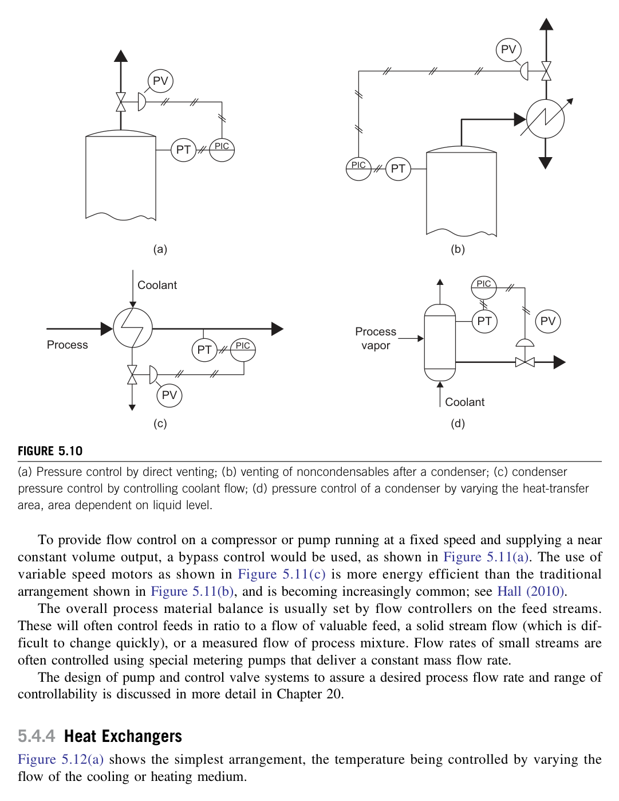

* **Inherent Characteristics** (constant $\Delta P$ across valve):
  1. **Linear**: Flow is directly proportional to stem lift: $m = x$. Used for liquid level control and systems where valve $\Delta P$ is a large, constant fraction of system $\Delta P$.
  2. **Equal Percentage**: Equal increments of stem travel produce equal percentage changes in flow:
     $$\frac{dm}{dx} = \alpha m \implies m = R^{x - 1}$$
     where $R$ is rangeability (typically 20 to 50).
  3. **Quick Opening**: Rapid flow increase at low travel. Used for emergency isolation and safety bypass.
* **Installed Characteristics (Valve Authority $P_r$)**:
  In a real pipeline, as the valve opens, flow increases, causing pipeline frictional pressure drop to increase as $v^2$. Consequently, $\Delta P_{valve}$ decreases.
  * **Valve Authority**:
    $$P_r = \frac{\Delta P_{valve,wide\_open}}{\Delta P_{system,total}}$$
  * **Golden Design Rule**: An **Equal Percentage** valve in a system with $P_r \approx 0.25 - 0.50$ shifts its installed characteristic to near-linear, providing stable loop gain across the entire operating range.
  * Sizing rule: At normal flow, the valve should be $50 - 70\%$ open; at maximum design flow, no more than $85 - 90\%$ open.

### 4.3 Three-Way Control Valves

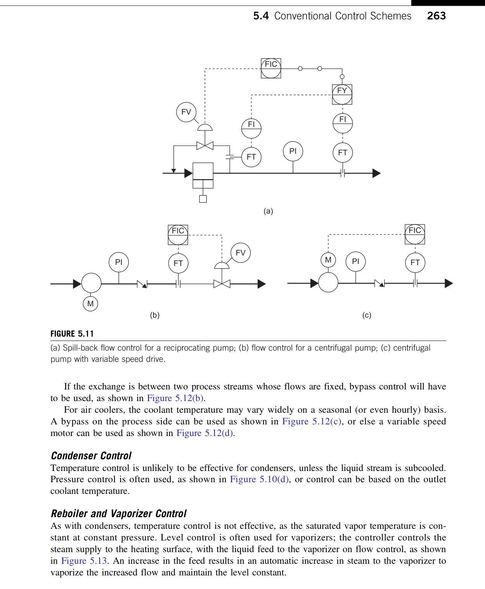

* **Mixing Valve**: Two inlet streams combine into a single outlet.
* **Diverting Valve**: A single inlet stream is divided into two outlet streams (e.g. process heat exchanger bypass).
