# Process Simulation & Thermodynamic Modeling

This skill provides an authoritative, detailed, textbook-grounded reference on chemical process simulation and physical property modeling, based directly on Chapter 4 of *Chemical Engineering Design* (Towler & Sinnott, 2nd Edition, pp. 172–242).

---

## 1. Flowsheet Simulation Architectures

A chemical process flowsheet is a network of unit operations connected by material, energy, and signal streams. Process simulators solve the large systems of algebraic and differential equations representing mass, energy, and momentum conservation.

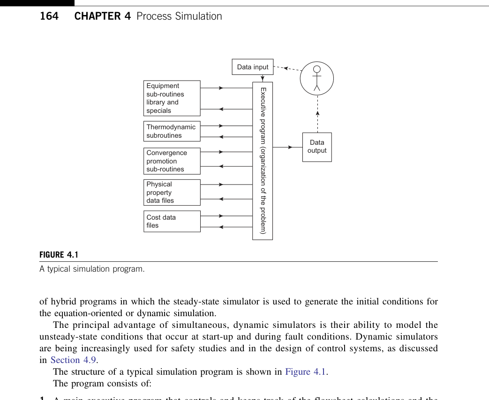

### 1.1 Sequential Modular (SM) Architecture
The industry-standard architecture used in DWSIM, Aspen Plus (in SM mode), and PRO/II.

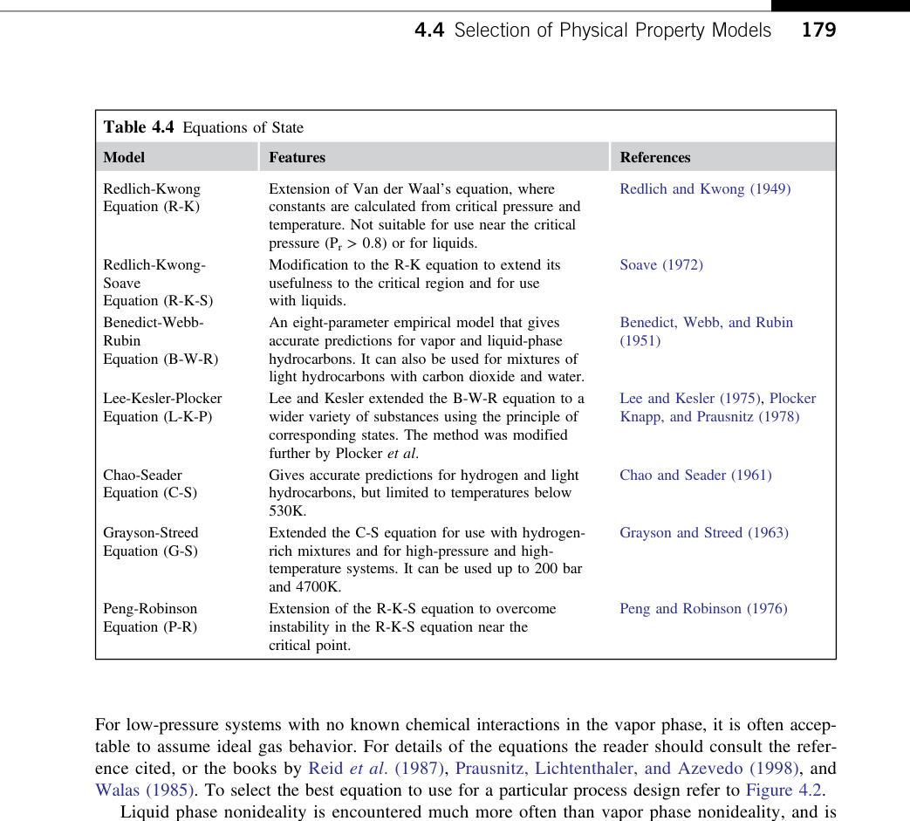

* **Execution Logic**: Simulation proceeds unit-by-unit in the direction of physical fluid flow. Each unit operation is an autonomous mathematical subroutine that takes known inlet stream vectors $\mathbf{S}_{in}$ and equipment parameters $\mathbf{P}_{unit}$ to compute outlet stream vectors $\mathbf{S}_{out}$:
  $$\mathbf{S}_{out} = \mathbf{f}_{unit}(\mathbf{S}_{in}, \mathbf{P}_{unit})$$
* **Advantages**:
  * Highly robust; individual units can use specialized, highly reliable numerical algorithms (e.g., tridiagonal matrix MESH solvers for distillation, Runge-Kutta for plug-flow reactors).
  * Intuitive physical troubleshooting: if a unit fails to converge, the engineer immediately inspects that specific unit's feed and parameters.
  * Intermediate converged stream results are preserved even if downstream units fail.
* **Limitations**:
  * Recycles of material and energy require iterative guessing, tearing, and acceleration loops.
  * Design specifications (e.g. adjust reboiler duty to achieve 99% distillate purity) require nested "control loops" (secant or Newton iterations) that wrap around unit operations, slowing convergence.

### 1.2 Equation-Oriented (EO) Architecture
* **Execution Logic**: All unit operation equations, equilibrium relationships, physical property models, and stream connectivity equations are collected into a single massive system of sparse nonlinear algebraic equations:
  $$\mathbf{F}(\mathbf{X}) = \mathbf{0}$$
* **Numerical Method**: Solved simultaneously using sparse Newton-Raphson or Successive Quadratic Programming (SQP) algorithms.
* **Advantages**:
  * Solves recycle loops and complex cross-plant heat integration in a single convergence step without nested iterations.
  * Extremely fast for online optimization, data reconciliation, and parameter estimation.
* **Limitations**:
  * Highly sensitive to initial guesses; poor initializations cause singular Jacobians or divergence.
  * Fails catastrophically with no intermediate stream results when convergence is lost.

---

## 2. Selection of Physical Property Models

The thermodynamic property package dictates the phase equilibrium ($K$-values), enthalpy ($H$), entropy ($S$), and volumetric properties ($V, \rho$) of every stream. An incorrect thermodynamic model produces invalid mass and energy balances regardless of grid resolution or solver precision.

### 2.1 The Master Thermodynamic Decision Trees

The selection of thermodynamic models follows the rigorous decision trees established by Reid, Prausnitz, and Poling, and summarized in the textbook:

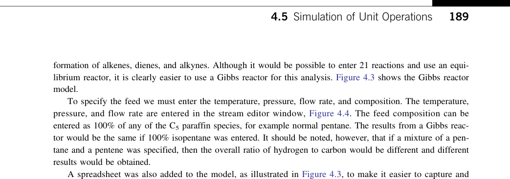

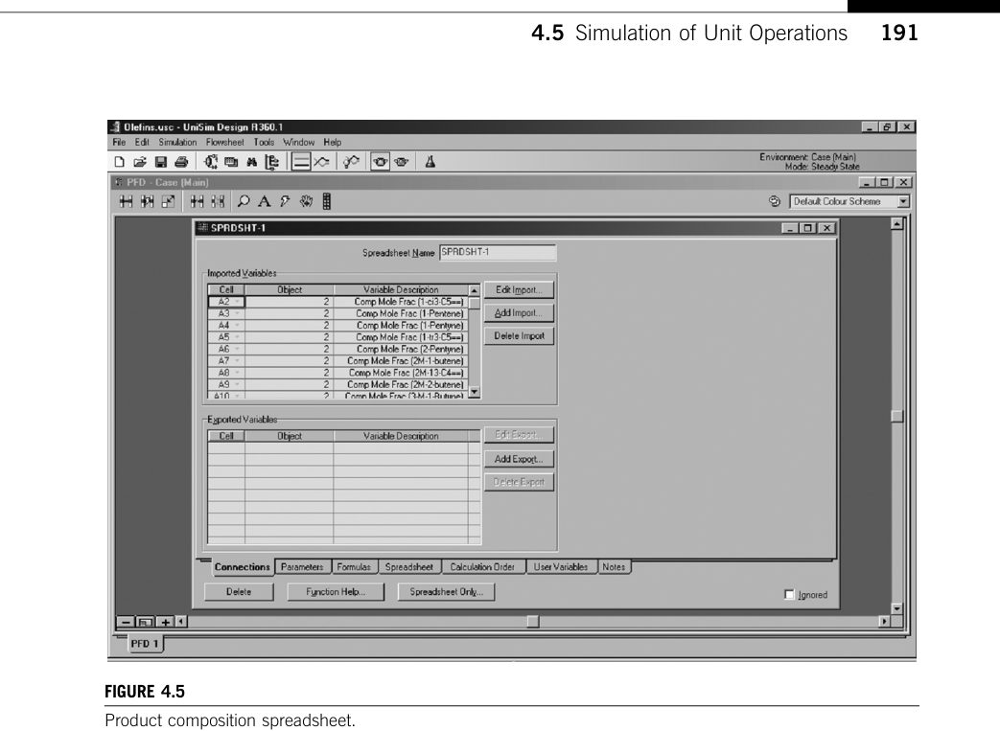

---

## 3. Equations of State (EOS) & Pure Component Thermodynamics

Equations of State describe $P-V-T$ behavior across both vapor and liquid phases in a single thermodynamic framework.

### 3.1 Cubic Equations of State
The general form of two-parameter cubic equations of state:

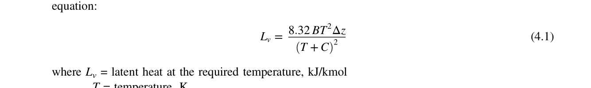

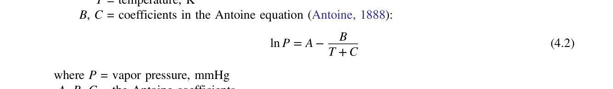

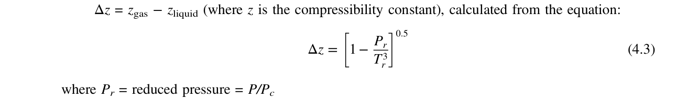

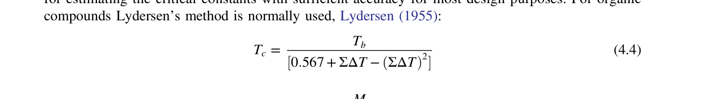

#### 3.1.1 Soave-Redlich-Kwong (SRK)
$$P = \frac{RT}{v - b} - \frac{a(T)}{v(v + b)}$$
$$a(T) = 0.42747 \frac{R^2 T_c^2}{P_c} \alpha(T, \omega), \quad b = 0.08664 \frac{R T_c}{P_c}$$
$$\alpha^{0.5} = 1 + (0.480 + 1.574 \omega - 0.176 \omega^2)(1 - T_r^{0.5})$$

#### 3.1.2 Peng-Robinson (PR)
$$P = \frac{RT}{v - b} - \frac{a(T)}{v(v + b) + b(v - b)}$$
$$a(T) = 0.45724 \frac{R^2 T_c^2}{P_c} \alpha(T, \omega), \quad b = 0.07780 \frac{R T_c}{P_c}$$
$$\alpha^{0.5} = 1 + (0.37464 + 1.54226 \omega - 0.26992 \omega^2)(1 - T_r^{0.5})$$
* **Industry Benchmark**: Peng-Robinson provides superior liquid density predictions compared to SRK and is the global standard for oil, gas, refining, and petrochemical systems at all pressures up to 1000 bar.

### 3.2 Mixing Rules and Binary Interaction Parameters ($k_{ij}$)
For mixtures of components $i$ and $j$, classical van der Waals one-fluid mixing rules are used:

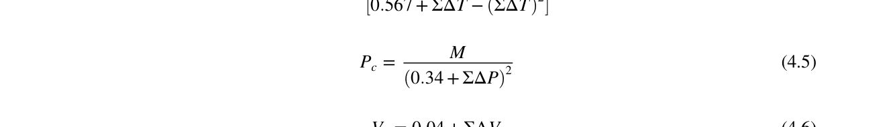

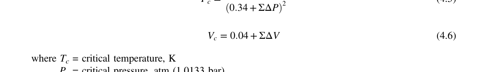

$$a_{mix} = \sum_i \sum_j x_i x_j a_{ij}, \quad a_{ij} = \sqrt{a_i a_j} (1 - k_{ij})$$
$$b_{mix} = \sum_i x_i b_i$$
* $k_{ij}$ is the empirical **Binary Interaction Parameter**, fitted to experimental binary VLE data. Setting $k_{ij} = 0$ assumes ideal hydrocarbon-like interactions; non-zero $k_{ij}$ values are mandatory when light gases ($CO_2, H_2S, N_2$) mix with heavy hydrocarbons.

### 3.3 Fugacity Coefficients & Enthalpy Departures
Phase equilibrium requires equality of chemical potentials, or fugacities:
$$f_{i,V} = f_{i,L} \iff y_i \phi_{i,V} P = x_i \phi_{i,L} P \iff K_i = \frac{y_i}{x_i} = \frac{\phi_{i,L}}{\phi_{i,V}}$$

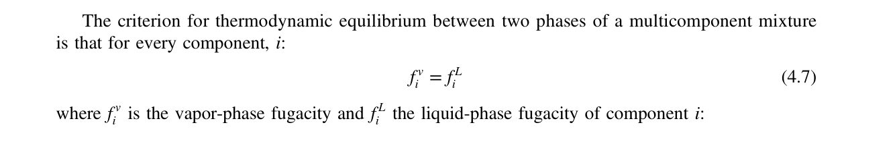

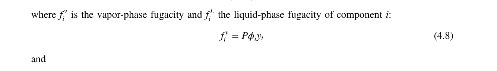

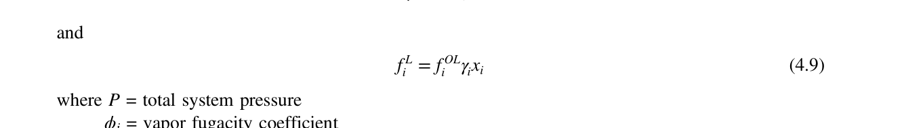

$$\ln \phi_i = \frac{1}{RT} \int_0^P \left( \bar{v}_i - \frac{RT}{P} \right) dP$$
Enthalpy departure from ideal gas:
$$H(T, P) - H^{ig}(T, P) = \int_\infty^V \left[ T \left(\frac{\partial P}{\partial T}\right)_V - P \right] dV + P V - R T$$

---

## 4. Activity Coefficient Models (Non-Ideal Liquids)

For highly polar, non-ideal liquid mixtures at low-to-moderate pressures ($P < 10\text{ bar}$), the **$\gamma-\phi$ formulation** is used:

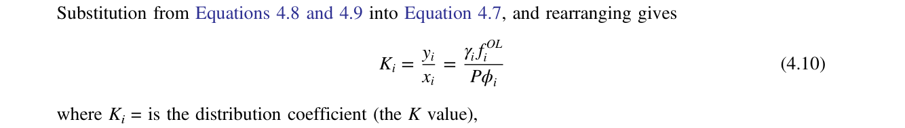

$$K_i = \frac{y_i}{x_i} = \frac{\gamma_i P_i^{sat} \phi_i^{sat} \mathcal{P}_i}{\phi_{i,V} P}$$
where $\mathcal{P}_i$ is the **Poynting Correction Factor**:

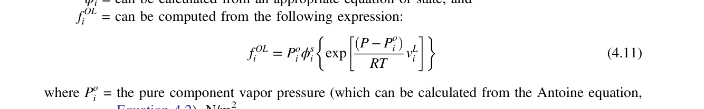

$$\mathcal{P}_i = \exp\left( \frac{V_{i,L} (P - P_i^{sat})}{RT} \right)$$
At pressures below $5\text{ bar}$, $\phi_i^{sat} \approx 1$, $\phi_{i,V} \approx 1$, and $\mathcal{P}_i \approx 1$, reducing to **Modified Raoult's Law**:
$$y_i P = x_i \gamma_i P_i^{sat}(T)$$

### 4.1 Activity Coefficient Models Comparison

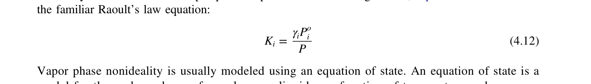

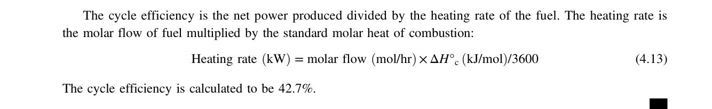

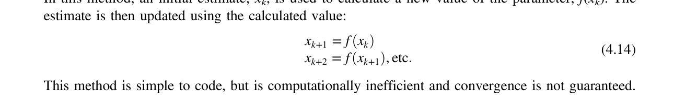

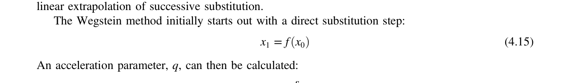

1. **Wilson Model**:
   * Highly effective for strongly non-ideal polar liquid mixtures (alcohols, ketones, water).
   * **Fatal Flaw**: Mathematically cannot predict liquid-liquid phase splitting (VLLE/decanters).
2. **NRTL (Non-Random Two-Liquid)**:
   * Uses local composition theory with non-randomness parameter $\alpha_{ij} \approx 0.2 - 0.3$.
   * Excellent for both VLE and VLLE (liquid-liquid extraction, decanters).
3. **UNIQUAC (Universal Quasi-Chemical)**:
   * Accounts for molecular size/shape differences via surface area parameter $q_i$ and volume parameter $r_i$.
   * Industry standard for complex polar, azeotropic, and biochemical mixtures.
4. **UNIFAC (Group Contribution)**:
   * Predicts activity coefficients when no experimental binary parameters exist by breaking molecules into functional groups ($-CH_3, -OH, -COOH$).

---

## 5. Flash Calculations (Vapor-Liquid Equilibrium)

The fundamental building block of all unit operations is the equilibrium flash calculation.

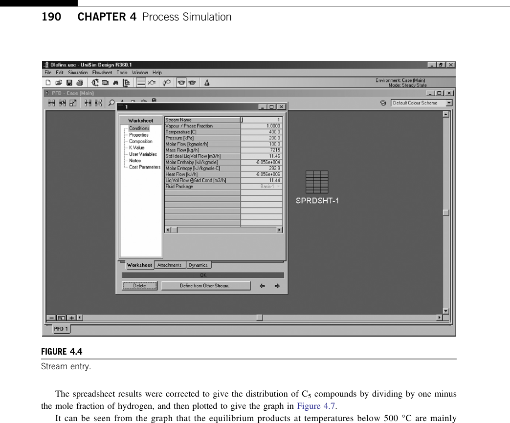

### 5.1 The Rachford-Rice Equation (Isothermal Flash)
Given feed composition $z_i$, temperature $T$, and pressure $P$:

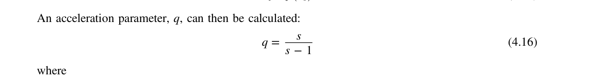

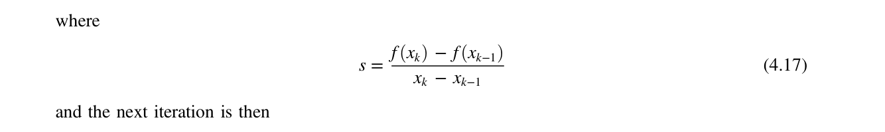

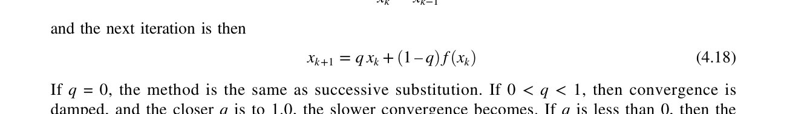

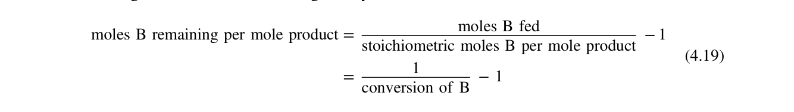

Component balances:
$$F z_i = L x_i + V y_i, \quad y_i = K_i x_i$$
$$x_i = \frac{z_i}{1 + \psi (K_i - 1)}, \quad y_i = \frac{K_i z_i}{1 + \psi (K_i - 1)}$$
where $\psi = V / F$ is the molar vapor fraction ($0 \le \psi \le 1$).

Summing mole fractions ($\sum y_i - \sum x_i = 0$) yields the **Rachford-Rice Equation**:
$$f(\psi) = \sum_{i=1}^C \frac{z_i (K_i - 1)}{1 + \psi (K_i - 1)} = 0$$

* **Monotonic Derivative (Guaranteed Newton Convergence)**:
  $$f'(\psi) = -\sum_{i=1}^C \frac{z_i (K_i - 1)^2}{[1 + \psi (K_i - 1)]^2} < 0$$
  Because $f'(\psi)$ is strictly negative everywhere in the interval $\psi \in [0, 1]$, Newton-Raphson iteration is unconditionally stable:
  $$\psi^{(k+1)} = \psi^{(k)} - \frac{f(\psi^{(k)})}{f'(\psi^{(k)})}$$

---

## 6. Recycle Convergence & Tear Streams

In flowsheets with recycle loops, a "tear stream" is chosen to convert the cyclic calculation graph into a directed acyclic graph (DAG).

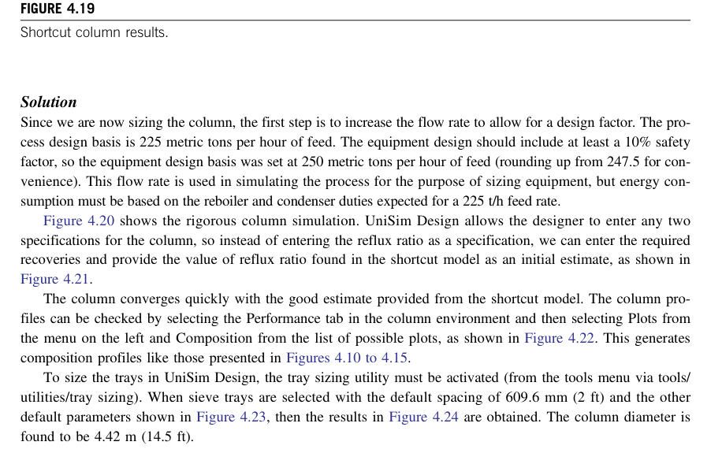

### 6.1 Tear Stream Selection (Kavlie & Moe Algorithm)
* Cut the minimum number of streams such that all cycles are broken.
* Prefer tearing streams with large capacitance (surge drums) and well-behaved physical properties.

### 6.2 Acceleration Algorithms

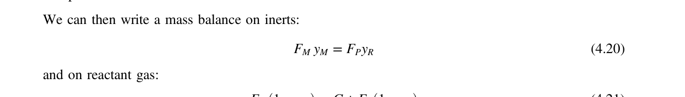

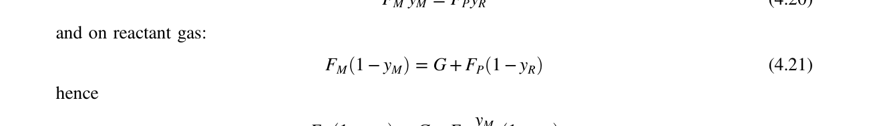

1. **Direct Substitution (Successive Substitution)**:
   $$\mathbf{x}^{(k+1)} = \mathbf{g}(\mathbf{x}^{(k)})$$
   * Extremely stable for weakly coupled systems; convergence rate depends on spectral radius $\rho(\mathbf{J}) < 1$.
2. **Wegstein Acceleration**:
   Fits a secant line between successive iterations to predict the root:
   $$s = \frac{g(x^{(k)}) - g(x^{(k-1)})}{x^{(k)} - x^{(k-1)}}$$
   $$q = \frac{s}{s - 1}$$
   $$x^{(k+1)} = q \cdot x^{(k)} + (1 - q) g(x^{(k)})$$
   * **Stability Bounds**: In practice, $q$ is clamped to $[-5, 0]$ (or $s \in [0, 0.9]$) to prevent oscillations and wild overshoots.
3. **Broyden's Quasi-Newton Method**:
   Approximates the Jacobian inverse matrix using rank-1 updates:
   $$\mathbf{B}^{(k+1)} = \mathbf{B}^{(k)} + \frac{(\Delta \mathbf{x} - \mathbf{B}^{(k)} \Delta \mathbf{f}) \Delta \mathbf{x}^T \mathbf{B}^{(k)}}{\Delta \mathbf{x}^T \mathbf{B}^{(k)} \Delta \mathbf{f}}$$
