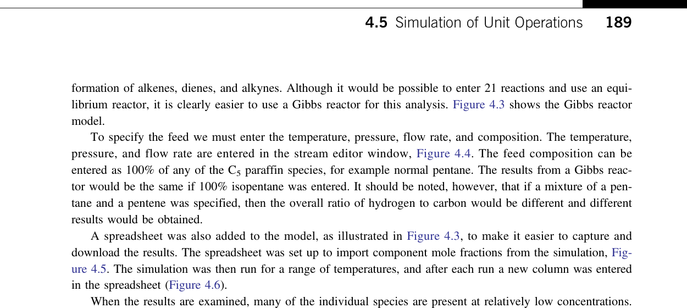
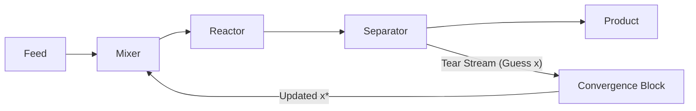

# Process Simulation & Thermodynamic Modeling

This skill provides an authoritative, textbook-grounded reference on chemical process simulation architecture, thermodynamic model selection decision trees, flash calculation solvers, and recycle convergence algorithms, based directly on Chapter 4 of *Chemical Engineering Design* (Towler & Sinnott, 2nd Edition, pp. 172–242).

---

## 1. Flowsheet Simulation Architectures

Commercial process simulators (e.g. Aspen Plus, HYSYS, UniSim, ChemCAD, DWSIM, and Visualcheme) solve complex heat and material balances across interconnected networks of unit operations.

### 1.1 Sequential Modular (SM) Architecture
* **Solving Mechanics**: Units are solved sequentially, one at a time, moving downstream in the direction of physical process fluid flow (Figure 4.1a). The calculated output streams of unit $N$ serve as the known input streams to unit $N+1$.
* **Advantages**:
  * Highly robust; failure in one unit is easily isolated and diagnosed.
  * Utilizes specialized, battle-tested unit operation algorithms (e.g. Inside-Out distillation algorithm, Kern exchanger rating).
  * Intuitive for process engineers to trace mass and energy balances.
* **Limitations**:
  * Requires iterative numerical convergence of recycle loops via "tear streams".
  * Optimization and design-spec solving (e.g. varying feed to meet product spec) require slow outer nested iteration loops.

### 1.2 Equation-Oriented (EO) Architecture
* **Solving Mechanics**: Every mass, energy, momentum, and phase equilibrium relationship across the entire plant is compiled into a single massive, sparse system of non-linear algebraic equations:
  $$\mathbf{F}(\mathbf{x}) = \mathbf{0}$$
  The entire system is solved simultaneously using sparse Newton-Raphson or SQP solvers (Figure 4.1b).
* **Advantages**:
  * Solves complex multi-recycle flowsheets and whole-plant optimizations in a fraction of the time required by SM.
  * Handles design constraints and inverse problems directly without outer iteration loops.
* **Limitations**:
  * Extremely sensitive to initialization; poor starting guesses cause solver divergence.
  * Difficult to debug when the global Jacobian matrix becomes singular.

---

## 2. Selection of Physical Property Models

The single most critical decision in process simulation is selecting the appropriate thermodynamic physical property package. Choosing the wrong thermodynamic model will produce completely invalid column profiles, wrong phase splits, and erroneous equipment dimensions.

### 2.1 The Master Thermodynamic Decision Trees
Towler & Sinnott provide three hierarchical decision trees (Figures 4.4, 4.5, 4.6) for choosing thermodynamic packages:

#### 2.1.1 General Selection Criteria (Figure 4.4):
1. **Electrolytes Present?** $\rightarrow$ Use **Electrolyte NRTL (e-NRTL)** or **Pitzer equations** (Figure 4.6).
2. **Polar / Non-Ideal Components Present?**
   * *NO (Purely non-polar hydrocarbons and light gases $CH_4, N_2, CO_2, H_2S$)* $\rightarrow$ Use **Cubic Equations of State (EOS)**:
     * **Peng-Robinson (PR)**: Industry standard for oil, gas, and refining. Superior liquid density prediction.
     * **Soave-Redlich-Kwong (SRK)**: Gas processing and cryogenic petrochemicals.
   * *YES (Alcohols, ketones, water, amines, organic acids)* $\rightarrow$ Use **Activity Coefficient Models** (Figure 4.5).

#### 2.1.2 Polar Non-Electrolyte Selection Criteria (Figure 4.5):
* **Operating Pressure**:
  * *Low to Moderate Pressure ($P < 10\text{ bar}$)*:
    * Liquid phase non-ideality modeled via **Activity Coefficient models ($\gamma_i$)**:
      * **NRTL (Non-Random Two-Liquid)**: Highly versatile for polar mixtures and liquid-liquid phase separation (VLE and LLE).
      * **UNIQUAC**: Excellent for mixtures containing molecules of widely different molecular sizes and shapes.
      * **Wilson**: Excellent for miscible highly non-ideal VLE; *cannot model liquid-liquid immiscibility (LLE)*.
      * **UNIFAC**: Group-contribution method used when experimental binary interaction parameters are unavailable.
    * Vapor phase non-ideality modeled via:
      * Ideal gas ($P < 2\text{ bar}$).
      * Redlich-Kwong or Hayden-O'Connell (required for carboxylic acids such as acetic acid, which dimerize in vapor phase).
  * *High Pressure ($P > 10\text{ bar}$)*:
    * Use **EOS with Advanced Mixing Rules**:
      * **Wong-Sandler (PR-WS)** or **Huron-Vidal** mixing rules that link cubic EOS to NRTL excess Gibbs energy formulations.

---

## 3. Vapor-Liquid Equilibrium & Flash Solvers

A flash calculation determines the vapor fraction ($\psi = V/F$), equilibrium phase compositions ($x_i, y_i$), and temperature/pressure of a multi-component stream exiting a flash vessel or separator:

### 3.1 The Rachford-Rice Algorithm
For a flash vessel operating at known temperature $T$ and pressure $P$ with feed composition $z_i$:
* Overall mass balance: $F = V + L \implies 1 = \psi + (1 - \psi)$
* Component balance: $F z_i = V y_i + L x_i \implies z_i = \psi y_i + (1 - \psi) x_i$
* Phase equilibrium definition: $y_i = K_i x_i$

Solving for $x_i$ and $y_i$:
$$x_i = \frac{z_i}{1 + \psi (K_i - 1)}$$
$$y_i = \frac{K_i z_i}{1 + \psi (K_i - 1)}$$

Because mole fractions in both phases must sum to unity ($\sum y_i - \sum x_i = 0$), we formulate the **Rachford-Rice objective function** (Equation 4.7):

$$f(\psi) = \sum_{i=1}^C \frac{z_i (K_i - 1)}{1 + \psi (K_i - 1)} = 0$$

#### Numerical Properties & Newton-Raphson Solution:
The derivative of the Rachford-Rice function with respect to vapor fraction $\psi$ is strictly negative:
$$f'(\psi) = -\sum_{i=1}^C \frac{z_i (K_i - 1)^2}{[1 + \psi (K_i - 1)]^2} < 0$$
* Because $f'(\psi) < 0$ everywhere on the interval $\psi \in (0, 1)$, the function is **monotonically decreasing** with no local extrema.
* A standard **Newton-Raphson iteration** is guaranteed to converge quadratically:
  $$\psi^{(k+1)} = \psi^{(k)} - \frac{f(\psi^{(k)})}{f'(\psi^{(k)})}$$

---

### 3.2 Bubble Point and Dew Point Algorithms
* **Bubble Point (Onset of boiling, $\psi = 0$)**:
  $$\sum_{i=1}^C y_i = \sum_{i=1}^C K_i z_i = 1.0$$
  * *Bubble Pressure*: $P_{bub} = \sum z_i P_{sat,i}(T)$ (for ideal systems).
  * *Bubble Temperature*: Solve $\sum z_i K_i(T) = 1.0$ via 1D root search.
* **Dew Point (Onset of condensation, $\psi = 1$)**:
  $$\sum_{i=1}^C x_i = \sum_{i=1}^C \frac{z_i}{K_i} = 1.0$$
  * *Dew Pressure*: $P_{dew} = \frac{1}{\sum (z_i / P_{sat,i})}$.
  * *Dew Temperature*: Solve $\sum [z_i / K_i(T)] = 1.0$.

---

## 4. Flowsheets with Recycle (Tear Stream Convergence)

Recycle loops are ubiquitous in chemical processes (recovering unreacted feed, solvent circulation, pump-around cooling). In sequential modular simulators, recycle loops create circular information dependencies that must be broken by "tearing" streams.

### 4.1 Successive Substitution (Direct Picard Iteration)
The tear stream variables $x$ are guessed, the loop is calculated sequentially, and the computed value $g(x)$ becomes the guess for the next iteration:
$$x^{(k+1)} = g(x^{(k)})$$
* Extremely simple, but converges very slowly (first-order) when the recycle ratio is high, and oscillates or diverges when process gain $|g'(x)| > 1$.

---

### 4.2 The Wegstein Acceleration Method (Figure 4.23)
The Wegstein method is the standard acceleration algorithm in process simulation. It projects a secant line between successive iterations to extrapolate directly to the fixed point where $x = g(x)$:

#### Mathematical Formulation (Equations 4.15–4.21):
1. Evaluate the numerical slope of the transformation function between iterations $k-1$ and $k$:

$$s = \frac{g(x^{(k)}) - g(x^{(k-1)})}{x^{(k)} - x^{(k-1)}}$$

2. Compute the Wegstein weighting factor $q$:

$$q = \frac{s}{s - 1}$$

3. Update the tear variable for iteration $k+1$:
   $$x^{(k+1)} = q x^{(k)} + (1 - q) g(x^{(k)})$$

#### Numerical Stability Heuristics:
* If $q = 0$ ($s = 0$), the formula collapses to simple Successive Substitution.
* If $0 < s < 1$, acceleration occurs ($q < 0$), cutting iteration count by $70\% - 80\%$.
* To prevent wild overshoots or numerical instability, simulators enforce bounds:
  $$-5.0 \le q \le 0.0$$

---

## 5. Visualcheme Implementation Architecture

1. **State Variables**: Model flowsheet streams using pressure $P$, temperature $T$, vapor fraction $\psi$, total molar flow $\dot{n}$, component mole fractions $\mathbf{z}$, and enthalpy $h$.
2. **Interactive Visualization Gradients**:
   * *Thermodynamic Model Decision Navigator*: Interactive tree highlighting the recommended model based on active stream components.
   * *Flash Rachford-Rice Curve Viewer*: Plot $f(\psi)$ vs $\psi$ displaying Newton-Raphson tangent steps converging to $f(\psi) = 0$.
   * *Recycle Convergence Tracker*: Live HUD displaying Wegstein residual $|x^{(k+1)} - x^{(k)}|$ decreasing across iteration steps.
3. **Preset Scenarios**:
   * *Hydrocarbon Flash Drum*: Pentane/Hexane/Heptane flash at $80^\circ\text{C}, 1.5\text{ bar}$ using Peng-Robinson EOS.
   * *Methanol-Water Separation*: Highly polar non-ideal VLE using NRTL model with vapor dimerization.
