# Design of Chemical Reactors and Mixers

This skill provides an authoritative, textbook-grounded reference on chemical reactor sizing, reaction kinetics, stirred vessel mixing, power consumption curves, and thermal management, based directly on Chapter 15 of *Chemical Engineering Design* (Towler & Sinnott, 2nd Edition, pp. 640–758).

---

## 1. Reactor Types & Performance Equations

Chemical reactors convert chemical feedstocks into products. Reactor selection depends on phase, reaction kinetics, production scale, and heat transfer requirements.

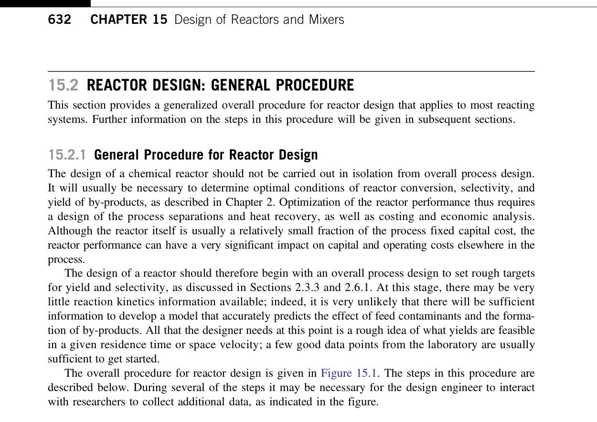

### 1.1 The Classical Ideal Reactor Models

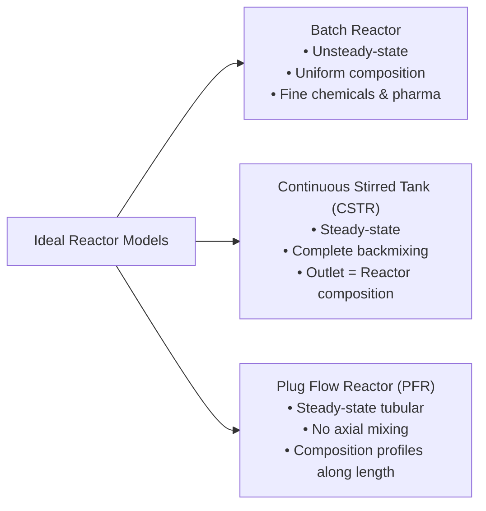

#### 1.1.1 Batch Reactor Sizing (Equation 15.1)
Operates unsteadily with uniform spatial composition. The time $t_r$ required to reach fractional conversion $X_A$ of limiting reactant $A$:

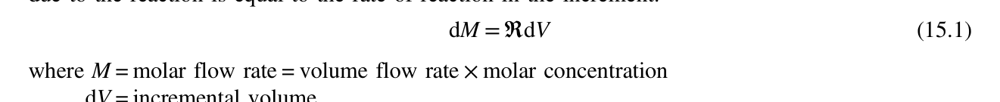

$$t_r = N_{A0} \int_0^{X_A} \frac{d X_A}{(-r_A) V}$$
$$\text{For constant volume liquid systems:}$$
$$t_r = C_{A0} \int_0^{X_A} \frac{d X_A}{(-r_A)}$$
* Total batch cycle time: $t_{cycle} = t_r + t_{charge} + t_{heat} + t_{discharge} + t_{clean}$.

#### 1.1.2 Continuous Stirred Tank Reactor (CSTR) Sizing (Equation 15.3)
Assumes instantaneous, perfect fluid micromixing. The composition in the exit stream is identical to the fluid throughout the vessel:

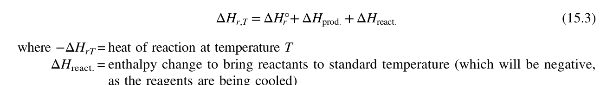

$$V_r = \frac{F_{A0} X_A}{(-r_A)_{exit}} = \frac{\dot{V} C_{A0} X_A}{(-r_A)_{exit}}$$
$$\text{Residence Time ($\tau$):}$$
$$\tau = \frac{V_r}{\dot{V}} = \frac{C_{A0} X_A}{(-r_A)_{exit}}$$
* Because the reaction rate is evaluated at the lowest concentration (the exit conversion), a CSTR requires a substantially larger volume than a PFR for positive-order kinetics ($n > 0$).
* Operating CSTRs in a cascade of $N$ tanks in series dramatically reduces total volume, approaching PFR performance as $N \to \infty$.

#### 1.1.3 Plug Flow Reactor (PFR) Sizing (Equation 15.5)
Fluids move through a cylindrical tube as a continuous plug with zero axial backmixing but perfect radial uniformity:

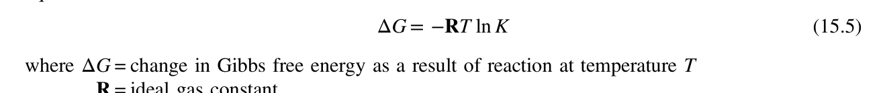

$$V_r = F_{A0} \int_0^{X_A} \frac{d X_A}{(-r_A)}$$
$$\text{Space Time ($\tau$):}$$
$$\tau = \frac{V_r}{\dot{V}_0} = C_{A0} \int_0^{X_A} \frac{d X_A}{(-r_A)}$$

---

## 2. Chemical Kinetics & Damköhler Numbers

### 2.1 Rate Formulations & Temperature Dependence
The rate of reaction $(-r_A)$ per unit fluid volume is given by power-law kinetics:
$$(-r_A) = k(T) C_A^a C_B^b$$

The temperature dependence of the reaction rate constant $k(T)$ follows the **Arrhenius equation** (Equation 15.11):

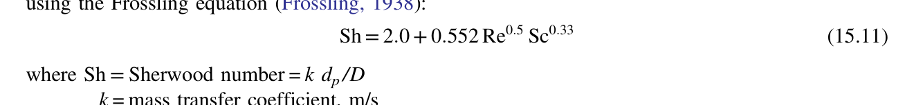

$$k = A \exp\left( -\frac{E_a}{R T} \right)$$
$$\text{Where:}$$
* $A$ = Pre-exponential frequency factor
* $E_a$ = Activation energy ($\text{J/mol}$)
* $R$ = Universal gas constant ($8.314\text{ J/mol}\cdot\text{K}$)
* $T$ = Absolute temperature ($\text{K}$)

### 2.2 Damköhler Number ($Da$)
The ratio of characteristic chemical reaction rate to fluid transport rate:
* For a first-order reaction in a CSTR:
  $$Da = k \tau = \frac{X_A}{1 - X_A}$$
* For $Da \ll 1$, conversion is low; the system is reaction-rate limited.
* For $Da \gg 1$, conversion approaches completion; mixing or heat transfer becomes rate-limiting.

---

## 3. Mixing and Agitation in Stirred Vessels

Agitation promotes fluid homogenization, suspends solid catalyst particles, disperses gas bubbles, and enhances heat transfer coefficients to vessel walls and cooling coils.

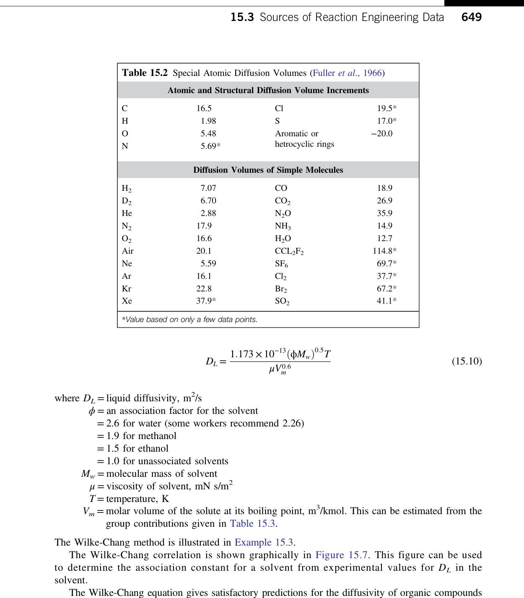

### 3.1 Standard Vessel Geometry Proportions (Towler & Sinnott, Section 15.5)
For a standard cylindrical dished-end vessel of diameter $D_T$:
* **Liquid Level**: $Z_L = D_T$ (Aspect ratio $H/D_T = 1.0 - 1.25$)
* **Impeller Diameter ($D$)**:
  * High-speed turbine / propeller: $D = D_T / 3$ ($0.3 - 0.5\ D_T$)
  * Low-speed anchor / helical ribbon: $D = 0.90 - 0.98\ D_T$
* **Impeller Off-Bottom Clearance ($C$)**: $C = D_T / 3$
* **Baffle Proportions**: 4 standard full-length vertical baffles mounted at $90^\circ$ around vessel periphery:
  * Baffle width: $W = D_T / 10$ to $D_T / 12$
  * Wall clearance: $W_{clear} = D_T / 50$ (prevents stagnant solids buildup behind baffles).
  * *Baffle Function*: Baffles transform bulk rotational swirl (which causes a deep central surface vortex that starves impellers of liquid) into vertical recirculating loops that promote intense micro-turbulence and bulk fluid turnover.

---

### 3.2 Impeller Selection (Figures 15.12, 15.13, 15.14)
Impeller selection depends primarily on fluid dynamic viscosity and process duty:

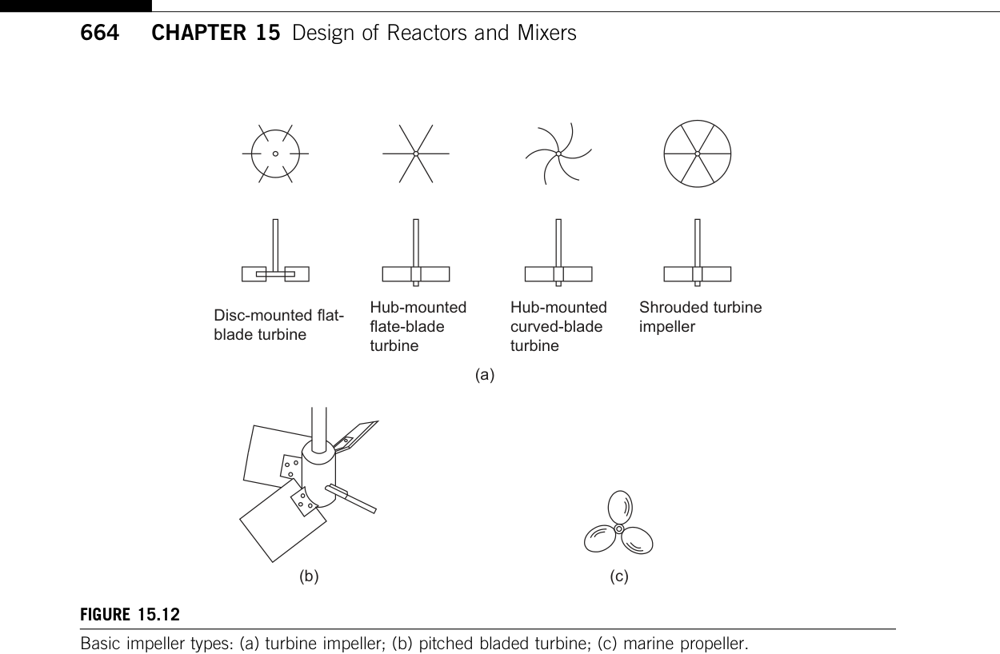

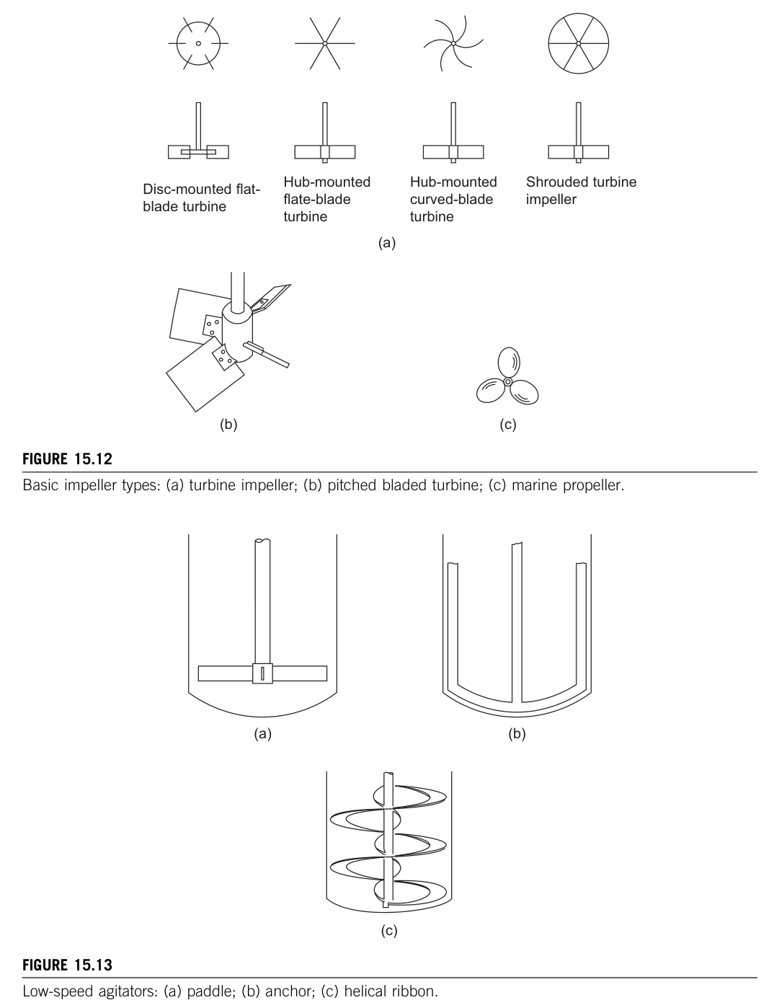

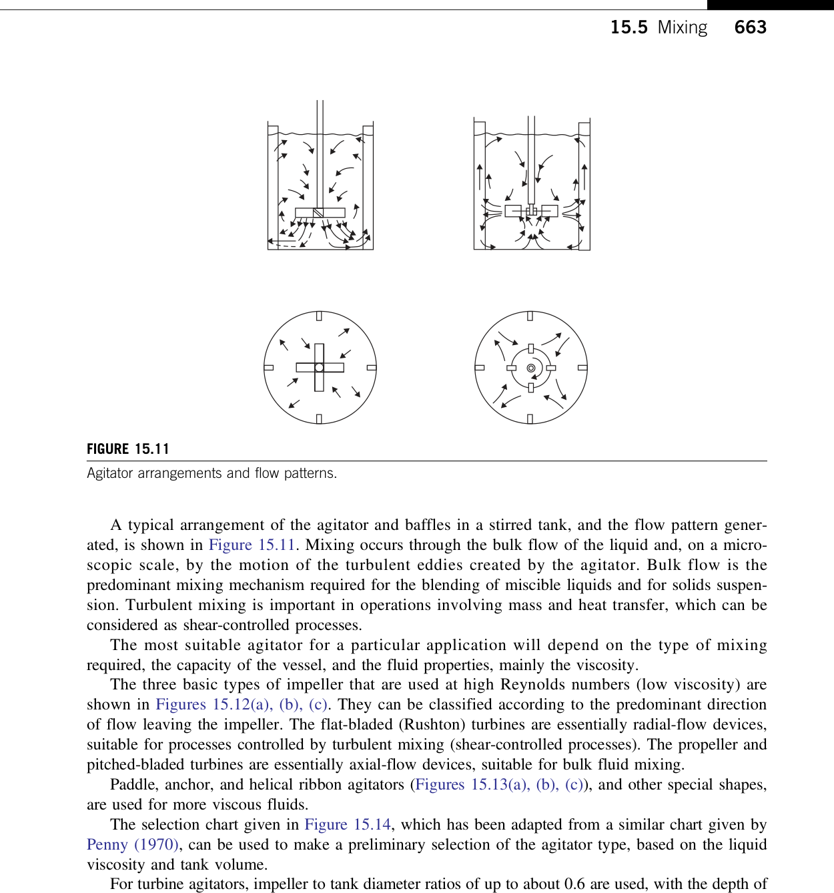

1. **Marine Propeller (Axial Flow)**:
   * 3 curved blades, high speed ($400 - 1750\text{ rpm}$).
   * Generates strong axial downward jet for blending low-viscosity miscible liquids ($\mu < 2000\text{ mPa}\cdot\text{s}$).
2. **Flat-Blade Disc Turbine (Rushton Turbine, Radial Flow)**:
   * 6 flat vertical blades mounted on a central horizontal disc ($D = D_T / 3$).
   * Discharges fluid radially outward toward vessel wall. Produces extreme shear stresses at blade tips; standard choice for **gas-liquid dispersion (sparging)** and liquid-liquid emulsification.
3. **Pitched-Blade Turbine (PBT, Mixed Flow)**:
   * 4 or 6 blades inclined at $45^\circ$.
   * Produces both axial and radial flow at lower shear and lower power than Rushton turbine. Excellent for **solid particle suspension**.
4. **Anchor & Helical Ribbon Agitators (High-Viscosity Laminar Flow)**:
   * Close vessel wall clearance ($10 - 25\text{ mm}$) to scrape boundary layer fluids.
   * Required for non-Newtonian polymers and heavy pastes ($\mu > 20,000\text{ to } 1,000,000\text{ mPa}\cdot\text{s}$).

---

### 3.3 Agitator Power Consumption Formulations

#### 3.3.1 Agitation Reynolds Number ($Re_m$) (Equation 15.12)
Flow regime in a stirred tank is governed by the rotational Reynolds number:

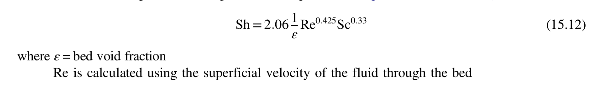

$$Re_m = \frac{\rho N D^2}{\mu}$$
$$\text{Where:}$$
* $N$ = Impeller rotational speed ($\text{rev/s}$ or $\text{rps}$)
* $D$ = Impeller diameter ($\text{m}$)
* $\rho$ = Liquid density ($\text{kg/m}^3$)
* $\mu$ = Dynamic viscosity ($\text{Pa}\cdot\text{s}$)
* *Regimes*: Laminar ($Re_m < 10$); Transition ($10 < Re_m < 10,000$); Fully Turbulent ($Re_m > 10,000$).

#### 3.3.2 Power Number ($N_P$) Definition (Equation 15.14)
The dimensionless power number is defined as:

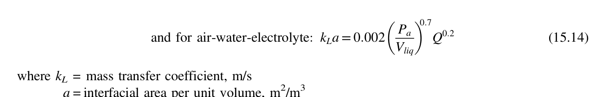

$$N_P = \frac{P}{\rho N^3 D^5}$$
Rearranging to calculate mechanical shaft power:
$$P = N_P \cdot \rho N^3 D^5$$

#### 3.3.3 Power Correlation Curves (Figures 15.15 and 15.16)
In fully turbulent baffled flow ($Re_m > 10,000$), $N_P$ becomes completely independent of Reynolds number ($N_P = \text{constant}$):

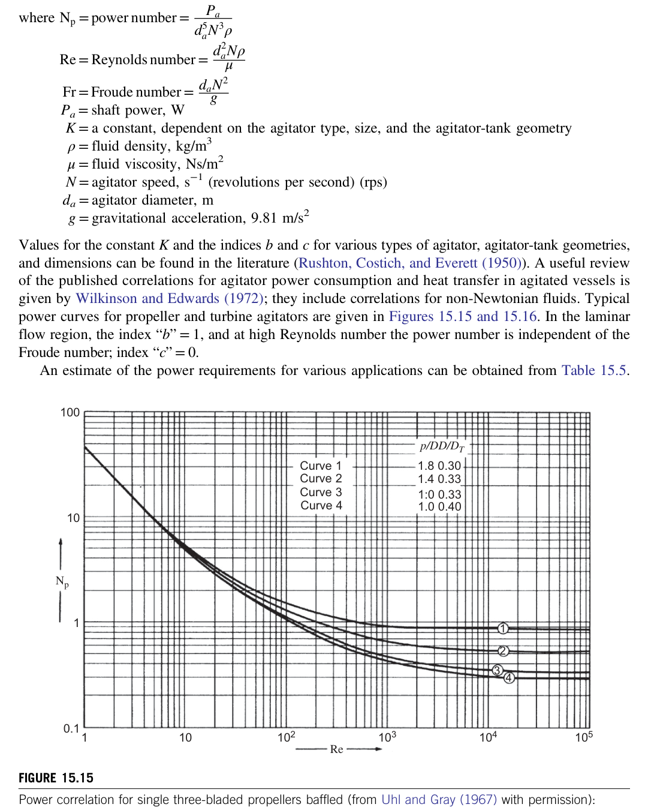

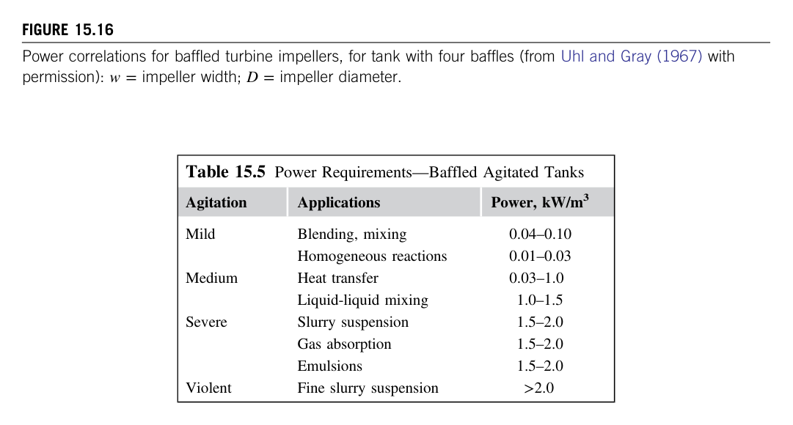

* **Rushton Turbine (Flat Blade, 4 Baffles)**: $N_P \approx \mathbf{5.0}$ (constant in turbulent regime)
* **Pitched-Blade Turbine ($45^\circ$, 4 Blades)**: $N_P \approx \mathbf{1.2 - 1.6}$
* **Marine Propeller (Pitch ratio $p/D = 1.0$)**: $N_P \approx \mathbf{0.32}$
* In the laminar regime ($Re_m < 10$):
  $$N_P = \frac{K_L}{Re_m} \implies P = K_L \mu N^2 D^3$$
  Where $K_L \approx 65$ for Rushton turbine; $K_L \approx 40$ for marine propeller.

---

## 4. Heating and Cooling of Reacting Systems

Exothermic reactions require continuous heat removal to prevent runaway temperature excursions.

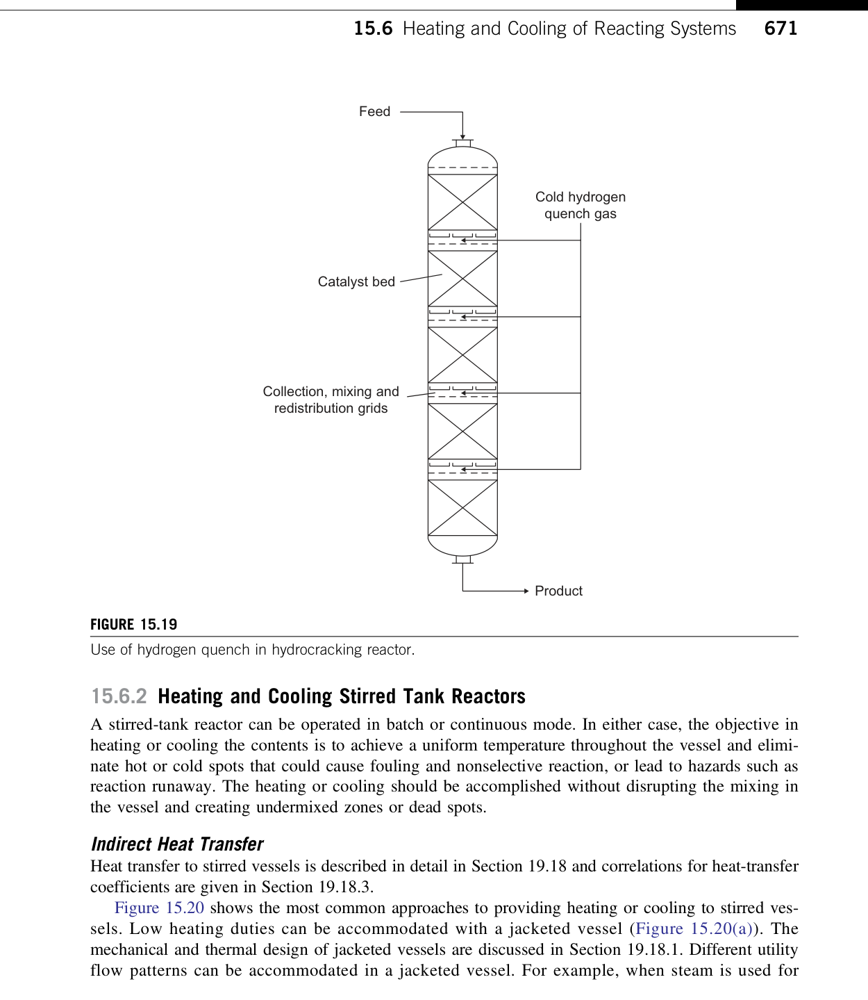

### 4.1 Vessel Thermal Jacketing vs Internal Coils
1. **Conventional Outer Jacket (Figure 15.20a)**:
   * Annular jacket surrounding lower vessel shell and bottom head.
   * Simple and cheap, but low coolant velocity produces low heat transfer coefficients ($U \approx 200 - 400\text{ W/m}^2\cdot\text{K}$).
2. **Half-Pipe Coil & Dimple Jackets**:
   * Pipe welded in a spiral around vessel exterior.
   * High coolant fluid velocity increases film coefficient ($U \approx 400 - 800\text{ W/m}^2\cdot\text{K}$); handles high utility pressure ($> 20\text{ bar}$).
3. **Internal Helical Cooling Coils (Figure 15.20b)**:
   * Immersed directly in the agitated liquid zone.
   * Provides very large surface area ($A$) and high external film coefficients ($h \approx 1000 - 2500\text{ W/m}^2\cdot\text{K}$). Disadvantages: occupies reactor volume, difficult to clean, susceptible to vibration fatigue.
4. **External Pump-Around Loop with Heat Exchanger (Figure 15.20c)**:
   * Liquid is continuously pumped from reactor through a high-efficiency shell-and-tube or plate exchanger and returned.
   * Area is not limited by reactor vessel dimensions.

---

## 5. Catalytic Fixed-Bed Reactors (Figure 15.25)

Heterogeneous gas-solid catalytic reactions (e.g. ammonia synthesis, sulfur oxidation, partial oxidation of hydrocarbons) take place in fixed-bed reactors:

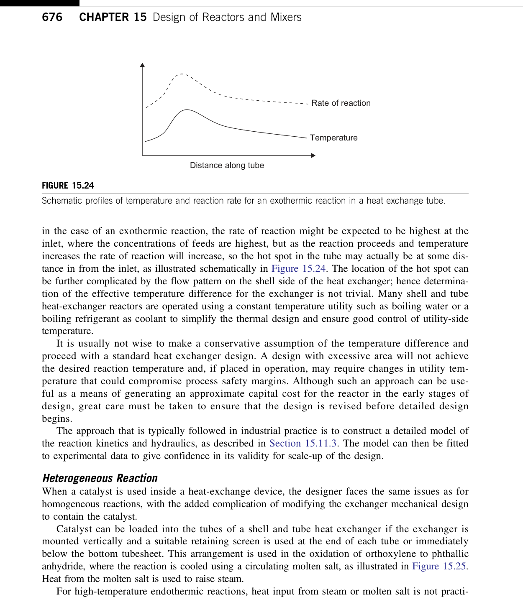

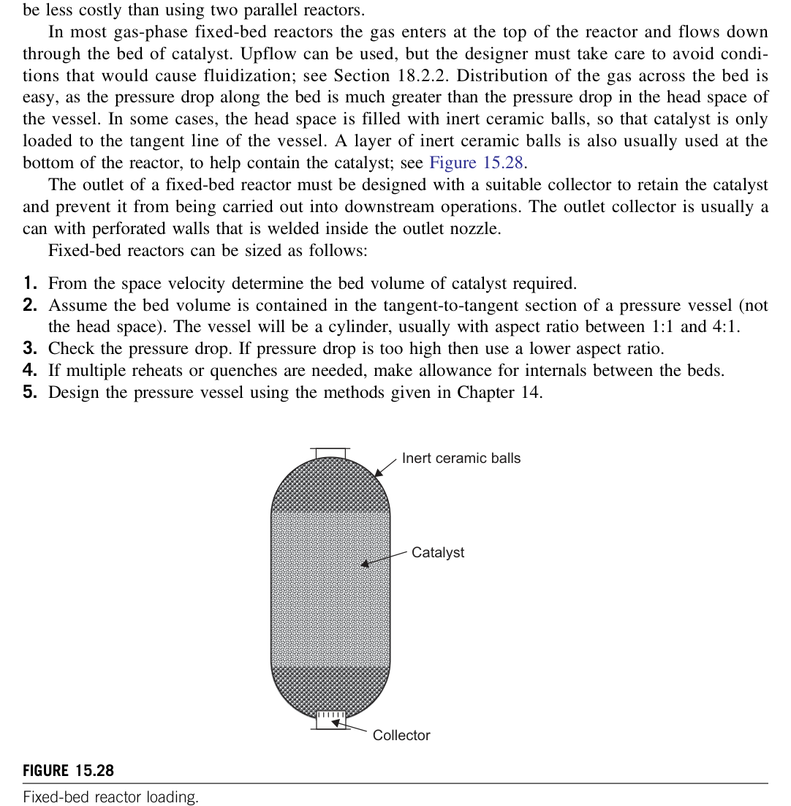

### 5.1 Pressure Drop Across Catalyst Beds (The Ergun Equation)
Fluid pressure drop through a packed bed of solid catalyst pellets of diameter $d_p$ and void fraction $\varepsilon$ obeys the Ergun formulation:

$$\frac{\Delta P}{L} = 150 \frac{(1 - \varepsilon)^2}{\varepsilon^3} \frac{\mu U}{d_p^2} + 1.75 \frac{1 - \varepsilon}{\varepsilon^3} \frac{\rho U^2}{d_p}$$
* Typical catalyst bed void fraction: $\varepsilon = 0.35 - 0.42$.
* High pressure drop represents wasted compressor power and risks crushing fragile catalyst pellets.

---

## 6. Visualcheme Implementation Architecture

1. **State Variables**: Model reactor vessels with volume $V_r$, conversion $X_A$, core temperature $T_r$, jacket temperature $T_j$, heat generation $\dot{Q}_{rxn} = (-r_A) V_r (-\Delta H_r)$, and agitation power $P$.
2. **Interactive Visualization Gradients**:
   * *Reaction Rate & Conversion Spatial Profile*: Plot $X(z)$ and $T(z)$ along tubular PFR length.
   * *Thermal Runaway Stability Phase Plane*: Dynamic plot of Heat Generation ($Q_g \propto e^{-E_a/RT}$) vs Heat Removal ($Q_r = U A (T - T_c)$). Illustrates multiple steady states and ignition thresholds.
   * *Agitator Velocity Field*: Display rotational velocity vectors showing radial discharge from Rushton turbines and axial loops from marine propellers.
3. **Preset Scenarios**:
   * *Exothermic CSTR with Runaway Hazard*: Styrene polymerization, cooling jacket with failsafe interlock.
   * *Fixed-Bed Catalytic SO2 Converter*: Multi-bed adiabatic reactor with inter-stage gas cooling.
