# Specification and Design of Solids-Handling Equipment

This skill provides an authoritative, detailed, textbook-grounded reference on particulate characterization, cyclone separation, cake filtration, and industrial drying, based directly on Chapter 18 of *Chemical Engineering Design* (Towler & Sinnott, 2nd Edition, pp. 946–1054).

---

## 1. Particle Characterization & Bulk Solids Properties

Particulate solids are characterized by particle size distribution (PSD), shape factor (sphericity $\phi_s$), and porosity.

### 1.1 Sauter Mean Diameter ($d_{32}$)
The volume-to-surface mean diameter, critical for fluidization and mass/heat transfer:
$$d_{32} = \frac{\sum n_i d_i^3}{\sum n_i d_i^2} = \frac{1}{\sum (w_i / d_i)}$$
where $w_i$ is the mass fraction of particles in size interval $d_i$.

---

## 2. Gas-Solids Separation: Reverse-Flow Cyclones

Cyclones separate solid particles from a gas stream using centrifugal force created by tangential gas entry into a cylindrical/conical body.

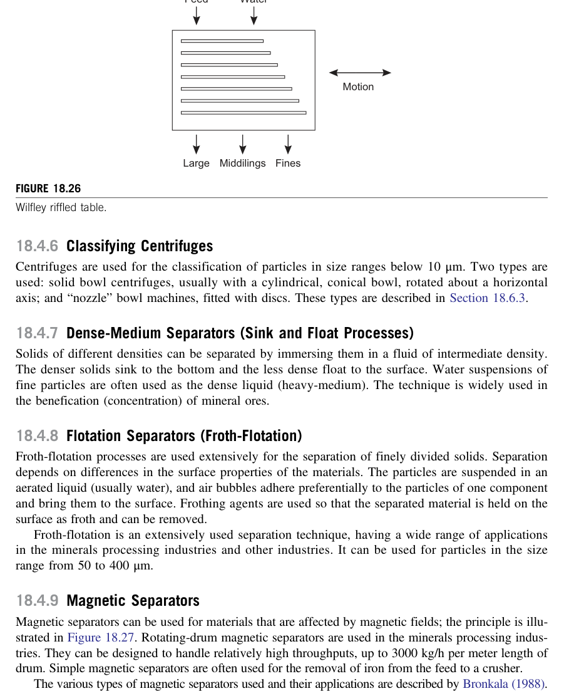

### 2.1 Standard Lapple Proportions (Reference: Barrel Diameter $D_c$)
The standard high-efficiency Lapple design dimensions:
* Inlet height: $a = D_c / 2 = 0.5 D_c$
* Inlet width: $b = D_c / 4 = 0.25 D_c$
* Gas vortex finder outlet diameter: $D_e = D_c / 2 = 0.5 D_c$
* Vortex finder length: $S = D_c / 2 = 0.5 D_c$
* Cylindrical barrel height: $h = 2.0 D_c$
* Conical section height: $z = 2.0 D_c$
* Total cyclone height: $H = h + z = 4.0 D_c$
* Dust discharge diameter: $B = D_c / 4 = 0.25 D_c$

### 2.2 Cut Diameter ($d_{50}$ or $d_{pc}$)
The cut diameter is the particle size collected with exactly $50\%$ efficiency:

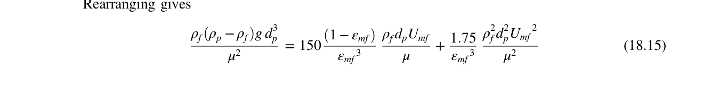

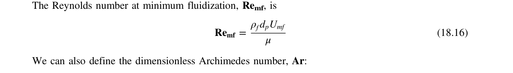

$$d_{pc} = \sqrt{\frac{9 \mu b}{2 \pi N_e v_{in} (\rho_p - \rho_g)}}$$
$$\text{Where:}$$
* $\mu$ = Gas dynamic viscosity ($\text{Pa}\cdot\text{s}$)
* $b$ = Inlet width ($D_c / 4$, m)
* $v_{in}$ = Inlet gas velocity ($15 - 25\text{ m/s}$)
* $\rho_p, \rho_g$ = Densities of particle and gas ($\text{kg/m}^3$)
* $N_e$ = Number of effective gas spiral revolutions inside cyclone ($N_e \approx 5$ for Lapple design)

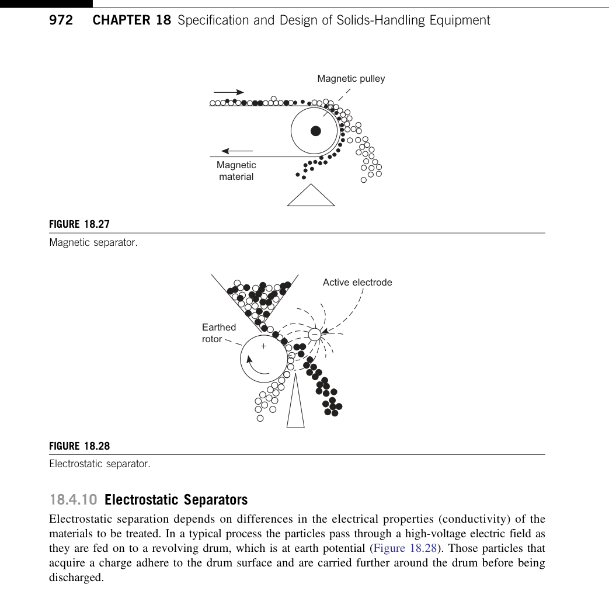

* **Grade Efficiency Curve ($\eta_i$)**:
  $$\eta_i = \frac{1}{1 + (d_{pc} / d_i)^2}$$
  Particles with $d_i \ge 2 d_{pc}$ are captured with $> 80\%$ efficiency; particles with $d_i \ge 5 d_{pc}$ with $> 96\%$ efficiency.

### 2.3 Cyclone Pressure Drop
Pressure drop across a cyclone is proportional to inlet velocity head:

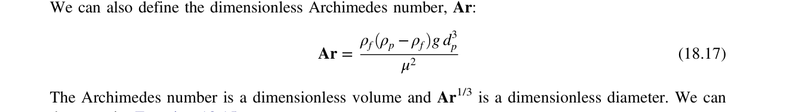

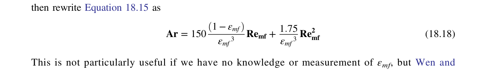

$$\Delta P = \frac{1}{2} \rho_g v_{in}^2 N_H$$
where $N_H$ is the number of inlet velocity heads:
$$N_H = K \frac{a b}{D_e^2} \approx 16 \frac{(0.5 D_c)(0.25 D_c)}{(0.5 D_c)^2} \approx 8.0$$
* Typical pressure drop: $\Delta P = 0.5\text{ to } 2.5\text{ kPa}$ ($2 - 10\text{ in. } H_2O$).

---

## 3. Solid-Liquid Filtration

Separates insoluble solid particles from a liquid slurry by passing the suspension through a porous filter medium that retains solids as a "cake".

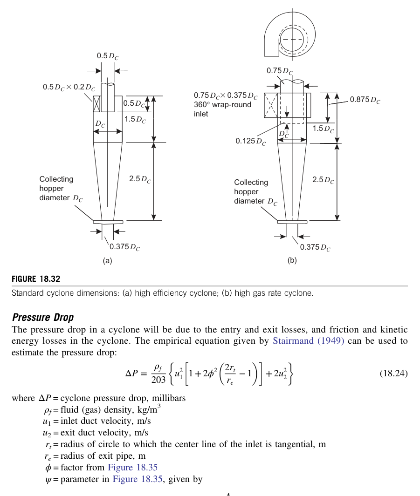

### 3.1 Fundamental Filtration Theory (The Ruth Equation)

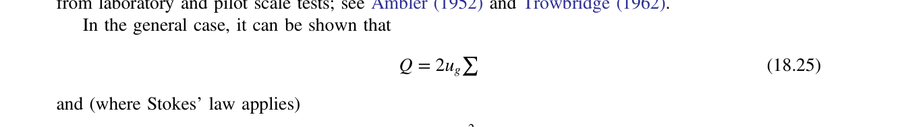

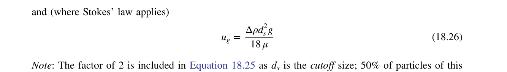

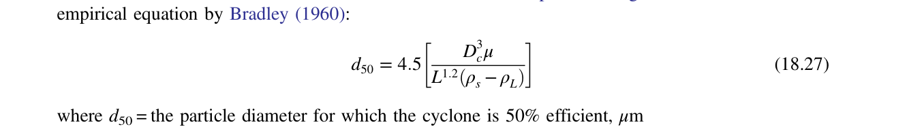

The rate of filtrate flow through the cake and filter medium:
$$\frac{dV}{dt} = \frac{A \Delta P}{\mu (R_c + R_m)} = \frac{A^2 \Delta P}{\mu (r c V + A R_m)}$$
In linearized form for constant pressure ($\Delta P = \text{const}$):
$$\frac{dt}{dV} = \left(\frac{\mu r c}{A^2 \Delta P}\right) V + \frac{\mu R_m}{A \Delta P}$$
Plotting $\frac{dt}{dV}$ versus filtrate volume $V$ yields a straight line with:
$$\text{Slope } K_p = \frac{\mu r c}{A^2 \Delta P} \implies \text{Specific Cake Resistance } r$$
$$\text{Intercept } B = \frac{\mu R_m}{A \Delta P} \implies \text{Medium Resistance } R_m$$

### 3.2 Rotary Drum Vacuum Filters (Continuous)
* A horizontal drum rotates through an agitated slurry trough under vacuum ($40 - 80\text{ kPa}$ differential).
* Cycle is divided into 4 sequential zones:
  1. **Cake Formation**: Drum submerged ($30 - 40\%$ of circumference); vacuum draws filtrate into internal manifold, depositing cake.
  2. **Cake Washing**: Wash liquor sprayed to displace mother liquor without cake disturbance.
  3. **Drying / Dewatering**: Air drawn through cake reduces moisture content.
  4. **Cake Discharge**: Doctor blade, string discharge, or air blowback removes cake continuously.

---

## 4. Industrial Drying

Thermal removal of volatile liquid (typically water or solvent) from wet solids.

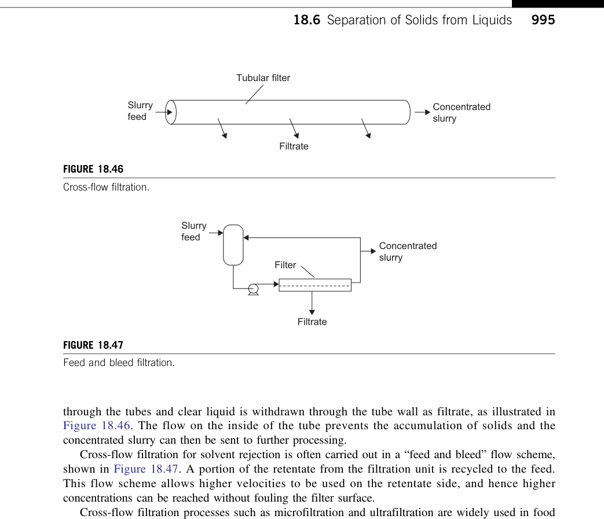

### 4.1 Drying Kinetics: Two Classical Regimes
1. **Constant Rate Period**:
   * The solid surface is covered with a continuous film of free liquid.
   * Evaporation rate is governed purely by gas-phase boundary layer heat and mass transfer:
     $$R_c = \frac{h (T_g - T_s)}{\Delta H_{vap}} = k_y (Y_s - Y_g)$$
   * Surface temperature $T_s$ remains at the adiabatic wet-bulb temperature.
2. **Falling Rate Period**:
   * Surface liquid depletes at the **Critical Moisture Content ($X_c$)**.
   * Drying rate is limited by internal liquid diffusion through particle pores. Surface temperature rises toward the gas temperature.
